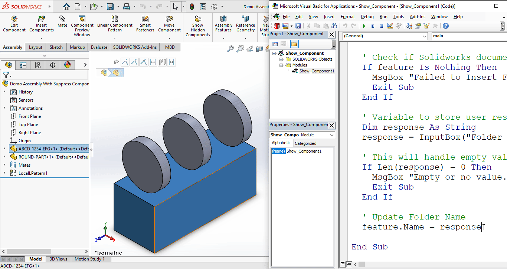

## Objective

In this article, we understand "how to" **Insert Folder** in **Assembly document** from VBA macro.

We will insert an empty folder in Feature Tree.

This is most updated method of **Insert Folder** in an assembly document.

## Results We Can Get

Below image shows the result we get.

[](assembly-insert-folder/final-result-gif.gif)

We **Insert Folder** in simple manners.

There are no extra steps required.

To get the correct result, please follow the steps correctly.
{: .notice--warning}

## Macro Video

Below 🎬 video shows how to **Insert Folder** from *SOLIDWORKS VBA Macros*.

<iframe src="https://www.youtube.com/embed/sPt7MLNlp7k" frameborder="0" allowfullscreen></iframe>
<br>

***Above video is just for visualization and there is no explanation.*** 

***I have explained every line in this article.***

It is advisable to watch video, since it helps you to better understand the process.
{: .notice--warning}

## VBA Macro

Below is the ***VBA macro*** for *Insert Folder*.

```vb
Option Explicit

' Variable for Solidworks Application
Dim swApp As SldWorks.SldWorks

' Variable for Solidworks document
Dim swDoc As SldWorks.ModelDoc2

' Variable for Solidworks Feature Manager
Dim swFeatureManager As SldWorks.FeatureManager

' Variable for Solidworks Feature
Dim feature As SldWorks.feature

' Program to Add New Folder
Sub main()
  
  ' Set Solidworks Application variable to current application
  Set swApp = Application.SldWorks
  
  ' Set Solidworks document variable to currently opened document
  Set swDoc = swApp.ActiveDoc
  
  ' Check if Solidworks document is opened or not
  If swDoc Is Nothing Then
    MsgBox "Solidworks document is not opened."
    Exit Sub
  End If
  
  ' Set Feature manager
  Set swFeatureManager = swDoc.FeatureManager

  ' Insert Folder
  Set feature = swFeatureManager.InsertFeatureTreeFolder2(swFeatureTreeFolder_EmptyBefore)

  ' Check if Folder is added or not
  If feature Is Nothing Then
    MsgBox "Failed to Insert Folder."
    Exit Sub
  End If

  ' Variable to store user response
  Dim response As String
  response = InputBox("Folder Name:", "Folder")
  
  ' This will handle empty value or cancel case
  If Len(response) = 0 Then
    MsgBox "Empty or no value. Please try again."
    Exit Sub
  End If

  ' Update Folder Name
  feature.Name = response
  
End Sub
```

## Prerequisite

There are some *prerequisites* for this article.

* Knowledge of **VBA programming language** is ❗***required***.
* We use existing parts in Assembly document.
* Both components are fully constraint as shown in below image.
* **For inserting folder atleast one part must be selected. Otherwise this method will not work**.

[](assembly-insert-folder/prerequisite.png)

We will apply checks in this article, so the code we write, should be **error free** mostly.
{: .notice}

## Steps To Follow

This **VBA macro** can be divided into following sections:

1. *Create Global Variables*
2. *Initialize Global Variables*
3. *Insert Folder*

***Every section with each line is explained below.***

I also give some ***links (see icon 🚀)*** so that you can go through them if there are anything I explained in previous articles.
{: .notice}

### Create Global Variables

In this section, we create global variables.

```vb
Option Explicit
```

* **Purpose**: Above line forces us to define every variable we are going to use. 
* **Reference**: 🚀 **[SOLIDWORKS Macros - Open new Part document](/solidworks-macros/open-new-document)** article.

```vb
' Variable for Solidworks application
Dim swApp As SldWorks.SldWorks
```

* **Purpose**: In above line, we create a variable for *Solidworks application*.
* **Variable Name**: `swApp`
* **Type**: `SldWorks.SldWorks`
* **Reference**: Please visit 🚀 **[online SOLIDWORKS API Help](https://help.solidworks.com/2019/english/api/sldworksapi/SolidWorks.Interop.sldworks~SolidWorks.Interop.sldworks.ISldWorks_members.html)**.

```vb
' Variable for Solidworks document
Dim swDoc As SldWorks.ModelDoc2
```

* **Purpose**: In above line, we create a variable for *Solidworks document*. 
* **Variable Name**: `swDoc` 
* **Type**: `SldWorks.ModelDoc2`
* **Reference**: Please visit 🚀 **[online SOLIDWORKS API Help](https://help.solidworks.com/2019/english/api/sldworksapi/SolidWorks.Interop.sldworks~SolidWorks.Interop.sldworks.IModelDoc2_members.html)**.

```vb
' Variable for Solidworks Feature Manager
Dim swFeatureManager As SldWorks.FeatureManager
```

* **Purpose**: In above line, we create a variable for *Solidworks Feature Manager*.
* **Variable Name**: `swFeatureManager`
* **Type**: `SldWorks.FeatureManager`
* **Reference**: Please visit 🚀 **[online SOLIDWORKS API Help](https://help.solidworks.com/2019/english/api/sldworksapi/SolidWorks.Interop.sldworks~SolidWorks.Interop.sldworks.IFeatureManager_members.html)**.

```vb
' Variable for Solidworks Feature
Dim feature As SldWorks.feature
```

* **Purpose**: In above line, we create a variable for *Solidworks Feature*.
* **Variable Name**: `feature` 
* **Type**: `SldWorks.feature`.
* **Reference**: Please visit 🚀 **[online SOLIDWORKS API Help](https://help.solidworks.com/2019/english/api/sldworksapi/SolidWorks.Interop.sldworks~SolidWorks.Interop.sldworks.Ifeature_members.html)**.


***These all are our global variables.***

They are **SOLIDWORKS API Objects**.

```vb
' Program to Add New Folder
Sub main()

End Sub
```

* In above line, we create *Program to Add New Folder*.
* This is a **`Sub`** procedure which has name of **`main`**. 
* This procedure hold all the *statements (instructions)* we give to computer.
* **Reference**: Detailed information 🚀 **[VBA Sub and Function Procedures](/vba/sub-and-function-procedure/)** article of this website.

### Initialize Global Variables

In this section, we initialize global variables.

```vb
' Set Solidworks Application variable to current application
Set swApp = Application.SldWorks
```

* In above line, we set *value* of **`swApp`** variable.
* This *value* is currently opened Solidworks application.

```vb
' Set Solidworks document variable to currently opened document
Set swDoc = swApp.ActiveDoc
```

* In above line, we set *value* of **`swDoc`** variable.
* This *value* is currently *opened part document*.

```vb
' Check if Solidworks document is opened or not
If swDoc Is Nothing Then
  MsgBox ("Solidworks document is not opened.")
  Exit Sub
End If
```

* In above code block, we check if we successfully set the value of **`swDoc`** variable.
* We use 🚀 **[IF statement](/vba/if-then-structure-select-case/)** for checking.
* **Condition**: **`swDoc Is Nothing`**
* When this condition is **`True`**, 
  * We show and 🚀 **[message window](/vba/msgBox-function/)** to user.
  * **Message**: *SOLIDWORKS document is not opened.*
  * Then we **stop** our macro here.

### Insert Folder

In this section, we perform *UnSuppress Component* action.

```vb
' Set Feature manager
Set swFeatureManager = swDoc.FeatureManager
```

* In above line, we set *value* of **`swFeatureManager`** variable.
* We set value to **`FeatureManager`** property of **`swDoc`** variable.

```vb 
' Insert Folder
Set feature = swFeatureManager.InsertFeatureTreeFolder2(swFeatureTreeFolder_EmptyBefore)
```

* In above line, we "Insert Folder" by setting the value of **`feature`** variable. 
* This **`InsertFeatureTreeFolder2()`** method is part of **`swFeatureManager`** variable.
* This **`InsertFeatureTreeFolder2()`** method takes following parameter.
  * **Type**: *Type of folder as defined in **`swFeatureTreeFolderType_e`** in below table.*

    | Member                                | Description                                                              |
    | ------------------------------------- | ------------------------------------------------------------------------ |
    | **`swFeatureTreeFolder_Containing`**  | *2 = Create and insert a folder to contain the pre-selected features*    |
    | **`swFeatureTreeFolder_EmptyBefore`** | *1 = Create and insert an empty folder before the pre-selected features* |
    | **`swFeatureTreeFolder_Mold`**        | *3*                                                                      |

* **Return Value** : This **`InsertFeatureTreeFolder2()`** method return 🚀 **[feature](https://help.solidworks.com/2019/english/api/sldworksapi/SOLIDWORKS.Interop.sldworks~SOLIDWORKS.Interop.sldworks.Ifeature.html)** data object.

* In our code, I have used following values:

  | Parameter Name | Value Used                        |
  | -------------- | --------------------------------- |
  | **Type**       | `swFeatureTreeFolder_EmptyBefore` |

**Reference**: For more details about 

* **Solidworks FeatureManager details**: 🚀 **[online Solidworks API Help](https://help.solidworks.com/2019/english/api/sldworksapi/SolidWorks.Interop.sldworks~SolidWorks.Interop.sldworks.IFeatureManager_members.html)** for Solidworks Feature Manager.
* **InsertFeatureTreeFolder2 Method**: 🚀 **[online Solidworks API Help](https://help.solidworks.com/2019/english/api/sldworksapi/SolidWorks.Interop.sldworks~SolidWorks.Interop.sldworks.IFeatureManager~InsertFeatureTreeFolder2.html)** for `InsertFeatureTreeFolder2` Method.


```vb
' Check if Folder is added or not
If feature Is Nothing Then
  MsgBox "Failed to Insert Folder."
  Exit Sub
End If
```

* In above code block, we check if we successfully added **Insert Folder** or not.
* We use 🚀 **[IF statement](/vba/if-then-structure-select-case/)** for checking.
* **Condition**: **`feature Is Nothing`**
* When this condition is **`True`**, 
  * We show and 🚀 **[message window](/vba/msgBox-function/)** to user.
  * **Message**: *Failed to Insert Folder*.
  * Then we **stop** our macro here.

```vb
' Variable to hold user input
Dim response As String
```

* In above line, we create a variable as a counter.
* **Variable Name**: `response`
* **Type**: `String`

```vb
' Getting Folder Name from user.
response = InputBox("Folder Name:", "Folder")
```

* In above line of code we are doing **2 steps** in one line.

  Those 2 steps are explained below.

  * **Step 1** - Getting **Folder Name** from user.

  Below image shows the message for **Folder Name** to the user.

  [](assembly-insert-folder/message-to-folder-name.png)

  * **Step 2** - Assigned input value to **`response`** variable.

```vb
' This will handle empty value or cancel case
If Len(response) = 0 Then
  MsgBox "Empty or no value. Please try again."
  Exit Sub
End If
```

* In above code block, we check the ***length of input value***.
* This check will handle **case for empty value** or **cancel operation case**.
* We use 🚀 **[IF statement](/vba/if-then-structure-select-case/)** for checking.
* **Condition**: **`Len(response) = 0`**
  * **`Len()`** is pre-build VBA function which check the length of a object.
  * In above cases, we will get **0** value.
* When this condition is **`True`**, 
  * We show and 🚀 **[message window](/vba/msgBox-function/)** to user.
  * **Message**: *Empty or no value. Please try again.*
  * Then we **stop** our macro here.

```vb
' Update Folder Name
feature.Name = response
```

* In above line, we set *value* of **`Name`** property of **`feature`** variable.
* We set value to **`response`**, which we asked from user.

Now we run the macro and after running macro we show selected component as shown in below image.

[](assembly-insert-folder/final-result-gif.gif)

**This is it !!!**

*I hope my efforts will helpful to someone!* 😊

If you found anything to **add or update**, please let me know on my *e-mail* 📧.

Hope this post helps you to **Insert Folder** with SOLIDWORKS VBA Macros.

For more such tutorials on **SOLIDWORKS VBA Macro**, do come to this website after sometime.

*If you like the post then please share it with your friends also.* 🙏🏻

*Do let me know by you like this post or not!*

*Till then, Happy learning!!!*

- [🎁 Download 5 Free SolidWorks Macros →](/download-solidworks-macros/)
