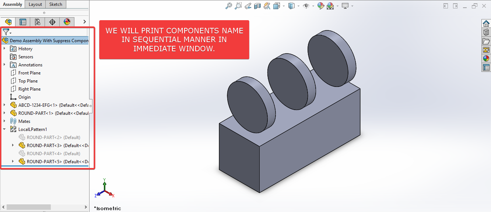

## Objective

In this article, we understand "how to" **Traverse Components Sequentially** in **Assembly document** from VBA macro.

There are no direct method to **Traverse Components in Sequentially** manner.

There are 2 methods available from which we get Components in an Assembly document.

1. **[`GetComponents()`](https://help.solidworks.com/2019/english/api/sldworksapi/SolidWorks.Interop.sldworks~SolidWorks.Interop.sldworks.ISldWorks_members.html)** method from **`AssemblyDoc`** object.

2. **[`GetChildren()`](https://help.solidworks.com/2019/english/api/sldworksapi/SolidWorks.Interop.sldworks~SolidWorks.Interop.sldworks.IComponent2~GetChildren.html)** method from **`Component2`** object.

Both methods, return collection of **`Component2`** object but not in the same order as they are in Feature tree.

To address this issue, we have this macro.

## Results We Can Get

Below image shows the result we get.

[](assembly-traverse-sequentially/final-result-gif.gif)

We **Traverse Components Sequentially** in simple manners.

There are no extra steps required.

To get the correct result, please follow the steps correctly.
{: .notice--warning}

## Macro Video

Below 🎬 video shows how to **Traverse Components Sequentially** from *SOLIDWORKS VBA Macros*.

<iframe src="https://www.youtube.com/embed/tQfObXgqPoA" frameborder="0" allowfullscreen></iframe>
<br>

***Above video is just for visualization and there is no explanation.*** 

***I have explained every line in this article.***

It is advisable to watch video, since it helps you to better understand the process.
{: .notice--warning}

## VBA Macro

Below is the ***VBA macro*** for *Traverse Components Sequentially*.

```vb
Option Explicit

' Variable for Solidworks Application
Dim swApp As SldWorks.SldWorks

' Variable for Solidworks document
Dim swDoc As SldWorks.ModelDoc2

' Variable for Solidworks Assembly
Dim swAssembly As SldWorks.AssemblyDoc

' Variable for Solidworks Component
Dim swComponent As SldWorks.Component2

' Variable for Solidworks Feature
Dim swFeature As SldWorks.Feature

'  Program to sequentially Traversing Assembly document
Sub main()

  ' Set Solidworks Application variable to current application
  Set swApp = Application.SldWorks
  
  ' Set Solidworks document variable to currently opened document
  Set swDoc = swApp.ActiveDoc
  
  ' Check if Solidworks document is opened or not
  If swDoc Is Nothing Then
    MsgBox "Solidworks document is not opened."
    Exit Sub
  End If
  
  ' Set Solidworks Assembly document
  Set swAssembly = swDoc
  
  ' Variable for List of elements
  Dim vArray As Variant
  
  ' Get Components list in opened assembly
  vArray = swAssembly.GetComponents(True)
  
  ' Variable for component
  Dim component As Variant
  
  ' Get first feature in Feature Tree
  Set swFeature = swDoc.FirstFeature
  
  ' Loop until Solidworks Feature is nothing
  Do While Not swFeature Is Nothing
    
    ' Loop Components List
    For Each component In vArray
    
      ' Set Solidworks Component variable
      Set swComponent = component
      
      ' Check if current feature name is same as current component
      If swFeature.Name = swComponent.Name Then
    
        ' Print Feature name
        Debug.Print swFeature.Name
    
      End If
    
    ' Move to next component
    Next component
    
    ' Get next Feature in Feature tree
    Set swFeature = swFeature.GetNextFeature
    
  Loop
  
End Sub
```

## Prerequisite

There are some *prerequisites* for this article.

* Knowledge of **VBA programming language** is ❗***required***.
* We use existing parts in Assembly document.
* All components are fully constraint as shown in below image.
* Immediate Window needs to open to see result.

[](assembly-traverse-sequentially/prerequisite.png)

We will apply checks in this article, so the code we write, should be **error free** mostly.
{: .notice}

## Steps To Follow

This **VBA macro** can be divided into following sections:

1. *Create Global Variables*
2. *Initialize Global Variables*
3. *Traverse Components*

***Every section with each line is explained below.***

I also give some ***links (see icon 🚀)*** so that you can go through them if there are anything I explained in previous articles.
{: .notice}

### Create Global Variables

In this section, we create global variables.

```vb
Option Explicit
```

* **Purpose**: Above line forces us to define every variable we are going to use. 
* **Reference**: 🚀 **[SOLIDWORKS Macros - Open new Part document](/solidworks-macros/open-new-document)** article.

```vb
' Variable for Solidworks application
Dim swApp As SldWorks.SldWorks
```

* **Purpose**: In above line, we create a variable for *Solidworks application*.
* **Variable Name**: `swApp`
* **Type**: `SldWorks.SldWorks`
* **Reference**: Please visit 🚀 **[online SOLIDWORKS API Help](https://help.solidworks.com/2019/english/api/sldworksapi/SolidWorks.Interop.sldworks~SolidWorks.Interop.sldworks.ISldWorks_members.html)**.

```vb
' Variable for Solidworks document
Dim swDoc As SldWorks.ModelDoc2
```

* **Purpose**: In above line, we create a variable for *Solidworks document*. 
* **Variable Name**: `swDoc` 
* **Type**: `SldWorks.ModelDoc2`
* **Reference**: Please visit 🚀 **[online SOLIDWORKS API Help](https://help.solidworks.com/2019/english/api/sldworksapi/SolidWorks.Interop.sldworks~SolidWorks.Interop.sldworks.IModelDoc2_members.html)**.

```vb
' Variable for Solidworks Assembly
Dim swAssembly As SldWorks.AssemblyDoc
```

* **Purpose**: In above line, we create a variable for *Solidworks Assembly*.
* **Variable Name**: `swAssembly`
* **Type**: `SldWorks.AssemblyDoc`
* **Reference**: Please visit 🚀 **[online SOLIDWORKS API Help](https://help.solidworks.com/2019/english/api/sldworksapi/SolidWorks.Interop.sldworks~SolidWorks.Interop.sldworks.IAssemblyDoc_members.html)**.

```vb
' Variable for Solidworks Component
Dim swComponent As SldWorks.Component2
```

* **Purpose**: In above line, we create a variable for *Solidworks Component*.
* **Variable Name**: `swComponent` 
* **Type**: `SldWorks.Component2`.
* **Reference**: Please visit 🚀 **[online SOLIDWORKS API Help](https://help.solidworks.com/2019/english/api/sldworksapi/SolidWorks.Interop.sldworks~SolidWorks.Interop.sldworks.IComponent2_members.html)**.

```vb
' Variable for Solidworks Feature
Dim swFeature As SldWorks.Feature
```

* **Purpose**: In above line, we create a variable for *Solidworks Feature*.
* **Variable Name**: `swFeature` 
* **Type**: `SldWorks.Feature`.
* **Reference**: Please visit 🚀 **[online SOLIDWORKS API Help](https://help.solidworks.com/2019/english/api/sldworksapi/SolidWorks.Interop.sldworks~SolidWorks.Interop.sldworks.Ifeature_members.html)**.


***These all are our global variables.***

They are **SOLIDWORKS API Objects**.

```vb
'  Program to sequentially Traversing Assembly document
Sub main()

End Sub
```

* In above line, we create *Program to sequentially Traversing Assembly document*.
* This is a **`Sub`** procedure which has name of **`main`**. 
* This procedure hold all the *statements (instructions)* we give to computer.
* **Reference**: Detailed information 🚀 **[VBA Sub and Function Procedures](/vba/sub-and-function-procedure/)** article of this website.

### Initialize Global Variables

In this section, we initialize global variables.

```vb
' Set Solidworks Application variable to current application
Set swApp = Application.SldWorks
```

* In above line, we set *value* of **`swApp`** variable.
* This *value* is currently opened Solidworks application.

```vb
' Set Solidworks document variable to currently opened document
Set swDoc = swApp.ActiveDoc
```

* In above line, we set *value* of **`swDoc`** variable.
* This *value* is currently *opened part document*.

```vb
' Check if Solidworks document is opened or not
If swDoc Is Nothing Then
  MsgBox ("Solidworks document is not opened.")
  Exit Sub
End If
```

* In above code block, we check if we successfully set the value of **`swDoc`** variable.
* We use 🚀 **[IF statement](/vba/if-then-structure-select-case/)** for checking.
* **Condition**: **`swDoc Is Nothing`**
* When this condition is **`True`**, 
  * We show and 🚀 **[message window](/vba/msgBox-function/)** to user.
  * **Message**: *SOLIDWORKS document is not opened.*
  * Then we **stop** our macro here.

```vb
' Set Solidworks Assembly document
Set swAssembly = swDoc
```

* In above line, we set *value* of **`swAssembly`** variable.
* This *value* is **`swDoc`** variable.

### Traverse Components

In this section, we perform *Traverse Components* action.

```vb 
' Variable for List of elements
Dim vArray As Variant
```

* **Purpose**: In above line, we create a variable for *List of elements*.
* **Variable Name**: `vArray`
* **Type**: `Variant`

```vb 
' Get Components list in opened assembly
vArray = swAssembly.GetComponents(False)
```

* In above line, we set the value of **`vArray`** variable. 
* We set value by **`GetComponents`** method of **`swAssembly`** variable.
* By passing **`False`** to **`GetComponents`** method, we get all components from Feature Tree.

```vb 
' Variable for component
Dim component As Variant
```

* In above line, we create **`component`** variable for looping.
* **Variable Name**: `component`
* **Type**: `Variant`

```vb 
' Get first feature in Feature Tree
Set swFeature = swDoc.FirstFeature
```

* In above line, we get the first feature in Feature Tree.
* We set the value of **`swFeature`** variable to **`FirstFeature`** property of **`swDoc`** variable.

```vb
' Loop until Solidworks Feature is nothing
Do While Not swFeature Is Nothing
  
Loop
```

* In above line, we create a `Do While` loop.
* We loop Feature tree manager.
* We loop until Solidworks Feature is nothing.

```vb 
' Loop Components List
For Each component In vArray
  
' Move to next component
Next component
```

* In above line, we create a `For Each` loop.
* In this loop, **`component`** variable loops every item in **`vArray`**.

```vb 
' Set Solidworks Component variable
Set swComponent = component
```

* In above line, we set *value* of **`swComponent`** variable.
* This *value* is current value of array **`vArray`**.
* Current value is represented by **`component`** variable.

```vb 
' Check if current feature name is same as current component
If swFeature.Name = swComponent.Name Then
  
End If
```

* In above code block, we check *if current feature name is same as current component*.
* We use 🚀 **[IF statement](/vba/vba-if-then-structure-select-case/)** for checking.
* **Condition**: **`swFeature.Name = swComponent.Name`**

```vb
' Print Feature name
Debug.Print swFeature.Name
```

* In above code, we print the **Feature name** in *Immediate window*.

```vb
' Get next Feature in Feature tree
Set swFeature = swFeature.GetNextFeature
```

* In above line of code, we get next Feature in Feature tree.
* We set the value of **`swFeature`** variable.
* We set the value to **`GetNextFeature`** property of **`swFeature`** variable.

Now we run the macro and after running macro we show selected component as shown in below image.

[](assembly-traverse-sequentially/final-result-gif.gif)

**This is it !!!**

*I hope my efforts will helpful to someone!* 😊

If you found anything to **add or update**, please let me know on my *e-mail* 📧.

Hope this post helps you to **Traverse Components** with SOLIDWORKS VBA Macros.

For more such tutorials on **SOLIDWORKS VBA Macro**, do come to this website after sometime.

*If you like the post then please share it with your friends also.* 🙏🏻

*Do let me know by you like this post or not!*

*Till then, Happy learning!!!*

- [🎁 Download 5 Free SolidWorks Macros →](/download-solidworks-macros/)
