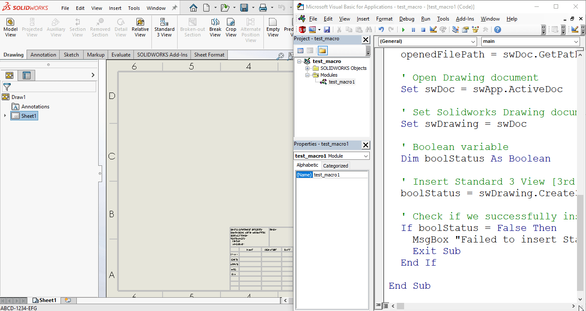

## Objective

In this article, we understand "how to" **Create Standard 3 View [3rd Angle]** in **Drawing document** from VBA macro.

We will insert Standard 3 View of [3rd Angle].

This is most updated method of **Standard 3 View of [3rd Angle]** in an drawing document.

## Results We Can Get

Below image shows the result we get.

[](drawing-3rd-angle-standardviews/final-result-gif.gif)

We **Create Standard 3 View [3rd Angle]** in simple manners.

There are no extra steps required.

To get the correct result, please follow the steps correctly.
{: .notice--warning}

## Macro Video

Below 🎬 video shows how to **Create Standard 3 View [3rd Angle]** from *SOLIDWORKS VBA Macros*.

<iframe src="https://www.youtube.com/embed/PhVSntutgU0" frameborder="0" allowfullscreen></iframe>
<br>

***Above video is just for visualization and there is no explanation.*** 

***I have explained every line in this article.***

It is advisable to watch video, since it helps you to better understand the process.
{: .notice--warning}

## VBA Macro

Below is the ***VBA macro*** for *Create Standard 3 View [3rd Angle]*.

```vb
Option Explicit

' Creating variable for Solidworks application
Dim swApp As SldWorks.SldWorks

' Creating variable for Solidworks document
Dim swDoc As SldWorks.ModelDoc2

' Creating variable for Solidworks Drawing
Dim swDrawing As SldWorks.DrawingDoc

' Program to Insert Standard 3 View [3rd Angle]
Sub main()

  ' Setting Solidworks variable to Solidworks application
  Set swApp = Application.SldWorks
  
  ' Get Opened "Demo Assembly" document
  Set swDoc = swApp.GetOpenDocument("Demo Assembly")
  
  ' Check if Solidworks document is opened or not
  If swDoc Is Nothing Then
    MsgBox "Solidworks document is not opened."
    Exit Sub
  End If
  
  ' Variable for opened File's full Path
  Dim openedFilePath As String
  
  ' Get opened File's full Path
  openedFilePath = swDoc.GetPathName
  
  ' Open Drawing document
  Set swDoc = swApp.ActiveDoc

  ' Set Solidworks Drawing document variable
  Set swDrawing = swDoc
  
  ' Boolean variable
  Dim boolStatus As Boolean
  
  ' Insert Standard 3 View [3rd Angle]
  boolStatus = swDrawing.Create3rdAngleViews2(openedFilePath)
  
  ' Check if we successfully insert views
  If boolStatus = False Then
    MsgBox "Failed to insert Standard 3 View [3rd Angle]"
    Exit Sub
  End If

End Sub
```

## Prerequisite

There are some *prerequisites* for this article.

* Knowledge of **VBA programming language** is ❗***required***.
* We create drawing from an already opened Assembly document.
* We will use name of Assembly document name **hardcoded**.

[](drawing-3rd-angle-standardviews/prerequisite.png)

We will apply checks in this article, so the code we write, should be **error free** mostly.
{: .notice}

## Steps To Follow

This **VBA macro** can be divided into following sections:

1. *Create Global Variables*
2. *Get Assembly Full Path*
3. *Insert Standard Views*

***Every section with each line is explained below.***

I also give some ***links (see icon 🚀)*** so that you can go through them if there are anything I explained in previous articles.
{: .notice}

### Create Global Variables

In this section, we create global variables.

```vb
Option Explicit
```

* **Purpose**: Above line forces us to define every variable we are going to use. 
* **Reference**: 🚀 **[SOLIDWORKS Macros - Open new Part document](/solidworks-macros/open-new-document)** article.

```vb
' Variable for Solidworks application
Dim swApp As SldWorks.SldWorks
```

* **Purpose**: In above line, we create a variable for *Solidworks application*.
* **Variable Name**: `swApp`
* **Type**: `SldWorks.SldWorks`
* **Reference**: Please visit 🚀 **[online SOLIDWORKS API Help](https://help.solidworks.com/2019/english/api/sldworksapi/SolidWorks.Interop.sldworks~SolidWorks.Interop.sldworks.ISldWorks_members.html)**.

```vb
' Variable for Solidworks document
Dim swDoc As SldWorks.ModelDoc2
```

* **Purpose**: In above line, we create a variable for *Solidworks document*. 
* **Variable Name**: `swDoc` 
* **Type**: `SldWorks.ModelDoc2`
* **Reference**: Please visit 🚀 **[online SOLIDWORKS API Help](https://help.solidworks.com/2019/english/api/sldworksapi/SolidWorks.Interop.sldworks~SolidWorks.Interop.sldworks.IModelDoc2_members.html)**.

```vb
' Creating variable for Solidworks Drawing
Dim swDrawing As SldWorks.DrawingDoc
```

* **Purpose**: In above line, we create a variable for *Solidworks Drawing*.
* **Variable Name**: `swDrawing`
* **Type**: `SldWorks.DrawingDoc`
* **Reference**: Please visit 🚀 **[online SOLIDWORKS API Help](https://help.solidworks.com/2019/english/api/sldworksapi/SolidWorks.Interop.sldworks~SolidWorks.Interop.sldworks.IDrawingDoc_members.html)**.

***These all are our global variables.***

They are **SOLIDWORKS API Objects**.

```vb
' Program to Insert Standard 3 View [3rd Angle]
Sub main()

End Sub
```

* In above line, we create *Program to Insert Standard 3 View [3rd Angle]*.
* This is a **`Sub`** procedure which has name of **`main`**. 
* This procedure hold all the *statements (instructions)* we give to computer.
* **Reference**: Detailed information 🚀 **[VBA Sub and Function Procedures](/vba/sub-and-function-procedure/)** article of this website.

### Get Assembly Full Path

In this section, we Get Assembly Full Path.

```vb
' Set Solidworks Application variable to current application
Set swApp = Application.SldWorks
```

* In above line, we set *value* of **`swApp`** variable.
* This *value* is currently opened Solidworks application.

```vb
' Get Opened "Demo Assembly" document
Set swDoc = swApp.GetOpenDocument("Demo Assembly")
```

* In above line, we set *value* of **`swDoc`** variable.
* This *value* is currently Opened "Demo Assembly" document.
* We use **`GetOpenDocument()`** method from **`swApp`** variable.
* This **`GetOpenDocument()`** method takes one parameter.
  * **DocName** - *Name of the document.*
* We pass Opened assembly name i.e. "**Demo Assembly**" as parameter.

```vb
' Check if Solidworks document is opened or not
If swDoc Is Nothing Then
  MsgBox ("Solidworks document is not opened.")
  Exit Sub
End If
```

* In above code block, we check if we successfully set the value of **`swDoc`** variable.
* We use 🚀 **[IF statement](/vba/if-then-structure-select-case/)** for checking.
* **Condition**: **`swDoc Is Nothing`**
* When this condition is **`True`**, 
  * We show and 🚀 **[message window](/vba/msgBox-function/)** to user.
  * **Message**: *SOLIDWORKS document is not opened.*
  * Then we **stop** our macro here.

```vb
' Variable for opened File's full Path
Dim openedFilePath As String
```

* In above line, we create a variable for opened File's full Path.
* **Variable Name**: `openedFilePath`
* **Type**: `String`


```vb
' Get opened File's full Path
openedFilePath = swDoc.GetPathName
```

* In above line, we set *value* of **`openedFilePath`** variable.
* This *value* opened File's full Path.
* We set the value by **`GetPathName()`** method of **`swDoc`** variable.

### Insert Standard Views

In this section, we *Insert Standard Views* action.

```vb
' Open Drawing document
Set swDoc = swApp.ActiveDoc
```

* In above line, we set *value* of **`swDoc`** variable.
* This *value* is currently *opened part document*.

```vb
' Set Solidworks Drawing document
Set swDrawing = swDoc
```

* In above line, we set *value* of **`swDrawing`** variable.
* This *value* is **`swDoc`** variable.

```vb
' Boolean Variable
Dim boolStatus As Boolean
```

* **Purpose**:  In above line, we create a variable for *Boolean* selection.
* **Variable Name**: `boolStatus`
* **Type**: `Boolean`

```vb 
' Insert Standard 3 View [3rd Angle]
boolStatus = swDrawing.Create3rdAngleViews2(openedFilePath)
```

* In above code, we **Insert Standard 3 View** into Drawing.
* For this, we use **`Create3rdAngleViews2`** method.
* This **`Create3rdAngleViews2`** method is part of **`swDrawing`** variable.
* This method takes 1 parameter.
  * **ModelName**: *Name of the document from which to create views.*


* **Return Value** : This `Create3rdAngleViews2` method return 🚀 **`True`** if successful, **`False`** if not.

* In our code, I have used following values:

  | Parameter Name | Value Used       |
  | -------------- | ---------------- |
  | **ModelName**  | `openedFilePath` |

* **Reference**: For more details please visit 🚀 **[online SOLIDWORKS API Help](https://help.solidworks.com/2019/english/api/sldworksapi/solidworks.interop.sldworks~solidworks.interop.sldworks.idrawingdoc~Create3rdAngleViews2.html)**.

```vb
' Check if we successfully insert views
If boolStatus = False Then
  MsgBox "Failed to insert Standard 3 View [3rd Angle]"
  Exit Sub
End If
```

* In above code block, we check if we successfully insert views or not.
* We use 🚀 **[IF statement](/vba/if-then-structure-select-case/)** for checking.
* **Condition**: **`boolStatus = False`**
* When this condition is **`True`**, 
  * We show and 🚀 **[message window](/vba/msgBox-function/)** to user.
  * **Message**: *Failed to insert Standard 3 View [3rd Angle].
  * Then we **stop** our macro here.

Now we run the macro and after running macro we show selected component as shown in below image.

[](drawing-3rd-angle-standardviews/final-result-gif.gif)

**This is it !!!**

*I hope my efforts will helpful to someone!* 😊

If you found anything to **add or update**, please let me know on my *e-mail* 📧.

Hope this post helps you to **Create Standard 3 View [3rd Angle]** with SOLIDWORKS VBA Macros.

For more such tutorials on **SOLIDWORKS VBA Macro**, do come to this website after sometime.

*If you like the post then please share it with your friends also.* 🙏🏻

*Do let me know by you like this post or not!*

*Till then, Happy learning!!!*

- [🎁 Download 5 Free SolidWorks Macros →](/download-solidworks-macros/)
