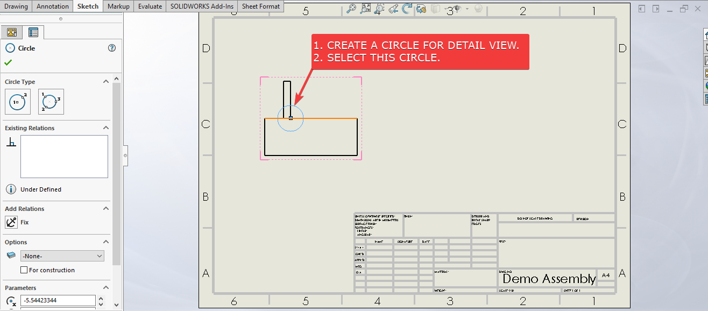

---

title:  Solidworks VBA Macro - Insert Detail View
url: /solidworks-vba-macros/drawing-insert-detailview/
weight: 96
---

## Objective

In this article, we understand "how to" **Insert Detail View** in **Drawing document** from VBA macro.

We will insert Detail View.

This is most updated method of **Insert Detail View** in an drawing document.

## Results We Can Get

Below image shows the result we get.

[](drawing-insert-detailview/final-result-gif.gif)

We **Insert Detail View** in simple manners.

There are no extra steps required.

To get the correct result, please follow the steps correctly.
{: .notice--warning}

## Macro Video

Below 🎬 video shows how to **Insert Detail View** from *SOLIDWORKS VBA Macros*.

<iframe src="https://www.youtube.com/embed/cwqGhSahdec" frameborder="0" allowfullscreen></iframe>
<br>

***Above video is just for visualization and there is no explanation.*** 

***I have explained every line in this article.***

It is advisable to watch video, since it helps you to better understand the process.
{: .notice--warning}

## VBA Macro

Below is the ***VBA macro*** for *Insert Detail View*.

```vb
Option Explicit

' Creating variable for Solidworks application
Dim swApp As SldWorks.SldWorks

' Creating variable for Solidworks document
Dim swDoc As SldWorks.ModelDoc2

' Creating variable for Solidworks Drawing
Dim swDrawing As SldWorks.DrawingDoc

' Creating variable for Solidworks View
Dim insertView As SldWorks.View

' Program to Insert Detail View
Sub main()

  ' Setting Solidworks variable to Solidworks application
  Set swApp = Application.SldWorks
  
  ' Set Solidworks document variable to currently opened document
  Set swDoc = swApp.ActiveDoc
  
  ' Check if Solidworks document is opened or not
  If swDoc Is Nothing Then
    MsgBox "Solidworks document is not opened."
    Exit Sub
  End If
  
  ' Set Solidworks Drawing document variable
  Set swDrawing = swDoc
  
  ' Insert Detail View
  Set insertView = swDrawing.CreateDetailViewAt4(0.2, 0.12, 0, swDetViewSTANDARD, 1, 10, "A", swDetCircleCIRCLE, True, False, False, 5)
  
  ' Check if we successfully insert Detail view
  If insertView Is Nothing Then
    MsgBox "Failed to Insert Detail View."
    Exit Sub
  End If
  
  ' Rebuild drawing
  swDoc.ForceRebuild3 False

End Sub
```

## Prerequisite

There are some *prerequisites* for this article.

* Knowledge of **VBA programming language** is ❗***required***.
* We create **Detail view** from an existing (Base) view.
* We already select a Circle in this existing (Base) view.

[](drawing-insert-detailview/prerequisite.png)

We will apply checks in this article, so the code we write, should be **error free** mostly.
{: .notice}

## Steps To Follow

This **VBA macro** can be divided into following sections:

1. *Create Global Variables*
2. *Initialize Variables*
3. *Insert Detail Views*

***Every section with each line is explained below.***

I also give some ***links (see icon 🚀)*** so that you can go through them if there are anything I explained in previous articles.
{: .notice}

### Create Global Variables

In this section, we create global variables.

```vb
Option Explicit
```

* **Purpose**: Above line forces us to define every variable we are going to use. 
* **Reference**: 🚀 **[SOLIDWORKS Macros - Open new Part document](/solidworks-macros/open-new-document)** article.

```vb
' Variable for Solidworks application
Dim swApp As SldWorks.SldWorks
```

* **Purpose**: In above line, we create a variable for *Solidworks application*.
* **Variable Name**: `swApp`
* **Type**: `SldWorks.SldWorks`
* **Reference**: Please visit 🚀 **[online SOLIDWORKS API Help](https://help.solidworks.com/2019/english/api/sldworksapi/SolidWorks.Interop.sldworks~SolidWorks.Interop.sldworks.ISldWorks_members.html)**.

```vb
' Variable for Solidworks document
Dim swDoc As SldWorks.ModelDoc2
```

* **Purpose**: In above line, we create a variable for *Solidworks document*. 
* **Variable Name**: `swDoc` 
* **Type**: `SldWorks.ModelDoc2`
* **Reference**: Please visit 🚀 **[online SOLIDWORKS API Help](https://help.solidworks.com/2019/english/api/sldworksapi/SolidWorks.Interop.sldworks~SolidWorks.Interop.sldworks.IModelDoc2_members.html)**.

```vb
' Creating variable for Solidworks Drawing
Dim swDrawing As SldWorks.DrawingDoc
```

* **Purpose**: In above line, we create a variable for *Solidworks Drawing*.
* **Variable Name**: `swDrawing`
* **Type**: `SldWorks.DrawingDoc`
* **Reference**: Please visit 🚀 **[online SOLIDWORKS API Help](https://help.solidworks.com/2019/english/api/sldworksapi/SolidWorks.Interop.sldworks~SolidWorks.Interop.sldworks.IDrawingDoc_members.html)**.

```vb
' Creating variable for Solidworks View
Dim insertView As SldWorks.View
```

* **Purpose**: In above line, we create a variable for *Solidworks View*.
* **Variable Name**: `insertView`
* **Type**: `SldWorks.View`
* **Reference**: Please visit 🚀 **[online SOLIDWORKS API Help](https://help.solidworks.com/2019/english/api/sldworksapi/SolidWorks.Interop.sldworks~SolidWorks.Interop.sldworks.IView_members.html)**.

***These all are our global variables.***

They are **SOLIDWORKS API Objects**.

```vb
' Program to Insert Detail View
Sub main()

End Sub
```

* In above line, we create *Program to Insert Detail View*.
* This is a **`Sub`** procedure which has name of **`main`**. 
* This procedure hold all the *statements (instructions)* we give to computer.
* **Reference**: Detailed information 🚀 **[VBA Sub and Function Procedures](/vba/sub-and-function-procedure/)** article of this website.

### Initialize Variables

In this section, we initialize Variables.

```vb
' Set Solidworks Application variable to current application
Set swApp = Application.SldWorks
```

* In above line, we set *value* of **`swApp`** variable.
* This *value* is currently opened Solidworks application.

```vb
' Set Solidworks document variable to currently opened document
Set swDoc = swApp.ActiveDoc
```

* In above line, we set *value* of **`swDoc`** variable.
* This *value* is currently *opened part document*.

```vb
' Check if Solidworks document is opened or not
If swDoc Is Nothing Then
  MsgBox ("Solidworks document is not opened.")
  Exit Sub
End If
```

* In above code block, we check if we successfully set the value of **`swDoc`** variable.
* We use 🚀 **[IF statement](/vba/if-then-structure-select-case/)** for checking.
* **Condition**: **`swDoc Is Nothing`**
* When this condition is **`True`**, 
  * We show and 🚀 **[message window](/vba/msgBox-function/)** to user.
  * **Message**: *SOLIDWORKS document is not opened.*
  * Then we **stop** our macro here.

```vb
' Set Solidworks Drawing document
Set swDrawing = swDoc
```

* In above line, we set *value* of **`swDrawing`** variable.
* This *value* is **`swDoc`** variable.

### Insert Detail Views

In this section, we *Insert Detail Views*.

```vb 
' Insert Detail View
Set insertView = swDrawing.CreateDetailViewAt4(0.2, 0.12, 0, swDetViewSTANDARD, 1, 10, "A", swDetCircleCIRCLE, True, False, False, 5)
```

* In above code, we **Insert Detail View** into Drawing.
* For this, we use **`CreateDetailViewAt4`** method.
* This **`CreateDetailViewAt4`** method is part of **`swDrawing`** variable.
* This method takes following parameters.
  * **X**: *X position for the Detail view.*
  * **Y**: *Y position for the Detail view.*
  * **Z**: *Z position for the Detail view.*
  * **Style**: *Style for the detail view as defined in **`swDetViewStyle_e`** as following.*

    | Parameter Name         | Description                            |
    | ---------------------- | -------------------------------------- |
    | **swDetViewBROKEN**    | `1 = Use broken detail view style.`    |
    | **swDetViewCONNECTED** | `4 = Use connected detail view style.` |
    | **swDetViewLEADER**    | `2 = Use leader detail view style.`    |
    | **swDetViewNOLEADER**  | `3 = Use no leader detail view style.` |
    | **swDetViewSTANDARD**  | `0 = Use standard detail view style.`  |

  * **Scale1**: *Scale numerator.*
  * **Scale2**: *Scale denominator.*
  * **LabelIn**: *Detail view label.*
  * **Showtype**: *Type of sketch for the detail view as defined in **`swDetCircleShowType_e`** as following.*

    | Parameter Name          | Description                                     |
    | ----------------------- | ----------------------------------------------- |
    | **swDetCircleCIRCLE**   | `1 = Use sketch circle to create detail view.`  |
    | **swDetCircleDONTSHOW** | `2 = Do not show a sketch profile.`             |
    | **swDetCirclePROFILE**  | `0 = Use sketch profile to create detail view.` |

  * **FullOutline**: * **`True`** to show a full outline, **`False`** to not; valid only if **`NoOutline`** is `False`.*
  * **JaggedOutline**: * **`True`** to show a jagged outline, **`False`** does not; valid only if **`NoOutline`** is `False`.*
  * **NoOutline**: * **`True`** to not show an outline, **`False`** to show an outline.*
  * **ShapeIntensity**: *Intensity of jagged outline; valid range is 1 (most) to 5 (least) and only valid if **`JaggedOutline`** is `True` and **`NoOutline`** is `False`.*

* **Return Value** : This `CreateDetailViewAt4` method return 🚀 **[View](https://help.solidworks.com/2019/english/api/sldworksapi/SolidWorks.Interop.sldworks~SolidWorks.Interop.sldworks.IView_members.html)** data object.

* In our code, I have used following values:

  | Parameter Name     | Value Used          |
  | ------------------ | ------------------- |
  | **X**              | `0.2`               |
  | **Y**              | `0.12`              |
  | **Z**              | `0`                 |
  | **Style**          | `swDetViewSTANDARD` |
  | **Scale1**         | `1`                 |
  | **Scale2**         | `10`                |
  | **LabelIn**        | `A`                 |
  | **Showtype**       | `swDetCircleCIRCLE` |
  | **FullOutline**    | `True`              |
  | **JaggedOutline**  | `False`             |
  | **NoOutline**      | `False`             |
  | **ShapeIntensity** | `5`                 |

* **Reference**: For more details please visit 🚀 **[online SOLIDWORKS API Help](https://help.solidworks.com/2019/english/api/sldworksapi/solidworks.interop.sldworks~solidworks.interop.sldworks.idrawingdoc~Create3rdAngleViews2.html)**.

```vb
' Check if we successfully insert view
If insertView Is Nothing Then
  MsgBox "Failed to Insert Detail View"
  Exit Sub
End If
```

* In above code block, we check if we successfully insert views or not.
* We use 🚀 **[IF statement](/vba/if-then-structure-select-case/)** for checking.
* **Condition**: **`insertView Is Nothing`**
* When this condition is **`True`**, 
  * We show and 🚀 **[message window](/vba/msgBox-function/)** to user.
  * **Message**: *Failed to Insert Detail View.
  * Then we **stop** our macro here.

```vb
' Rebuild drawing
swDoc.ForceRebuild3 True
```

* In above line, we Rebuild drawing.
* For this we use `ForceRebuild3` method which is part of *SOLIDWORKS Document* variable i.e `swDoc` variable.

Now we run the macro and after running macro we show selected component as shown in below image.

[](drawing-insert-detailview/final-result-gif.gif)

**This is it !!!**

*I hope my efforts will helpful to someone!* 😊

If you found anything to **add or update**, please let me know on my *e-mail* 📧.

Hope this post helps you to **Insert Detail View** with SOLIDWORKS VBA Macros.

For more such tutorials on **SOLIDWORKS VBA Macro**, do come to this website after sometime.

*If you like the post then please share it with your friends also.* 🙏🏻

*Do let me know by you like this post or not!*

*Till then, Happy learning!!!*

- [🎁 Download 5 Free SolidWorks Macros →](/download-solidworks-macros/)
