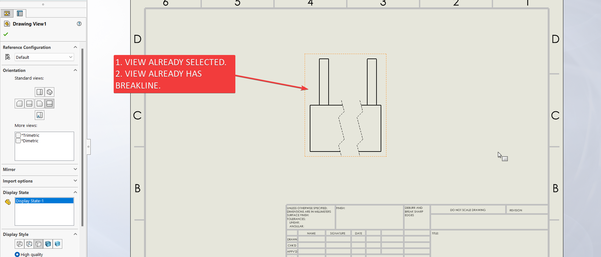

---

title:  Solidworks VBA Macro - Update Break line position
url: /solidworks-vba-macros/drawing-update-breakline-position/
weight: 105
---

## Objective

Objective of this article is simple, answer the below question.

**Question**: How to add a ***Update Break line position*** in a drawing from **Solidworks VBA macro**.

## Final Result

Final result as shown below 👇🏻

[](drawing-update-breakline-position/final-result-gif.gif)

## Macro Video

Below 🎬 video shows how to **Update Break line position** from *SOLIDWORKS VBA Macros*.

<iframe src="https://www.youtube.com/embed/9ucQaq4oMlk" frameborder="0" allowfullscreen></iframe>
<br>

Above video is just for visualization and there is no explanation.
<br/>
It is advisable to watch video, since it helps you to better understand the process.
{: .notice--warning}

## VBA Macro

Below is the ***VBA macro*** for *Update Break line position*.

```vb
Option Explicit

' Creating variable for Solidworks application
Dim swApp As SldWorks.SldWorks

' Creating variable for Solidworks document
Dim swDoc As SldWorks.ModelDoc2

' Creating variable for Solidworks Drawing
Dim swDrawing As SldWorks.DrawingDoc

' Creating variable for Solidworks View
Dim swView As SldWorks.View

' Creating variable for Solidworks Breakline
Dim swBreakLine As SldWorks.BreakLine

' Program to Update Break line position
Sub main()

  ' Setting Solidworks variable to Solidworks application
  Set swApp = Application.SldWorks
  
  ' Set Solidworks document variable to currently opened document
  Set swDoc = swApp.ActiveDoc
  
  ' Check if Solidworks document is opened or not
  If swDoc Is Nothing Then
    MsgBox "Solidworks document is not opened."
    Exit Sub
  End If
  
  ' Set Solidworks Drawing document variable
  Set swDrawing = swDoc
  
  ' Get activate view
  Set swView = swDrawing.ActiveDrawingView
  
  ' Variable for Break lines
  Dim breaks As Variant
  
  ' Get Break lines in current view
  breaks = swView.GetBreakLines
  
  ' Get first break line and set Solidworks Breakline variable
  Set swBreakLine = breaks(0)
  
  ' Variable for position
  Dim vPoints As Variant
  
  ' Get position of first break line
  vPoints = swBreakLine.GetPosition(0)
  
  ' Update Break line position
  swBreakLine.SetPosition vPoints + 0.01, vPoints + 0.003
  
  ' Rebuild document
  swDoc.ForceRebuild3 True

End Sub
```

## Prerequisite

There are some *prerequisites* for this article.

* Knowledge of **VBA programming language** is ❗***required***.

* We arleady selected view.

* We already have a break view created in 🚀 **[SOLIDWORKS Macros - Insert Break view](/solidworks-vba-macros/drawing-insert-break-view/)** article. .

[](drawing-update-breakline-position/prerequisite.png)

We will apply checks in this article, so the code we write, should be **error free** mostly.
{: .notice}

## Steps To Follow

This **VBA macro** can be divided into following sections:

1. *Create Global Variables*
2. *Initialize Variables*
3. *Update Break line position*

***Every section with each line is explained below.***

I also give some ***links (see icon 🚀)*** so that you can go through them if there are anything I explained in previous articles.
{: .notice}

### Create Global Variables

In this section, we create global variables.

```vb
Option Explicit
```

* **Purpose**: Above line forces us to define every variable we are going to use. 
* **Reference**: 🚀 **[SOLIDWORKS Macros - Open new Part document](/solidworks-macros/open-new-document)** article.

```vb
' Variable for Solidworks application
Dim swApp As SldWorks.SldWorks
```

* **Purpose**: In above line, we create a variable for *Solidworks application*.
* **Variable Name**: `swApp`
* **Type**: `SldWorks.SldWorks`
* **Reference**: Please visit 🚀 **[online SOLIDWORKS API Help](https://help.solidworks.com/2019/english/api/sldworksapi/SolidWorks.Interop.sldworks~SolidWorks.Interop.sldworks.ISldWorks_members.html)**.

```vb
' Variable for Solidworks document
Dim swDoc As SldWorks.ModelDoc2
```

* **Purpose**: In above line, we create a variable for *Solidworks document*. 
* **Variable Name**: `swDoc` 
* **Type**: `SldWorks.ModelDoc2`
* **Reference**: Please visit 🚀 **[online SOLIDWORKS API Help](https://help.solidworks.com/2019/english/api/sldworksapi/SolidWorks.Interop.sldworks~SolidWorks.Interop.sldworks.IModelDoc2_members.html)**.

```vb
' Creating variable for Solidworks Drawing
Dim swDrawing As SldWorks.DrawingDoc
```

* **Purpose**: In above line, we create a variable for *Solidworks Drawing*.
* **Variable Name**: `swDrawing`
* **Type**: `SldWorks.DrawingDoc`
* **Reference**: Please visit 🚀 **[online SOLIDWORKS API Help](https://help.solidworks.com/2019/english/api/sldworksapi/SolidWorks.Interop.sldworks~SolidWorks.Interop.sldworks.IDrawingDoc_members.html)**.

```vb
' Creating variable for Solidworks View
Dim swView As SldWorks.View
```

* **Purpose**: In above line, we create a variable for *Solidworks View*.
* **Variable Name**: `swView`
* **Type**: `SldWorks.View`
* **Reference**: Please visit 🚀 **[online SOLIDWORKS API Help](https://help.solidworks.com/2019/english/api/sldworksapi/SolidWorks.Interop.sldworks~SolidWorks.Interop.sldworks.IView_members.html)**.

```vb
' Creating variable for Solidworks Breakline
Dim swBreakLine As SldWorks.BreakLine
```

* **Purpose**: In above line, we create a variable for *Solidworks Breakline*.
* **Variable Name**: `swBreakLine`
* **Type**: `SldWorks.BreakLine`
* **Reference**: Please visit 🚀 **[online SOLIDWORKS API Help](https://help.solidworks.com/2019/english/api/sldworksapi/SolidWorks.Interop.sldworks~SolidWorks.Interop.sldworks.IBreakLine_members.html)**.

***These all are our global variables.***

They are **SOLIDWORKS API Objects**.

```vb
' Program to Update Break line position
Sub main()

End Sub
```

* In above line, we create *Program to Update Break line position*.
* This is a **`Sub`** procedure which has name of **`main`**. 
* This procedure hold all the *statements (instructions)* we give to computer.
* **Reference**: Detailed information 🚀 **[VBA Sub and Function Procedures](/vba/sub-and-function-procedure/)** article of this website.

### Initialize Variables

In this section, we initialize Variables.

```vb
' Set Solidworks Application variable to current application
Set swApp = Application.SldWorks
```

* In above line, we set *value* of **`swApp`** variable.
* This *value* is currently opened Solidworks application.

```vb
' Set Solidworks document variable to currently opened document
Set swDoc = swApp.ActiveDoc
```

* In above line, we set *value* of **`swDoc`** variable.
* This *value* is currently *opened part document*.

```vb
' Check if Solidworks document is opened or not
If swDoc Is Nothing Then
  MsgBox ("Solidworks document is not opened.")
  Exit Sub
End If
```

* In above code block, we check if we successfully set the value of **`swDoc`** variable.
* We use 🚀 **[IF statement](/vba/if-then-structure-select-case/)** for checking.
* **Condition**: **`swDoc Is Nothing`**
* When this condition is **`True`**, 
  * We show and 🚀 **[message window](/vba/msgBox-function/)** to user.
  * **Message**: *SOLIDWORKS document is not opened.*
  * Then we **stop** our macro here.

```vb
' Set Solidworks Drawing document
Set swDrawing = swDoc
```

* In above line, we set *value* of **`swDrawing`** variable.
* This *value* is **`swDoc`** variable.

```vb
' Get activate view
Set swView = swDrawing.ActiveDrawingView
```

* In above line, we set *value* of **`swView`** variable.
* This value is currently selected view.
* We get value by **`ActiveDrawingView`** method.
* This **`ActiveDrawingView`** method is part of **`swDrawing`** variable.


```vb
' Check if Solidworks document is opened or not
If swView Is Nothing Then
  MsgBox "No view selected."
  Exit Sub
End If
```

* In above code block, we check if we successfully get the value of **`swView`** variable.
* We use 🚀 **[IF statement](/vba/if-then-structure-select-case/)** for checking.
* **Condition**: **`swView Is Nothing`**
* When this condition is **`True`**, 
  * We show and 🚀 **[message window](/vba/msgBox-function/)** to user.
  * **Message**: *No view selected.*
  * Then we **stop** our macro here.

### Update Break line position

In this section, we *Update Break line position*.

```vb 
' Variable for Break lines
Dim breaks As Variant
```

* **Purpose**: In above line, we create a variable for getting *Break lines* from current views.
* **Variable Name**: `breaks`
* **Type**: `Variant`

```vb 
' Get Break lines in current view
breaks = swView.GetBreakLines
```

* In above code, we **get Break lines** in current view.
* Then we set the value of **`breaks`** variable.
* For this, we use **`GetBreakLines`** method.
* This **`GetBreakLines`** method is part of **`swView`** variable.
* This method did not take any parameter.
* **Return Value** : This **`GetBreakLines`** method returns **Solidworks Break line**.
* **Reference**: For more details please visit 🚀 **[online SOLIDWORKS API Help](https://help.solidworks.com/2021/english/api/sldworksapi/solidworks.interop.sldworks~solidworks.interop.sldworks.iview~getbreaklines.html)**.

```vb
' Get first break line and set Solidworks Breakline variable
Set swBreakLine = breaks(0)
```

* In above line, we get first break line.
* Then we set the value of Solidworks Breakline variable **`swBreakLine`**.

```vb 
' Variable for position
Dim vPoints As Variant
```

* **Purpose**: In above line, we create a variable for getting *Break lines position* from break line.
* **Variable Name**: `vPoints`
* **Type**: `Variant`

```vb
' Get position of first break line
vPoints = swBreakLine.GetPosition(0)
```

* In above line, we get the first position of break line.
* For this, we use **`GetPosition`** method.
* This **`GetPosition`** method is part of **`swBreakLine`** variable.
* We store the value of Solidworks Breakline variable **`swBreakLine`** in **`vPoints`** variable.
* **Return Value** : This **`GetPosition`** method returns array of position of break line.

```vb 
' Update Break line position
swBreakLine.SetPosition vPoints + 0.01, vPoints + 0.003
```

* In above code, we **Update Break line position**.
* For this, we use **`SetPosition`** method.
* This **`SetPosition`** method is part of **`swBreakLine`** variable.
* This method following parameter.
  * **Position1** - *Location of the first break line.*
  * **Position2** - *Location of the second break line.*

* **Return Value** : This **`BreakView`** method does not return **`True`** if the break lines are positioned, **`False`** if not.

```vb
' Rebuild drawing
swDoc.ForceRebuild3 True
```

* In above line, we Rebuild drawing.
* For this we use `ForceRebuild3` method which is part of *SOLIDWORKS Document* variable i.e **`swDoc`** variable.

Now we run the macro and after running macro we show selected component as shown in below image.

[](drawing-update-breakline-position/final-result-gif.gif)

**This is it !!!**

*I hope my efforts will helpful to someone!* 😊

If you found anything to **add or update**, please let me know on my *e-mail* 📧.

Hope this post helps you to **Update Break line position** with SOLIDWORKS VBA Macros.

For more such tutorials on **SOLIDWORKS VBA Macro**, do come to this website after sometime.

*If you like the post then please share it with your friends also.* 🙏🏻

*Do let me know by you like this post or not!*

*Till then, Happy learning!!!*

- [🎁 Download 5 Free SolidWorks Macros →](/download-solidworks-macros/)
