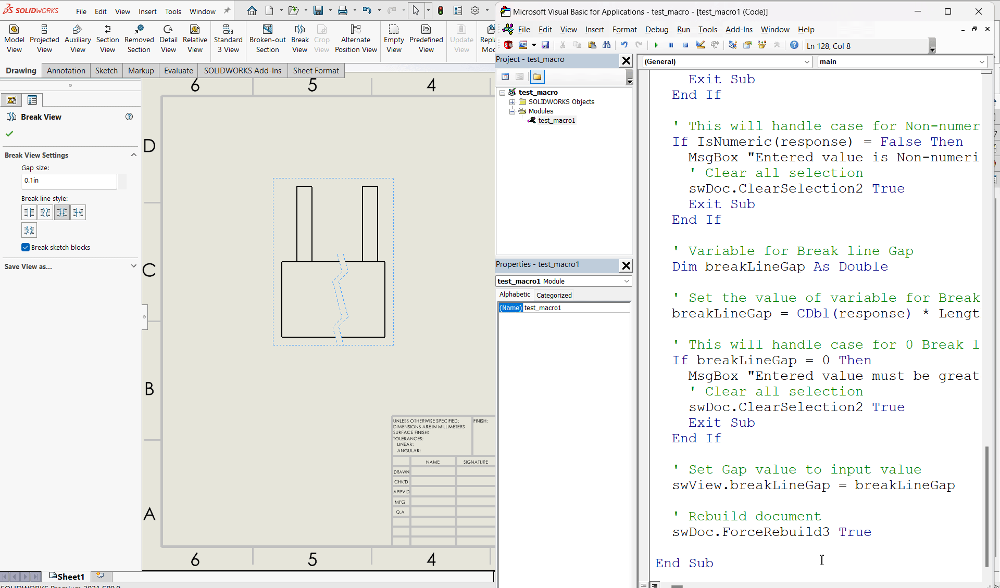
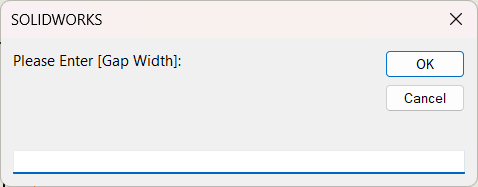

## Objective

Objective of this article is simple, answer the below question.

**Question**: How to ***Update Break line gap*** in a drawing from **Solidworks VBA macro**.

## Final Result

Final result as shown below 👇🏻

[](drawing-update-breakline-gap/final-result-gif.gif)

## Macro Video

Below 🎬 video shows how to **Update Break Line Gap** from *SOLIDWORKS VBA Macros*.

<iframe src="https://www.youtube.com/embed/HJQgO2DK0a8" frameborder="0" allowfullscreen></iframe>
<br>

Above video is just for visualization and there is no explanation.
<br/>
It is advisable to watch video, since it helps you to better understand the process.
{: .notice--warning}

## VBA Macro

Below is the ***VBA macro*** for *Update Break Line Gap*.

```vb
Option Explicit

' Creating variable for Solidworks application
Dim swApp As SldWorks.SldWorks

' Creating variable for Solidworks document
Dim swDoc As SldWorks.ModelDoc2

' Creating variable for Solidworks Drawing
Dim swDrawing As SldWorks.DrawingDoc

' Creating variable for Solidworks View
Dim swView As SldWorks.View

' Program to Update Break line Gap
Sub main()

  ' Setting Solidworks variable to Solidworks application
  Set swApp = Application.SldWorks
  
  ' Set Solidworks document variable to currently opened document
  Set swDoc = swApp.ActiveDoc
  
  ' Check if Solidworks document is opened or not
  If swDoc Is Nothing Then
    MsgBox "Solidworks document is not opened."
    Exit Sub
  End If
  
  ' Set Solidworks Drawing document variable
  Set swDrawing = swDoc
  
  ' Get activate view
  Set swView = swDrawing.ActiveDrawingView
  
  ' Check if view is selected or not
  If swView Is Nothing Then
    MsgBox "No view selected."
    Exit Sub
  End If
  
  ' Local variables used as Conversion Factors
  Dim LengthConversionFactor As Double
  Dim AngleConversionFactor As Double
  
  ' Use a Select Case, to get the length of active Unit and set the different factors
  Select Case swDoc.GetUnits(0)       ' GetUnits function gives us, active unit
    
    Case swMETER    ' If length is in Meter
      LengthConversionFactor = 1
      AngleConversionFactor = 1
    
    Case swMM       ' If length is in MM
      LengthConversionFactor = 1 / 1000
      AngleConversionFactor = 1 * 0.01745329
    
    Case swCM       ' If length is in CM
      LengthConversionFactor = 1 / 100
      AngleConversionFactor = 1 * 0.01745329
    
    Case swINCHES   ' If length is in INCHES
      LengthConversionFactor = 1 * 0.0254
      AngleConversionFactor = 1 * 0.01745329
    
    Case swFEET     ' If length is in FEET
      LengthConversionFactor = 1 * (0.0254 * 12)
      AngleConversionFactor = 1 * 0.01745329
    
    Case swFEETINCHES     ' If length is in FEET & INCHES
      LengthConversionFactor = 1 * 0.0254  ' For length we use sama as Inch
      AngleConversionFactor = 1 * 0.01745329
    
    Case swANGSTROM        ' If length is in ANGSTROM
      LengthConversionFactor = 1 / 10000000000#
      AngleConversionFactor = 1 * 0.01745329
    
    Case swNANOMETER       ' If length is in NANOMETER
      LengthConversionFactor = 1 / 1000000000
      AngleConversionFactor = 1 * 0.01745329
    
    Case swMICRON       ' If length is in MICRON
      LengthConversionFactor = 1 / 1000000
      AngleConversionFactor = 1 * 0.01745329
  End Select
  
  ' Variable to hold user input
  Dim response As String
  
  ' Get Gap width value from user
  response = InputBox("Please Enter [Gap Width]: ")
  
  ' This will handle empty value or cancel case
  If Len(response) = 0 Then
    MsgBox "Empty or no value. Please try again."
    ' Clear all selection
    swDoc.ClearSelection2 True
    Exit Sub
  End If
    
  ' This will handle case for Non-numeric values
  If IsNumeric(response) = False Then
    MsgBox "Entered value is Non-numeric. Please try again."
    ' Clear all selection
    swDoc.ClearSelection2 True
    Exit Sub
  End If
  
  ' Variable for Break line Gap
  Dim breakLineGap As Double
  
  ' Set the value of variable for Break line Gap
  breakLineGap = CDbl(response) * LengthConversionFactor
  
  ' This will handle case for 0 Break line Gap
  If breakLineGap = 0 Then
    MsgBox "Entered value must be greater than 0. Please try again."
    ' Clear all selection
    swDoc.ClearSelection2 True
    Exit Sub
  End If
  
  ' Set Gap value to input value
  swView.breakLineGap = breakLineGap
  
  ' Rebuild document
  swDoc.ForceRebuild3 True

End Sub
```

## Prerequisite

There are some *prerequisites* for this article.

* Knowledge of **VBA programming language** is❗***required***.

[](drawing-update-breakline-gap/prerequisite.png)

As shown in above 👆🏻 image:

  * We arleady selected view.
  * Current Gap Size: **0.1 inch**

If you want to **Insert Break view** in a drawing ***programmatically*** then please refer to below article.

* 🚀 **[SOLIDWORKS Macros - Insert Break view](/solidworks-vba-macros/drawing-insert-break-view)**.

Additionally, if you want to **Update Break Line Position** in a drawing ***programmatically*** then please refer to below article.

* 🚀 **[SOLIDWORKS Macros - Update Break line position](/solidworks-vba-macros/drawing-update-breakline-position)**.

We will apply checks in this article, so the code we write, should be **error free** mostly.
{: .notice}

## Steps To Follow

This **VBA macro** can be divided into following sections:

1. *Create Global Variables*
2. *Initialize Variables*
3. *Get unit Conversion factors*
4. *Get Wrap thickness And Validation*
5. *Update Break line gap*

***Every section with each line is explained below.***

I also give some ***links (see icon 🚀)*** so that you can go through them if there are anything I explained in previous articles.
{: .notice}

### Create Global Variables

In this section, we create global variables.

```vb
Option Explicit
```

* **Purpose**: Above line forces us to define every variable we are going to use. 
* **Reference**: 🚀 **[SOLIDWORKS Macros - Open new Part document](/solidworks-macros/open-new-document)** article.

```vb
' Variable for Solidworks application
Dim swApp As SldWorks.SldWorks
```

* **Purpose**: In above line, we create a variable for *Solidworks application*.
* **Variable Name**: `swApp`
* **Type**: `SldWorks.SldWorks`
* **Reference**: Please visit 🚀 **[online SOLIDWORKS API Help](https://help.solidworks.com/2019/english/api/sldworksapi/SolidWorks.Interop.sldworks~SolidWorks.Interop.sldworks.ISldWorks_members.html)**.

```vb
' Variable for Solidworks document
Dim swDoc As SldWorks.ModelDoc2
```

* **Purpose**: In above line, we create a variable for *Solidworks document*. 
* **Variable Name**: `swDoc` 
* **Type**: `SldWorks.ModelDoc2`
* **Reference**: Please visit 🚀 **[online SOLIDWORKS API Help](https://help.solidworks.com/2019/english/api/sldworksapi/SolidWorks.Interop.sldworks~SolidWorks.Interop.sldworks.IModelDoc2_members.html)**.

```vb
' Creating variable for Solidworks Drawing
Dim swDrawing As SldWorks.DrawingDoc
```

* **Purpose**: In above line, we create a variable for *Solidworks Drawing*.
* **Variable Name**: `swDrawing`
* **Type**: `SldWorks.DrawingDoc`
* **Reference**: Please visit 🚀 **[online SOLIDWORKS API Help](https://help.solidworks.com/2019/english/api/sldworksapi/SolidWorks.Interop.sldworks~SolidWorks.Interop.sldworks.IDrawingDoc_members.html)**.

```vb
' Creating variable for Solidworks View
Dim swView As SldWorks.View
```

* **Purpose**: In above line, we create a variable for *Solidworks View*.
* **Variable Name**: `swView`
* **Type**: `SldWorks.View`
* **Reference**: Please visit 🚀 **[online SOLIDWORKS API Help](https://help.solidworks.com/2019/english/api/sldworksapi/SolidWorks.Interop.sldworks~SolidWorks.Interop.sldworks.IView_members.html)**.

***These all are our global variables.***

They are **SOLIDWORKS API Objects**.

```vb
' Program to Update Break line gap
Sub main()

End Sub
```

* In above line, we create *Program to Update Break line gap*.
* This is a **`Sub`** procedure which has name of **`main`**. 
* This procedure hold all the *statements (instructions)* we give to computer.
* **Reference**: Detailed information 🚀 **[VBA Sub and Function Procedures](/vba/sub-and-function-procedure/)** article of this website.

### Initialize Variables

In this section, we initialize Variables.

```vb
' Set Solidworks Application variable to current application
Set swApp = Application.SldWorks
```

* In above line, we set *value* of **`swApp`** variable.
* This *value* is currently opened Solidworks application.

```vb
' Set Solidworks document variable to currently opened document
Set swDoc = swApp.ActiveDoc
```

* In above line, we set *value* of **`swDoc`** variable.
* This *value* is currently *opened part document*.

```vb
' Check if Solidworks document is opened or not
If swDoc Is Nothing Then
  MsgBox ("Solidworks document is not opened.")
  Exit Sub
End If
```

* In above code block, we check if we successfully set the value of **`swDoc`** variable.
* We use 🚀 **[IF statement](/vba/if-then-structure-select-case/)** for checking.
* **Condition**: **`swDoc Is Nothing`**
* When this condition is **`True`**, 
  * We show and 🚀 **[message window](/vba/msgBox-function/)** to user.
  * **Message**: *SOLIDWORKS document is not opened.*
  * Then we **stop** our macro here.

```vb
' Set Solidworks Drawing document
Set swDrawing = swDoc
```

* In above line, we set *value* of **`swDrawing`** variable.
* This *value* is **`swDoc`** variable.

```vb
' Get activate view
Set swView = swDrawing.ActiveDrawingView
```

* In above line, we set *value* of **`swView`** variable.
* This value is currently selected view.
* We get value by **`ActiveDrawingView`** method.
* This **`ActiveDrawingView`** method is part of **`swDrawing`** variable.


```vb
' Check if view is selected or not
If swView Is Nothing Then
  MsgBox "No view selected."
  Exit Sub
End If
```

* In above code block, we check if we successfully get the value of **`swView`** variable.
* We use 🚀 **[IF statement](/vba/if-then-structure-select-case/)** for checking.
* **Condition**: **`swView Is Nothing`**
* When this condition is **`True`**, 
  * We show and 🚀 **[message window](/vba/msgBox-function/)** to user.
  * **Message**: *No view selected.*
  * Then we **stop** our macro here.

### Get unit Conversion factors

In this section we get unit Conversion factors.

```vb
' Local variables used as Conversion Factors
Dim LengthConversionFactor As Double
Dim AngleConversionFactor As Double

' Use a Select Case, to get the length of active Unit and set the different factors
Select Case swDoc.GetUnits(0)       ' GetUnits function gives us, active unit

Case swMETER    ' If length is in Meter
  LengthConversionFactor = 1
  AngleConversionFactor = 1

Case swMM       ' If length is in MM
  LengthConversionFactor = 1 / 1000
  AngleConversionFactor = 1 * 0.01745329

Case swCM       ' If length is in CM
  LengthConversionFactor = 1 / 100
  AngleConversionFactor = 1 * 0.01745329

Case swINCHES   ' If length is in INCHES
  LengthConversionFactor = 1 * 0.0254
  AngleConversionFactor = 1 * 0.01745329

Case swFEET     ' If length is in FEET
  LengthConversionFactor = 1 * (0.0254 * 12)
  AngleConversionFactor = 1 * 0.01745329

Case swFEETINCHES     ' If length is in FEET & INCHES
  LengthConversionFactor = 1 * 0.0254  ' For length we use sama as Inch
  AngleConversionFactor = 1 * 0.01745329

Case swANGSTROM        ' If length is in ANGSTROM
  LengthConversionFactor = 1 / 10000000000#
  AngleConversionFactor = 1 * 0.01745329

Case swNANOMETER       ' If length is in NANOMETER
  LengthConversionFactor = 1 / 1000000000
  AngleConversionFactor = 1 * 0.01745329

Case swMICRON       ' If length is in MICRON
  LengthConversionFactor = 1 / 1000000
  AngleConversionFactor = 1 * 0.01745329
End Select
```

* I have already explained about this in previous 🚀 **[Solidworks Macro - Fix Unit Issue](/solidworks-macros/unit-correction/)** article in this website.
* Please visit 🚀 **[Solidworks Macro - Fix Unit Issue](/solidworks-macros/unit-correction/)** article for more details.

### Get Break Line Gap And Validation

In this section, we get get the **Break Line Gap** from user and apply some validation on **Break Line Gap**.

```vb
' Variable to hold user input
Dim response As String
```

* In above line, we create a variable hold user input.
* **Variable Name**: **`response`**
* **Type**: **`String`**

```vb
' Get Gap width value from user
response = InputBox("Please Enter [Gap Width]: ")
```

* In above line of code we are doing **2 steps** in one line.

  * **Step 1** - Getting **Gap width** from user.

  Below image shows the message for **Gap width** to the user.

  [](drawing-update-breakline-gap/breakline-gap-input.png)

  * **Step 2** - Assigned input value to **`response`** variable.

```vb
' This will handle empty value or cancel case
If Len(response) = 0 Then  
  MsgBox "Empty or no value. Please try again."  
  ' Clear all selection
  swDoc.ClearSelection2 True
  Exit Sub
End If
```

* In above code block, we check the ***length of input value***.
* This check will handle **case for empty value** or **cancel operation case**.

[](drawing-update-breakline-gap/breakline-gap-input.png)

* We use 🚀 **[IF statement](/vba/if-then-structure-select-case/)** for checking.

* **Condition**: **`Len(response) = 0`**
  * **`Len()`** is *pre-build* VBA function which check the length of a object.
  * In above cases, we will get **0** value.
  
* When this condition is **`True`**, 
  * We show and 🚀 **[message window](/vba/msgBox-function/)** to user.
  * **Message**: *Empty or no value. Please try again.*
  
  [](drawing-update-breakline-gap/message-to-show-when-empty-or-no-value-given.png)
  
  * Then we **stop** our macro here.

```vb
' This will handle case for Non-numeric values
If IsNumeric(response) = False Then  
  MsgBox "Entered value is Non-numeric. Please try again."  
  ' Clear all selection
  swDoc.ClearSelection2 True
  Exit Sub
End If
```

* In above code block, we check if the *input value* is **Non-numeric**.
* This check will handle **case for Non-numeric values**.
* We use 🚀 **[IF statement](/vba/if-then-structure-select-case/)** for checking.
* **Condition**: **`IsNumeric(response) = False`**
  * **`IsNumeric()`** is *pre-build* VBA function which check if *passing object is **Numeric** or not*.
  
  [](drawing-update-breakline-gap/entering-non-numeric-value.png)
  
  * In above cases, we will get **False** value.
* When this condition is **`True`**, 
  * We show and 🚀 **[message window](/vba/msgBox-function/)** to user.
  * **Message**: *Entered value is Non-numeric. Please try again.*
  
  [](drawing-update-breakline-gap/message-to-show-non-numeric-value-given.png)
  
  * Then we **stop** our macro here.

```vb
' Variable for Break line Gap
Dim breakLineGap As Double
```

* In above line, we create a variable to store **Wrap thickness**.
* **Variable Name**: **`breakLineGap`**
* **Type**: **`Double`**

```vb
' Set the value of variable for Break line Gap
breakLineGap = CDbl(response) * LengthConversionFactor
```

* In above line of code we are doing **3 steps** in one line.

  Those 3 steps are explained below.

  * **Step 1** - Converting **Break line Gap** from user to **`Double`** type.
  * **Step 2** - Updating converted **Break line Gap** as per document unit system.
  * **Step 3** - Assigned input value to **`breakLineGap`** variable.

```vb
' This will handle case for 0 Break line Gap
If breakLineGap = 0 Then
  MsgBox "Entered value must be greater than 0. Please try again."
  ' Clear all selection
  swDoc.ClearSelection2 True
  Exit Sub
End If
```

* In above code block, we check if the *input value* is **zero (0)**.
* This check will handle **case for 0 Break line Gap**.
* We use 🚀 **[IF statement](/vba/if-then-structure-select-case/)** for checking.
* **Condition**: **`breakLineGap = 0`**

[](drawing-update-breakline-gap/entering-zera-as-value.png)

* When this condition is **`True`**, 
  * We show and 🚀 **[message window](/vba/msgBox-function/)** to user.
  * **Message**: *Entered value must be greater than 0. Please try again.*

  [](drawing-update-breakline-gap/message-to-show-on-zero-given.png)

  * Then we **stop** our macro here.

### Update Break line gap

In this section, we *Update Break line gap*.

```vb 
' Set Gap value to input value
swView.breakLineGap = breakLineGap
```

* In above code, we **Set Gap value to input value**.
* For this, we use **`breakLineGap`** property.
* This **`breakLineGap`** property is part of **`swView`** variable.
* We set the value of this **`breakLineGap`** property to value of **`breakLineGap`** variable.

```vb
' Rebuild drawing
swDoc.ForceRebuild3 True
```

* In above line, we Rebuild drawing.
* For this we use `ForceRebuild3` method which is part of *SOLIDWORKS Document* variable i.e **`swDoc`** variable.

Now we run the macro and after running macro we show selected component as shown in below image.

[](drawing-update-breakline-gap/final-result-gif.gif)

**This is it !!!**

*I hope my efforts will helpful to someone!* 😊

If you found anything to **add or update**, please let me know on my *e-mail* 📧.

Hope this post helps you to **Update Break Line Gap** with SOLIDWORKS VBA Macros.

For more such tutorials on **SOLIDWORKS VBA Macro**, do come to this website after sometime.

*If you like the post then please share it with your friends also.* 🙏🏻

*Do let me know by you like this post or not!*

*Till then, Happy learning!!!*

- [🎁 Download 5 Free SolidWorks Macros →](/download-solidworks-macros/)
