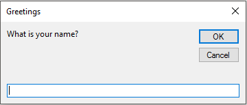

The VBA's `InputBox` function is useful for obtaining a single piece of information from the user. 

That information could be *a value*, *a text string*, or even *a range address*. 

This is a good alternative to developing a `UserForm` when you need to get only one value.

## InputBox syntax

Here’s a simplified version of the syntax for the *InputBox* function:

```vb
' InputBox syntax
InputBox(prompt[, title][, default])
```

The InputBox function accepts the arguments listed in below.

| Arguments | What it means                                               |
| --------- | ----------------------------------------------------------- |
| prompt    | The text displayed in the input box.                        |
| Title     | The text displayed in the input box’s title bar (optional). |
| Default   | The default value for the user’s input (optional)           |


## An InputBox example

Here’s an example showing how you can use the *InputBox* function:

```vb
' InputBox example
TheName = InputBox("What is your name?", "Greetings")
```

When you execute this VBA statement, application displays the dialog box shown in below figure. 

Notice that this example uses only the first two arguments and does not supply a default value. 

When the user enters a value and clicks `OK`, the routine assigns the value to the variable `TheName`.



Please note that VBA’s *InputBox function* always returns a `string`, so if you need to get a value, your code will need to do some additional checking. 

The following example uses the *InputBox function* to get a number. 

It uses the `IsNumeric` function to check whether the *string* is a *number*. 

If the string does contain a number, all is fine. 

If the user’s entry cannot be interpreted as a number, the code displays a message box.

```vb
' InputBox example
Sub GetDrawingSheetNumber()
  Dim NumberOfSheets as String
  Prompt = "How many sheets drawing have?"
  NumberOfSheets = InputBox (Prompt)

  If NumberOfSheets = "" Then Exit Sub
  If (IsNumeric)NumberOfSheets Then
    '......[Some code here]....
    Else
    MsgBox "Please enter a number."
  End If
End Sub
```

