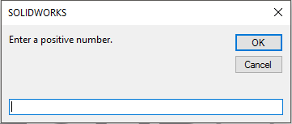
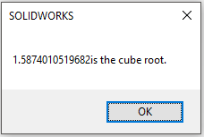

Although you may not know much about developing procedures at this point, I’m going to jump ahead a bit and discuss how to execute these procedures.

This is important because these procedures are worthless unless you know how to execute it.

## Executing Sub procedure

Executing a `Sub procedure` means the same thing as running or calling a `Sub procedure`.

You can use whatever terminology you like.

You can execute a `VBA Sub` in many ways - that’s one reason you can do so many useful things with `Sub procedures`.

Here’s a list of the ways to execute a `Sub procedure`:

- With the `Run -> Run Sub/UserForm` command (in the `VBE`). `VBE` executes the `Sub procedure` in which the cursor is located. This menu command has two alternatives: the `F5` key and the `Run Sub/UserForm` button on the Standard toolbar in the `VBE`. These methods don’t work if the procedure requires one or more arguments.
- From another `Sub procedure` that you write.
- From a custom item on the ribbon you develop.
- From the `Immediate window` in the `VBE`. Just type the name of the `Sub procedure` and press `Enter`.
- From `Run` **Macro** -> **Select Macro** you want to run. By this, your macro runs the `Sub procedure` without opening `VBE`.

I demonstrate some of these techniques in the following sections.

Before I can do that, you need to enter a `Sub procedure` into a `VBA` module as suggested below:

- Open the VBE in *Solidworks*.
- Enter the following code into your module

   
   

```vb {lineNos=true lineNoStart=1}
   Sub CubeRoot()
      Number = InputBox("Enter a positive number.")
      MsgBox number ^ (1/3) & "is the cube root."
   End Sub
   ```

   
   

This procedure asks the user for a *number* and then displays that number’s cube root in a `message box`.

Below Figures shows what happens when you execute this procedure.



I entered 4 as input value. And get result as shown in below image.



By the way, `CubeRoot` is not an example of a good macro. It doesn’t check for errors, so it fails easily.

To see what I mean, try clicking the `Cancel` button in the *input box* or entering a *negative number*.

### Executing the Sub procedure directly

The **quickest** way to execute this procedure is by doing so directly from the VBA module in which you defined it.

Follow these steps:

- Activate the `VBE` and select the `VBA module` that contains the procedure.
- Move the cursor anywhere in the procedure’s code.
- Press `F5` (or choose `Run -> Run Sub/UserForm`).
- Respond to the input box and click `OK`.
- The procedure displays the `cube root` of the number you entered.

You can’t use the `Run -> Run Sub/UserForm` command to execute a `Sub procedure` that uses arguments, because you have no way to pass the arguments to the procedure.

If the procedure contains *one* or *more arguments*, the only way to execute it is to call it from `another procedure` — which must supply the argument(s).

---

### Executing the Sub procedure from another procedure

You can also execute a `Sub procedure` from another procedure.

Follow these steps if you want to give this a try:

- Activate the `VBA` module that holds the `CubeRoot` routine.
- Enter this new procedure (either above or below `CubeRoot` code — it makes no difference):

   
   

```vb {lineNos=true lineNoStart=1}
   Sub NewSub()
      Call CubeRoot
   End Sub
   ```

   
   

- Execute the NewSub macro.

The easiest way to do this is to move the cursor anywhere within the `NewSub` code and press `F5`.
Notice that this NewSub procedure simply executes the CubeRoot procedure.


Please note that the keyword `Call` is optional. The statement can consist of only the Sub procedure’s name. I find that using the `Call` keyword makes it perfectly clear that a procedure is being *called*.


---

## Executing Function procedure

`Function` procedures, unlike `Sub` procedures, can be only executed in only one way:

- By calling the function from another `Sub` procedure or `Function` procedure.

Try this simple function. Enter it into a VBA module:




```vb {lineNos=true lineNoStart=1}
Function CubeRoot()
   CubeRoot = number ^ (1/3)
End Function
```




This function is pretty bored — it merely calculates the cube root of the number passed to it as its argument.

It does provide a starting point for understanding `functions`.

It also presents an important concept about functions: **how to return the value**.

(You do remember that a function returns a value, right?)

Notice that the single line of code that makes up this `Function` procedure performs a calculation.

The result of the math (number to the power of 1⁄3) is assigned to the variable `CubeRoot`.

Not coincidentally, `CubeRoot` is also the name of the function.

To tell the function what value to return, you assign that value to the name of the function.

### Executing the Function procedure from a Sub procedure

Because you can’t execute a `function` directly, you must call it from another procedure.

Enter the following simple procedure in the same `VBA` module that contains the `CubeRoot` function:




```vb {lineNos=true lineNoStart=1}
Sub CubeRoot()
   Ans = CubeRoot(125)
   MsgBox Ans
End Sub
```




When you execute the `CubeRoot` procedure (using any of the methods described earlier), your software displays a message box that contains the value of the `Ans` variable, which is **5**.

Here’s what’s going on:

- `CubeRoot(125)` means it `CubeRoot` receive argument of *125*.
- Then `Function CubeRoot(number)` is executed. As described previously, number is an argument. And here the value of this is *125*.
- Then by **number ^ (1/3)** we get the cube of 125. (why? Because *125* is argument passed by the `sub` function and this *125* is the value of *number*.)
- After that cube value of *125*, i.e. *5*, is assigned to or given to or equal to `CubeRoot`. This `CubeRoot` assigned to or given to or equal to `Ans`. After that message boxes show the value of *5* in your screen.


Please read again if you don’t understand what is going on here.


Next post will be about ***Programming Concepts, Comments and Data-types***.
