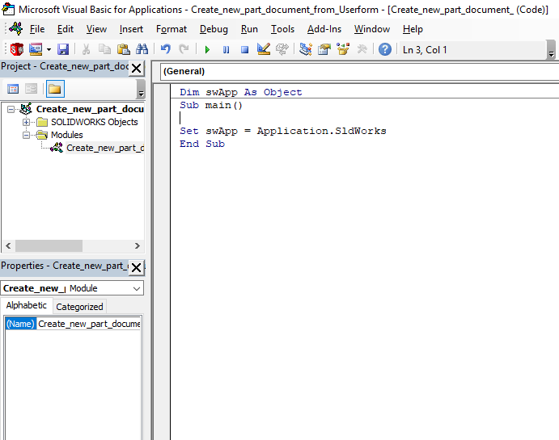
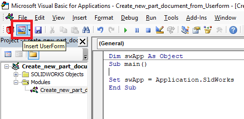
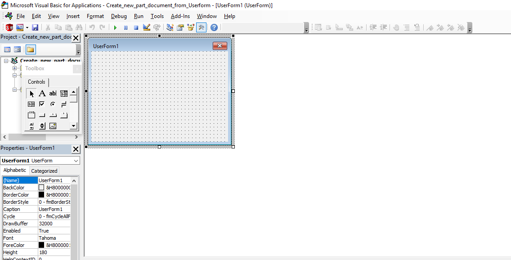
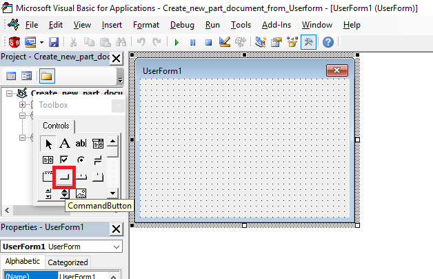
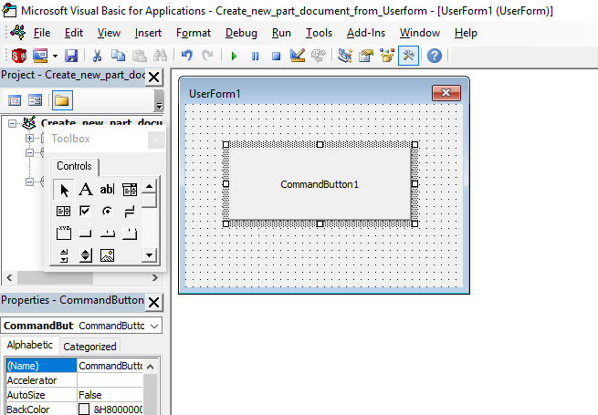
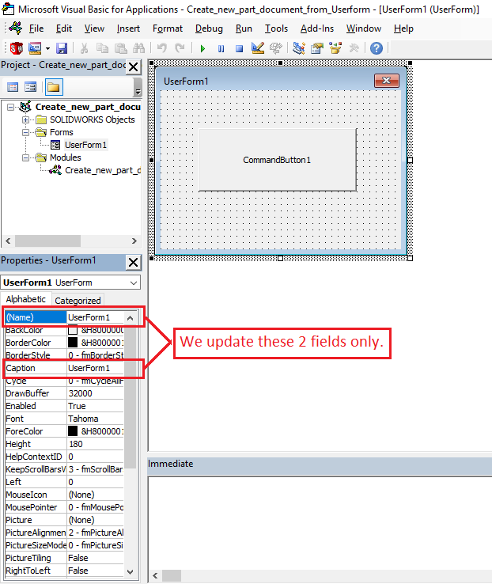

In this post, we learn how can we *open a part document* from a Visual Basic for Application's *Userform*.

For this please we need to do following steps as described below.

## Video of Code on YouTube

Please see below video on **Solidworks VBA Macro - Open new Part document** in Solidwoks VBA Userforms.

<iframe src="https://www.youtube.com/embed/pXMMSDeXEwo" frameborder="0" allowfullscreen></iframe>
<br>



Please note that there are **no explaination** in the video. 

**Explaination** of each line and why we write code this way is given in this post.

## Create a new macro

1st we need to create a **new macro** in *Solidworks 3D CAD Software*.

If you don't know how to create a new macro in Solidworks, please go to [VBA in Solidworks](/solidworks-macros/vba-in-solidworks) post for this.

This will open a new macro in Visual Basic Editor with some code as shown in below image.



## Insert userform in the macro

After this we need to insert a userform in our macro.

For this, select the button shown in below image.


This button is called ***insert userform***. 

As the name suggest, function of this button is *inserting a userform*.



Please note that in a macro we can insert any number of userform as we like. But for this example we insert only 1 userform.



After clicking the ***insert userform*** button we get the userform window as shown in below image.



## Adding a Button

Now in our userform window, we add a `Command Button` at center of window.

You can find `Command Button` highlighted in red in below image.


You can place command button at your desire. I placed it at center of the userform window as shown in below image.



## Updating Properties of Command Button and Userform Windows

Now we update some properties of Command Button and Userform Windows for our use.



It is not necessary to update properties but it is a good habit to update them for our purpose. 



1st we update the properties of Userform.

In below image, I have shown the properties of `Userform1` and update following properties:

1. Name of Userform

2. Caption of Userform



Update the value of *Name* property from `UserForm1` to `OurWindow`.



From *Name* property, we access the Userform.



Update the value of *Caption* property from `UserForm1` to `Our Window`.



From *Caption* property, we update the text appears in the window of our Userform.



Now, we repeat the same process for Command Button.

1st we need to select the Command Button in the user form after that we update same properties of Command Button.

1. Name of Command Button

2. Caption of Command Button

Update the value of *Name* property from `CommandButton1` to `OpenNewPartButton`.



From *Name* property, we access the Command Button.



Update the value of *Caption* property from `CommandButton1` to `Open NewPart Button`.



From *Caption* property, we update the text appears in the Command Button of our Userform.



## Add Functionality to Open NewPart Button

To add functionality in our `Open NewPart Button`, just double click the `Open NewPart Button`.

This will add give some code behind the designer and opens the **code window** of Userform designer.




```vb {lineNos=true lineNoStart=1}
Private Sub OpenNewPartButton_Click()

End Sub
```



We need to update this code for opening new part after clicking the button.

For this replace all above code with below code.




```vb {lineNos=true lineNoStart=1}
Option Explicit

' Creating variable for Solidworks application
Dim swApp As SldWorks.SldWorks
' Creating variable for Solidworks document
Dim swDoc As SldWorks.ModelDoc2

' Private function of Open New Part Button 
Private Sub OpenNewPartButton_Click()

    ' Setting Solidworks variable to Solidworks application
    Set swApp = Application.SldWorks
    
    ' Creating string type variable for storing default part location
    Dim defaultTemplate As String
    ' Setting value of this string type variable to "Default part template"
    defaultTemplate = swApp.GetUserPreferenceStringValue(swUserPreferenceStringValue_e.swDefaultTemplatePart)

    ' Setting Solidworks document to new part document
    Set swDoc = swApp.NewDocument(defaultTemplate, 0, 0, 0)

End Sub
```



