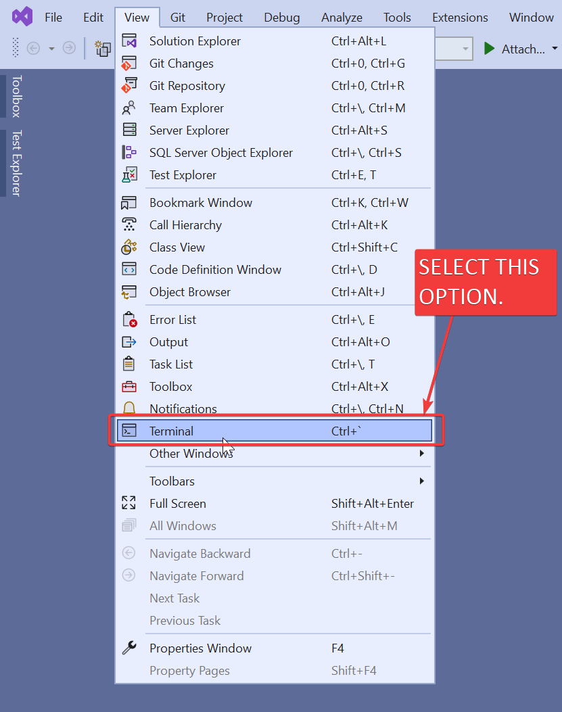
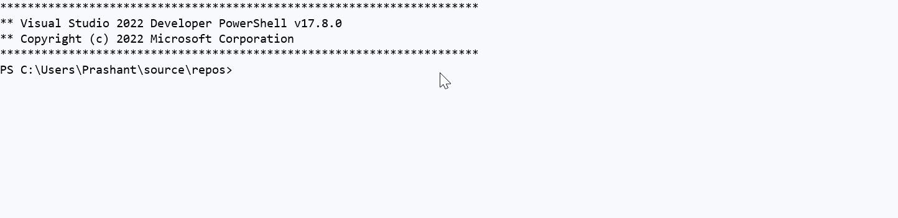

Hello all,

As mentioned in previous article, I need to learn some topics for my work.

One of those topics is Wix4 Toolset.

In this article we understand

- Why Wix?
- What is Wix?
- How to install Wix4 Toolset?


## Why Wix

Wix is used for creating MSI packages.

As you know, MSI packages are reponsible for installing software into our Windows machine.

We already had **Visual Studio Installer package**.

But for some of our requirements I need to learn about it.

If you browse internet for *Wix4 tutorials*, there are very few.

So for my future purpose, I want to write what I have learnt from various place into my website.

---

## What is Wix

Please see below 👇🏻 information about **Wix4 Toolset**.

**Official Website**: **

**Description**: _Wix Toolset is a set of tools, developers use to create Windows Installation Experience_.

**Official Doc**: __

---

## How To Install Wix4

**IDE**: __

Click above link to download 🚀 ****

- Open **Visual Studio 2022 Community**

- In "**Home**" screen of Visual Studio, select "**Continue without code**" option as shown in below 👇🏻 image.


- This open Visual Studio **without any project/solution** as shown in below 👇🏻 image.


- Select "**View**" ➡️ "**Terminal**" for opening _Terminal_ as shown in below 👇🏻 image.



- This will open "**Terminal**" window as shown in below 👇🏻 image.


- Run below command to install "**Wix.exe**" .Net tool.




```powershell {lineNos=true lineNoStart=1}
dotnet tool install --global wix
```




- Please see below image for installing "**Wix.exe**".



- For checking if Wix is install or not, check Wix version by run following command.




```powershell {lineNos=true lineNoStart=1}
wix --version
```




- Please see below image for checking version of "**Wix.exe**".


---

That's it!!! 

In next article we will install **"Free Heatwave Wix4 Extension"**.

Hope this post helps you.

*If you like the post then please share it with your friends also.*

*Do let me know by you like this post or not!*

*Till then, Happy learning!!!*
