In this article we 

- _Install Wix4 Visual Studio Extension_



This extension help us to create Wix4 project.



---

## Demo Video

Please see below video on how to "**Install Wix4 Visual Studio Extension**".





Please note that there are **no explanation** in the video. 
**Explanation** of each step and why we write code this way is given in this post.



---

## Open Visual Studio

**IDE**: __

Click above link to download 🚀 ****

- Open **Visual Studio 2022 Community**

- In "**Home**" screen of Visual Studio, select "**Continue without code**" option as shown in below 👇🏻 image.

- This open Visual Studio **without any project/solution** as shown in below 👇🏻 image.

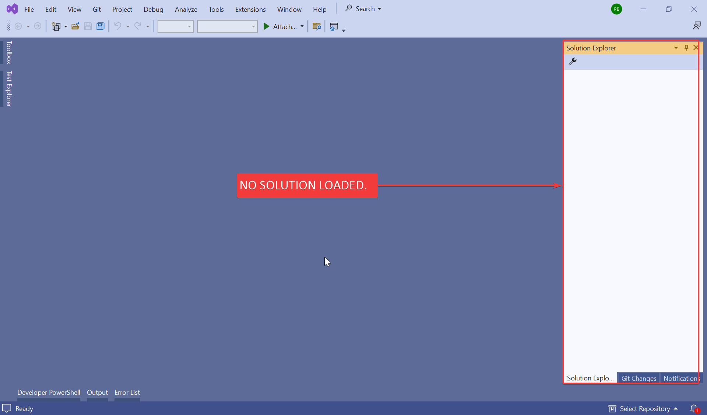

---

## Install Extension

**Extension Name**: _HeatWave for VS2022_

- Open **Extension window** in _Visual Studio 2022_ and search for __HeatWave for VS2022__ as shown in below 👇🏻 image.

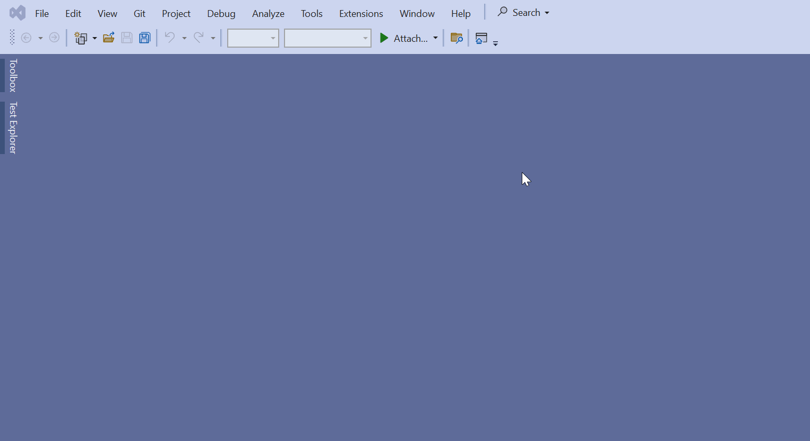

- Now select "**Download**" option as shown in below 👇🏻 image.

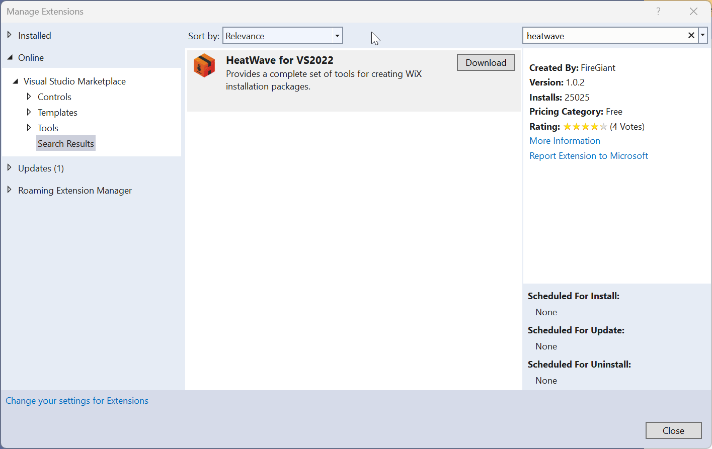

- After download **close** Visual Studio.

- When we close Visual Studio, _a pop-up of VSIX Installer will come_ as shown in below 👇🏻 image.

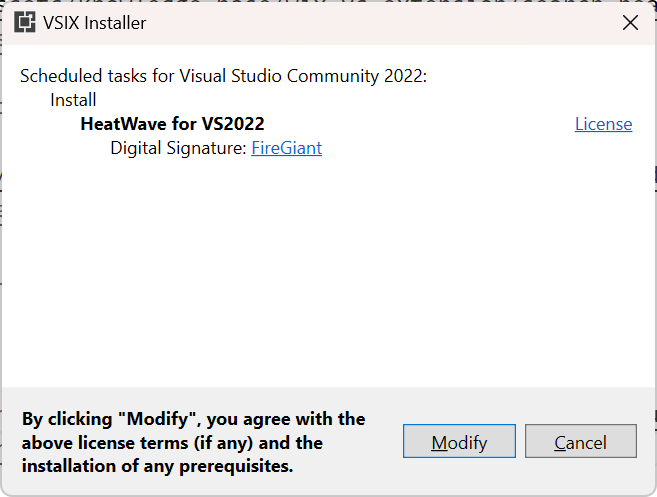

- Now select "**Modify**" button, _this will install extension_ as shown in below 👇🏻 image.

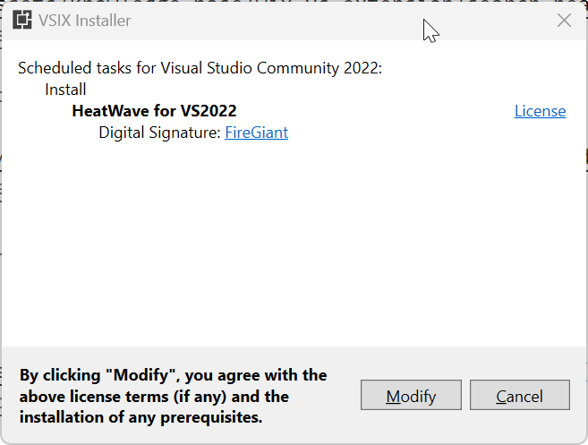

---

## Check Wix Project Template

- Now **open Visual Studio** and select **Create New Solution** option as shown in below 👇🏻 image.

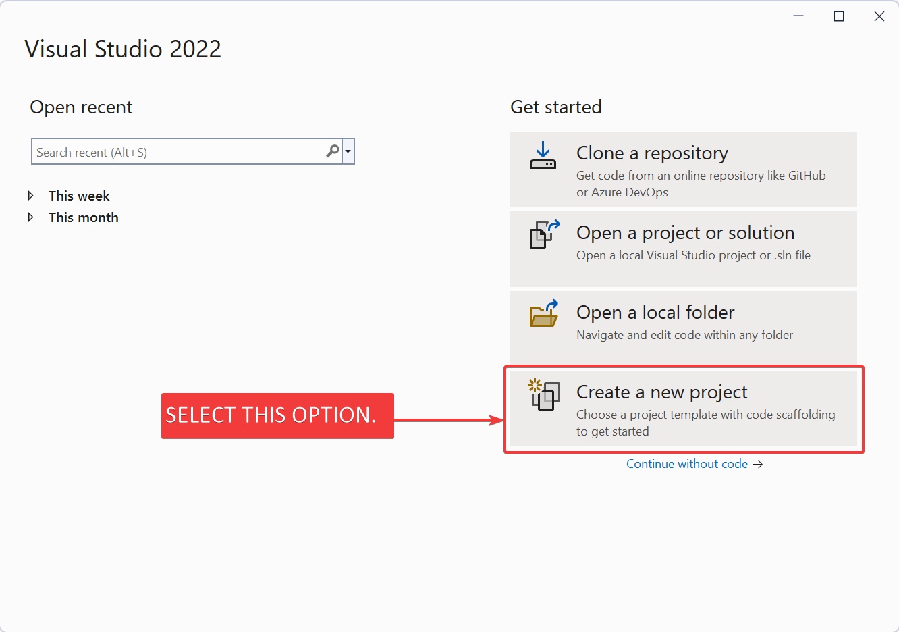

- This will _open a new screen_ which **shows Wix options** as shown in below 👇🏻 image.

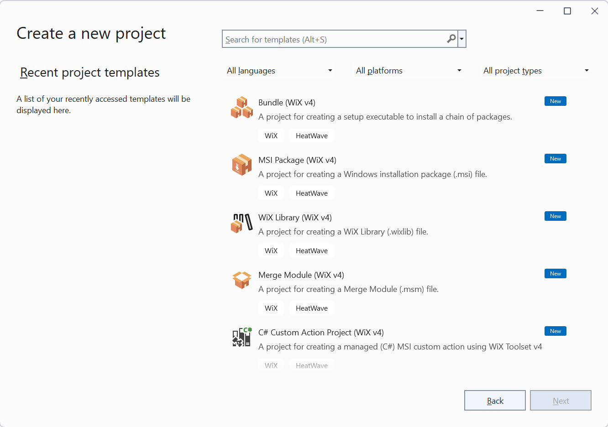

- In this screen, we select **MSI Package (Wix v4)** option for creating _MSI package_ as shown in below 👇🏻 image.

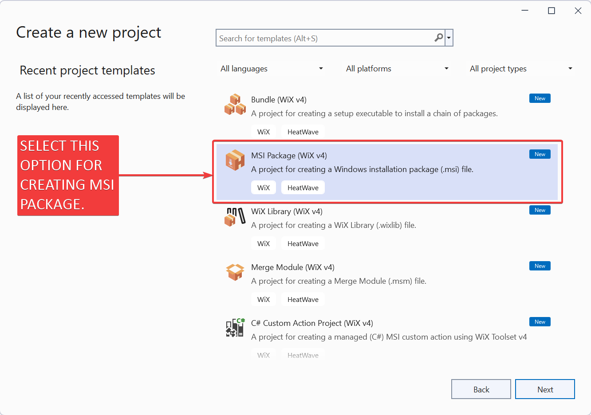

- Now select "**Next**" option as shown in below 👇🏻 image.

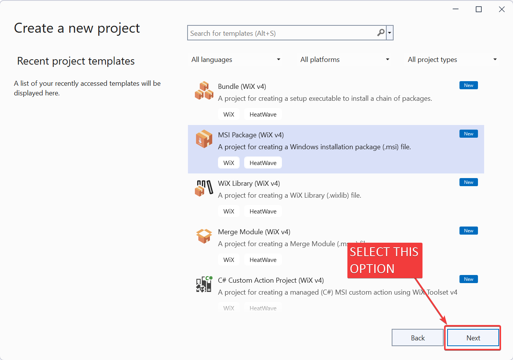

- In _next screen_ we define following screen.

  - **Project Name**
  - **Location of Solution**
  - **Name of Solution**

Please see below 👇🏻 image for reference.

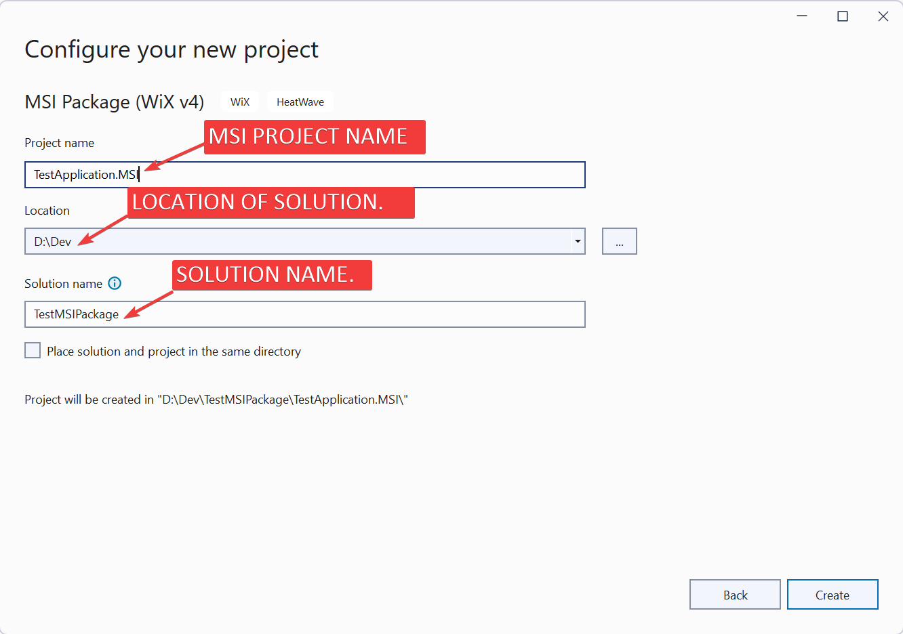

- Now select "**Create**" option as shown in below 👇🏻 image.

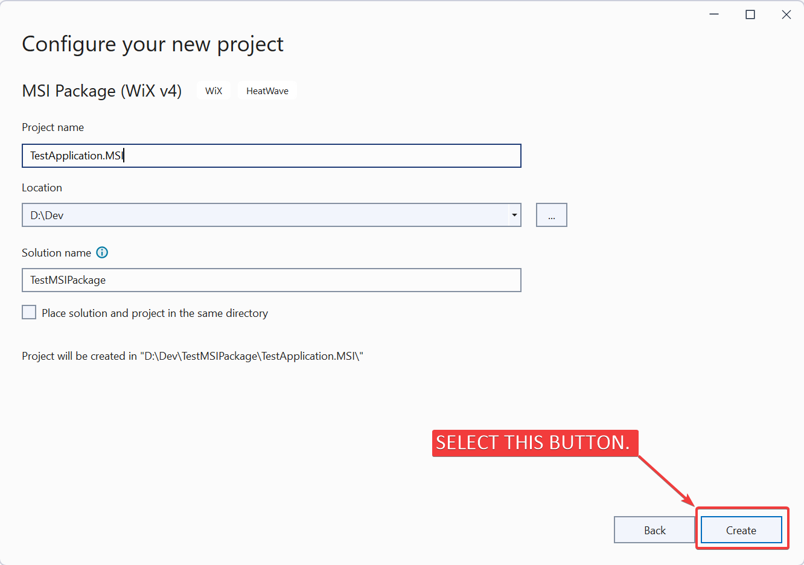

- This will create **new Solution with Wix V4 project** as shown in below 👇🏻 image.

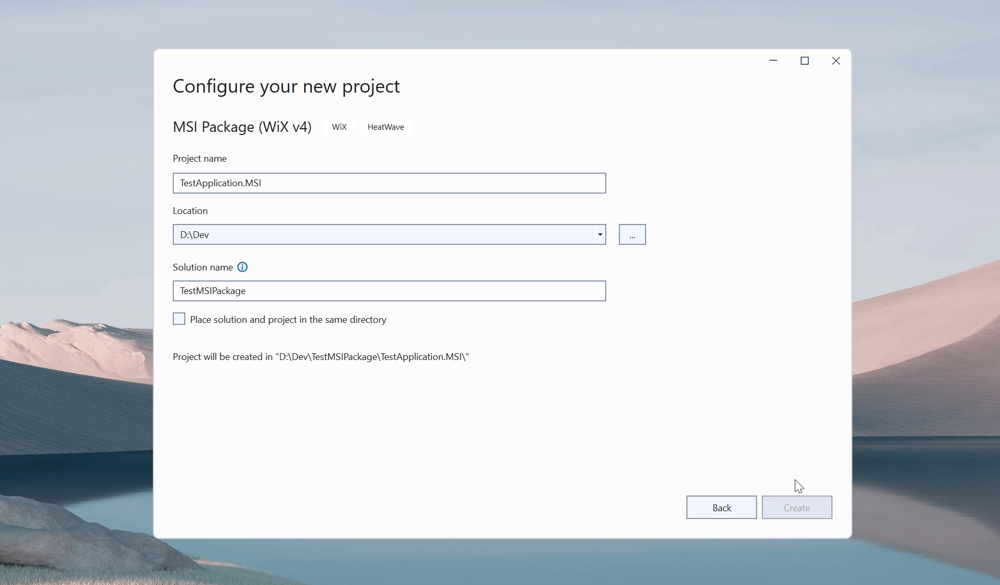

---

That's it!!! 

In next article we will understand **"File Structure of Wix V4 project"**.

Hope this post helps you.

*If you like the post then please share it with your friends also.*

*Do let me know by you like this post or not!*

*Till then, Happy learning!!!*
