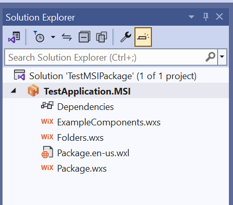
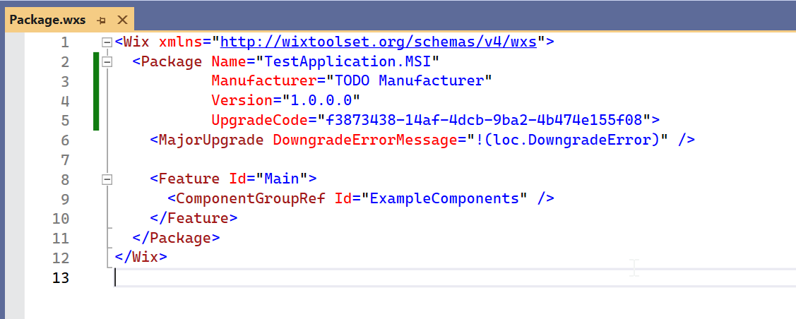

In this article we 

- _Understand **Wix V4 Files** and **Project Structure**_

  - _Different types of files in Project_
  - _Purpose of those files_

---

## Wix Project

In previous 🚀 **[Wix4 Visual Studio Extension](/knowledge-base/wix-vs-extension)** article, we created a new Wix V4 project.

Please see below 👇🏻 image of **Visual Studio** for reference.

[](wix-understand-project/wix-project-structure.png)

**WiX v4 MSI Package template** gives us _four files_.

In order of importance, they are:

1) **Package.wxs**<br/>
2) **Folders.wxs**<br/>
3) **ExampleComponents.wxs**<br/>
4) **Package.en-us.wxl**<br/>

---

## File Extensions

The files have two extensions:

- **`.wxs`**
- **`.wxl`**



_wxs_: **W**i**X S**ource file<br/>
_wxl_: **W**i**X L**ocalization file



---

## Understand [Package.wxs]

Below image show content of **`Package.wxs`**

[](wix-understand-project/package.wxs-file.png)




```xml {lineNos=true lineNoStart=1}
<Wix xmlns="http://wixtoolset.org/schemas/v4/wxs">
  <Package Name="TestApplication.MSI" 
           Manufacturer="TODO Manufacturer" 
           Version="1.0.0.0" 
           UpgradeCode="f3873438-14af-4dcb-9ba2-4b474e155f08">
    <MajorUpgrade DowngradeErrorMessage="!(loc.DowngradeError)" />

    <Feature Id="Main">
      <ComponentGroupRef Id="ExampleComponents" />
    </Feature>
  </Package>
</Wix>
```





### [Wix] Element

In this section, we understand [**`Wix`**] Element.




```xml {lineNos=true lineNoStart=1}
<Wix xmlns="http://wixtoolset.org/schemas/v4/wxs">

</Wix>
```




*XML Root Element*:

  - Source code we write for Wix project is **`xml`**.<br>
  - Every **`XML`** file has a root element.<br>
  - WiX source files, that root element is **`Wix`**.<br>
  - In above code sample, **`<Wix> </Wix>`** is root element.


Every **`XML`** element has a namespace.
For **`WiX`** element, 
  - namespace = **`http://wixtoolset.org/schemas/v4/wxs`**.

---

### [Package] Element

In this section, we understand [**`Package`**] element.




```xml {lineNos=true lineNoStart=1}
<Package Name="TestApplication.MSI" 
         Manufacturer="TODO Manufacturer" 
         Version="1.0.0.0" 
         UpgradeCode="f3873438-14af-4dcb-9ba2-4b474e155f08">

</Package>
```




- [**`Package`**] element describes about **MSI** package.
- [**`Package`**] element has **attributes** and **child elements** that *define* everything about an MSI package.




**Name**="TestApplication.MSI"
**Manufacturer**="TODO Manufacturer" 
**Version**="1.0.0.0"
**UpgradeCode**="f3873438-14af-4dcb-9ba2-4b474e155f08"





Above attributes are **REQUIRED**.<br>
Without them Wix will **not work**.<br>



**Name**: 
  - The **`Name`** attribute sets the **name** of the package. 
  - This **name** is shown in the **_Installed apps_** list. 

**Manufacturer**: 
  - The **`Manufacturer`** attribute sets the **name** of the _company_ that created the software included in the installer. 
  - This string is shown in **_Add/Remove Programs_**.

**Version**
  - The **`Version`** attribute sets the **version** of the package.
  - The package version is shown in **_Add/Remove Programs_**.
  - **Package versions** are an important part of managing upgrades between packages. 
  - *Versions* typically have **four** parts -- **`major.minor.build.patch`** 

**UpgradeCode**
  - The **UpgradeCode** attribute is important to recognize a package.
  - This **UpgradeCode** attribute is a GUID [**`Globally Unique Identifier`**]

---

### [MajorUpgrade] Element

In this section, we understand [**`MajorUpgrade`**] element.




```xml {lineNos=true lineNoStart=1}
<MajorUpgrade DowngradeErrorMessage="!(loc.DowngradeError)" />
```




**MajorUpgrade**
  - The **`MajorUpgrade`** Element is important to recognize a package.
  - It link with **`UpgradeCode`** code we discuss previously.
  - When we try to install a **lower version** than the version that's already installed.
  - The **`DowngradeErrorMessage`** attribute let us specify a message to be shown.
  - The **`!(loc.DowngradeError)`** syntax is a reference to a localization string i.e. string message to shown.

---

### [Feature] Element

In this section, we understand [**`Feature`**] element.




```xml {lineNos=true lineNoStart=1}
<Feature Id="Main">
  
</Feature>
```




- MSI lets you have a hierarchy of features in a package to control what gets installed.

- Currently features aren't shown, but MSI still requires at least one feature.

---

### [ComponentGroupRef] Element

In this section, we understand [**`ComponentGroupRef`**] element.




```xml {lineNos=true lineNoStart=1}
<ComponentGroupRef Id="ExampleComponents" />
```




- We have our first XML parent/child relationship. 
- The **`ComponentGroupRef`** element is a child of the _Feature element_.
- The **`ComponentGroupRef`** element is used to "__fill__" the feature described by the **`Feature`** element.
- The **`ComponentGroupRef`** element "__fill__" the feature by **components**, **references**, and **groups**.

---

## Understand [Folders.wxs]

Below image show content of **`Folders.wxs`**

[](wix-understand-project/folder.wxs-file.png)




```xml {lineNos=true lineNoStart=1}
<Wix xmlns="http://wixtoolset.org/schemas/v4/wxs">
  <Fragment>
    <StandardDirectory Id="ProgramFiles6432Folder">
      <Directory Id="INSTALLFOLDER" 
                 Name="!(bind.Property.Manufacturer) !(bind.Property.ProductName)" />
    </StandardDirectory>
  </Fragment>
</Wix>
```




---

### [Wix] Element

In this section, we understand [**`Wix`**] Element.




```xml {lineNos=true lineNoStart=1}
<Wix xmlns="http://wixtoolset.org/schemas/v4/wxs">

</Wix>
```




[**`Folders.wxs`**] has the same root element and namespace as for [**`Package.wxs`**]. 

The same is true of every WiX source file.

*XML Root Element*:

  - Source code we write for Wix project is **`xml`**.<br>
  - Every **`XML`** file has a root element.<br>
  - WiX source files, that root element is **`Wix`**.<br>
  - In above code sample, **`<Wix> </Wix>`** is root element.


Every **`XML`** element has a namespace.
For **`WiX`** element, 
  - namespace = **`http://wixtoolset.org/schemas/v4/wxs`**.

---

### [Fragment] Element

In this section, we understand [**`Fragment`**] element.




```xml {lineNos=true lineNoStart=1}
<Fragment>

</Fragment>
```




In [**`Folders.wxs`**] file, [**`Fragment`**] is main element.

[**`Fragment`**] is a way to organize authoring. 

In [**`Folders.wxs`**], there is one [**`Fragment`**] that contains authoring that's referenced from [**`Package.wxs`**].

You can have multiple [**`Fragments`**] in a single [**`.wxs`**] file. 

---

### [StandardDirectory] Element

In this section, we understand [**`StandardDirectory`**] element.




```xml {lineNos=true lineNoStart=1}
<StandardDirectory Id="ProgramFiles6432Folder">

</StandardDirectory>
```




The [**`StandardDirectory`**] element lets you use one of the standard directories as the parent directory of our package's directories.

There are large amount of possible parent directories.



Please visit 🚀**[StandardDirectoryType Types](https://wixtoolset.org/docs/schema/wxs/standarddirectorytype/){:target="_blank"}** page to get a list of all possible parent directories.



Below are the WiX standard directories:
  - **`CommonFiles6432Folder`**
  - **`ProgramFiles6432Folder`**
  - **`System6432Folder`**



Above ids are special.



WiX picks the **appropriate directory** based on the _bitness of the package_.

With a **`32-bit`** package, **`ProgramFiles6432Folder`** resolves as **`ProgramFilesFolder`**, which is typically **`C:\Program Files (x86)`**.

With a **`64-bit`** package, **`ProgramFiles6432Folder`** resolves as **`ProgramFiles64Folder`**, which is typically **`C:\Program Files`**.

---

### [Directory] Element

In this section, we understand [**`Directory`**] element.




```xml {lineNos=true lineNoStart=1}
<Directory Id="INSTALLFOLDER" 
           Name="!(bind.Property.Manufacturer) !(bind.Property.ProductName)" />
```




The [**`Directory`**] element _creates a new directory_ as a _child directory_ of the directory identified in its parent directory.

[**`Id`**] : The **`Id`** attribute specify an id that we'll use when referencing this directory.

[**`Name`**] : The **`Name`** attribute is the name of the directory on disk.

As we defined various attributes in [**`Package.wxs`**] element.

We can indirectly reference those attributes in our **`Name`** attribute.

**`!(bind.Property.Manufacturer)`** takes the value of the **[Package/Manufacturer]** attribute

**`!(bind.Property.ProductName)`** takes the value of the [**Package/Name**] attribute.

So




```xml {lineNos=true lineNoStart=1}
<Directory Id="INSTALLFOLDER" 
           Name="TODO Manufacturer !(bind.Property.ProductName)" />
```




is equivalent to




```xml {lineNos=true lineNoStart=1}
<Directory Id="INSTALLFOLDER" 
           Name="TODO Manufacturer TestApplication.MSI" />
```




---

## Understand [ExampleComponents.wxs]

Below image show content of **`ExampleComponents.wxs`**

[](wix-understand-project/ExampleComponents.wxs-file.png)




```xml {lineNos=true lineNoStart=1}
<Wix xmlns="http://wixtoolset.org/schemas/v4/wxs">
  <Fragment>
    <ComponentGroup Id="ExampleComponents" Directory="INSTALLFOLDER">
      <Component>
        <File Source="ExampleComponents.wxs" />
      </Component>
    </ComponentGroup>
  </Fragment>
</Wix>
```




---

### [Wix] Element




```xml {lineNos=true lineNoStart=1}
<Wix xmlns="http://wixtoolset.org/schemas/v4/wxs">

</Wix>
```




[**`ExampleComponents.wxs`**] has the same root element and namespace as for [**`Package.wxs`**]. 

The same is true of every WiX source file.

---

### [Fragment] Element

[**`Fragment`**] element is same as we discussed 🚀 **[previously](/knowledge-base/wix-understand-project/#fragment-element)**.




```xml {lineNos=true lineNoStart=1}
<Fragment>

</Fragment>
```




---

### [ComponentGroup] Element

In this section, we understand [**`ComponentGroup`**] element.




```xml {lineNos=true lineNoStart=1}
<ComponentGroup Id="ExampleComponents" Directory="INSTALLFOLDER">
  
</ComponentGroup>
```




This is the very same _component group_ that we referenced with a [**`ComponentGroupRef`**] element, back in [**`Package.wxs`**], under the [**`Feature`**] element.

All the components are grouped together and brought in as one piece under the parent feature i.e. [**`ComponentGroup`**] element.

[**`Id`**] : The **`Id`** attribute specify an id that we'll use when referencing this [**`ComponentGroup`**] element.
  - Name of [**`ComponentGroup`**] element is **`ExampleComponents`**.

[**`Directory`**] : The **`Directory`** attribute is the name of the directory on disk under which all files get installed.

---

### [Component] Element

In this section, we understand [**`Component`**] element.




```xml {lineNos=true lineNoStart=1}
<Component>
  <File Source="ExampleComponents.wxs" />
</Component>
```




- There is ONLY one [**`component`**] in our [**`ComponentGroup`**] element.

- This [**`component`**] has a single file in it. 

- The name of that file is [**`ExampleComponents.wxs`**]. 

---

## Understand [Package.en-us.wxl]

Below image show content of **`Package.en-us.wxl`**

[](wix-understand-project/Package.en-us.wxl-file.png)




```xml {lineNos=true lineNoStart=1}
<!--
This file contains the declaration of all the localizable strings.
-->
<WixLocalization xmlns="http://wixtoolset.org/schemas/v4/wxl" Culture="en-US">

  <String Id="DowngradeError" 
          Value="A newer version of [ProductName] is already installed." />

</WixLocalization>
```




```xml
<!--
This file contains the declaration of all the localizable strings.
-->
```

- This is an xml comment we write as a Note for us.

```xml
<WixLocalization xmlns="http://wixtoolset.org/schemas/v4/wxl" Culture="en-US">
```

As **localization files** are not [**`WiX`**] source files, they use a **different** root element and namespace.

[**`Culture`**] : The **`Culture`** attribute identifies the *culture (language and region)* used in the localization.

> [**`Culture`**] is the name of a culture following the rules of the 🚀 **[.NET](https://learn.microsoft.com/en-us/dotnet/api/system.globalization.cultureinfo#culture-names-and-identifiers)** [**`CultureInfo`**] 🚀 [class](https://learn.microsoft.com/en-us/dotnet/api/system.globalization.cultureinfo#culture-names-and-identifiers) which itself follows the Internet standard.

```xml
<String Id="DowngradeError" 
        Value="A newer version of [ProductName] is already installed." />
```

- Localization files usually contain a number of strings.

- Each string has an [**`id`**] and a [**`value`**].

- [**`DowngradeError`**] string is used back in [**`Package.wxs`**] to provide an *error message* for the [**`MajorUpgrade`**] element:

```xml
<MajorUpgrade
  DowngradeErrorMessage="!(loc.DowngradeError)" />
```

- The [**`!(loc.DowngradeError)`**] syntax is how you **refer** to a localization string by its [**`id`**].


---

That's it!!! 

Hope this post helps you.

*If you like the post then please share it with your friends also.*

*Do let me know by you like this post or not!*

*Till then, Happy learning!!!*