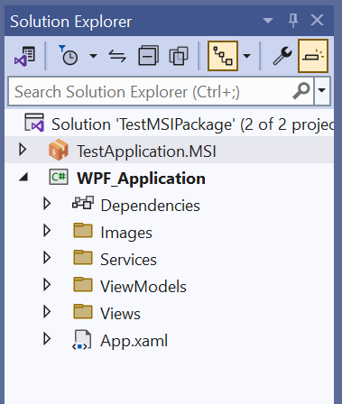

In this article we create MSI Details for Add/Remove Program details.

Please see below 👇🏻 image of **Visual Studio** for reference.

[](wix-add-remove-program-details/add-remove-msi-details.png)

---

## Add [WPF Project]

For this demo, I added a sample WPF Project.

Please see below 👇🏻 image of [**sample WPF Project**] for reference.

[](wix-add-remove-program-details/add-wpf-project.png)

### Application Logo

In my sample WPF Project, application logo file is placed at below location.

_Logo File Location_: [**Images/logo.ico**]

Please see below 👇🏻 image for reference.

[](wix-add-remove-program-details/application-logo-file.png)

### Reference WPF Project

In our [**`TestApplication.MSI`**] project, we need to reference our **WPF Application**.

For this select [**`Dependencies`**] node as shown in below 👇🏻 image.

[](wix-add-remove-program-details/reference-wpf-project.png)

Right Click on [**`Dependencies`**] node and select [**`Add Project Reference`**] as shown in below 👇🏻 image.

[](wix-add-remove-program-details/select-project-reference.png)

This will show [**`Reference Manager`**] window as shown in below 👇🏻 image.

[](wix-add-remove-program-details/show-reference-manager-window.png)

Then select [**`CheckBox`**] in front of project you want to add as a [**`Primary Project`**] as shown in below 👇🏻 image.

[](wix-add-remove-program-details/select-project-in-reference-manager-window.png)

By this we complete the process of *referencing WPF Project* into our *Wix MSI Project* for further use.

---

## Update [Package.en-us.wxl]

In *Wix MSI Project* we need to add required variables into [**`Package.en-us.wxl`**] file.

First open [**`Package.en-us.wxl`**] file then add required variables.

Below variables are required.

- **`PackageName`**
- **`PackageManufacturer`**
- **`PackageUpgradeCode`**
- **`PackageProductCode`**

Please see below 👇🏻 image of [**`Package.en-us.wxl`**] file for reference.

[](wix-add-remove-program-details/required-variables.png)

Please see below code sample for example.




```xml {lineNos=true lineNoStart=1}
<!--
This file contains the declaration of all the localizable strings.
-->
<WixLocalization xmlns="http://wixtoolset.org/schemas/v4/wxl" Culture="en-US">

  <String Id="DowngradeError" 
          Value="A newer version of [ProductName] is already installed." />

  <String Id="PackageName" Value="AA Application" />
  <String Id="PackageManufacturer" Value="The CAD Coder" />
  <String Id="PackageUpgradeCode" Value="{58D55889-FFE4-4EA1-93FD-B8BA7F97EF22}" />
  <String Id="PackageProductCode" Value="{9D0FA41D-30B6-4A5B-A3E2-E3FCB697E0C2}" />

</WixLocalization>
```




- **`PackageName`**: This is **Name of MSI Package**.
- **`PackageManufacturer`**: This is **Name of Package Manufacturer**.
- **`PackageUpgradeCode`**: This is **Package UpgradeCode**. This is **very important** field. For one MSI package this is **always unique and never changes**.
- **`PackageProductCode`**: This is **Package Product Code**. This is also very important. For each MSI Version this **always change** otherwise while installing _MSI will give error of same version already installed_.

---

## Update [Package.wxs]

Below image show **`default`** content of **`Package.wxs`**

[](wix-understand-project/package.wxs-file.png)




```xml {lineNos=true lineNoStart=1}
<Wix xmlns="http://wixtoolset.org/schemas/v4/wxs">
  <Package Name="TestApplication.MSI" 
           Manufacturer="TODO Manufacturer" 
           Version="1.0.0.0" 
           UpgradeCode="f3873438-14af-4dcb-9ba2-4b474e155f08">
    <MajorUpgrade DowngradeErrorMessage="!(loc.DowngradeError)" />

    <Feature Id="Main">
      <ComponentGroupRef Id="ExampleComponents" />
    </Feature>
  </Package>
</Wix>
```




Below image show **`updated`** content of **`Package.wxs`** 

[](wix-add-remove-program-details/updated-package-file.png)




```xml {lineNos=true lineNoStart=1}
<Wix xmlns="http://wixtoolset.org/schemas/v4/wxs">

  <?define BuildVersion= 1.0.0.0 ?>
  
  <Package Name="!(loc.PackageName)" 
           Manufacturer="!(loc.PackageManufacturer)" 
           Version="$(var.BuildVersion)" 
           Compressed="yes"
           Scope="perMachine"
           UpgradeCode="!(loc.PackageUpgradeCode)"
           ProductCode="!(loc.PackageProductCode)">

    <MajorUpgrade DowngradeErrorMessage="!(loc.DowngradeError)" />

    <MediaTemplate EmbedCab="yes"/>

    <Icon Id="icon.exe" SourceFile="$(WPF_Application.ProjectDir)\Images\logo.ico"/>
    <Property Id="ARPPRODUCTICON" Value="icon.exe" />
    
    <Feature Id="Main">
      <ComponentGroupRef Id="ApplicationComponents" />
    </Feature>
  </Package>
</Wix>
```




---

### Local Variable

Below line represent a variable in Wix.




```xml {lineNos=true lineNoStart=1}
<?define BuildVersion= 1.0.0.0 ?>
```




We create variable by **`<?define ?>`** tag.

Above we created a variable with:

  - *Name*: **`BuildVersion`**
  - *Value of Variable*: **`1.0.0.0`**

For accessing value of variable **`BuildVersion`** we use **`$(var.BuildVersion)`**.

Please see below 👇🏻 image of for reference.

[](wix-add-remove-program-details/create-buildversion-variable.png)


---

### [Package] Element

In this section, we understand updated [**`Package`**] element.




```xml {lineNos=true lineNoStart=1}
<Package Name="!(loc.PackageName)" 
         Manufacturer="!(loc.PackageManufacturer)" 
         Version="$(var.BuildVersion)" 
         Compressed="yes"
         Scope="perMachine"
         UpgradeCode="!(loc.PackageUpgradeCode)"
         ProductCode="!(loc.PackageProductCode)">

</Package>
```




**Name**: 
  - Sets the **name** of the package. 
  - Value: **`!(loc.PackageName)`**
  - **`!(loc.PackageName)`** means, search for variable in Wix Localization file (in our case [**`Package.en-us.wxl`**] file), whose name is **`PackageName`**, and set its value here.



[**`!(loc.VariableName)`**] is how you call the value of variable define in Wix Localization file.



Please see below 👇🏻 image of for reference.

[](wix-add-remove-program-details/name-property-value.png)

**Manufacturer**: 
  - Sets the **name** of the _company_ that created the software included in the installer. 
  - Value: **`!(loc.PackageManufacturer)`**
  - **`!(loc.PackageManufacturer)`** means, search for variable in Wix Localization file (in our case [**`Package.en-us.wxl`**] file), whose name is **`PackageManufacturer`**, and set its value here.

Please see below 👇🏻 image of for reference.

[](wix-add-remove-program-details/manufacture-property-value.png)

**Version**
  - Sets the **version** of the package.
  - Value: **`$(var.BuildVersion)`**
  - **`$(var.BuildVersion)`** means, search for variable in Wix Source file (in our case [**`Package.wxs`**] file), whose name is **`BuildVersion`**, and set its value here.



[**`$(var.BuildVersion)`**] is how you call the value of variable define in Wix Source file. They are also Local variables as we defined previously.



Please see below 👇🏻 image of for reference.

[](wix-add-remove-program-details/version-property-value.png)


**Compressed**
  - Compressed files.
  - Value accepted: **`"Yes/true"`** OR **`"No/false"`**
  - Current Value: **`Yes`**

Please see below 👇🏻 image of for reference.

[](wix-add-remove-program-details/compressed-option.png)

**Scope**
  - To define the installation scope of package:
    -	_Per-machine_
    -	_Per-user_
  - Value accepted: **`"perMachine"`** OR **`"perUser"`** OR **`perUserOrMachine`**
  - Current Value: **`perMachine`**

Please see below 👇🏻 image of for reference.

[](wix-add-remove-program-details/scope-options.png)

**UpgradeCode**
  - The **UpgradeCode** attribute is important to recognize a package. 
  - This property will is fix for every package.
  - This means once you define, we don’t need to change it when we release a new version of this package.
  - Value: **`!(loc.PackageUpgradeCode)`**
  - **`!(loc.PackageUpgradeCode)`** means, search for variable in Wix Localization file (in our case [**`Package.en-us.wxl`**] file), whose name is **`PackageUpgradeCode`**, and set its value here.

Please see below 👇🏻 image of for reference.

[](wix-add-remove-program-details/upgrade-property-value.png)

**ProductCode**
  - The **ProductCode** attribute is important to recognize a package. 
  - This property will is always change for every package.
  - This means we need to change it when we release a new version of this package.
  - Value: **`!(loc.PackageProductCode)`**
  - **`!(loc.PackageProductCode)`** means, search for variable in Wix Localization file (in our case [**`Package.en-us.wxl`**] file), whose name is **`PackageProductCode`**, and set its value here.

Please see below 👇🏻 image of for reference.

[](wix-add-remove-program-details/productcode-property-value.png)


---

### [MajorUpgrade] Element

In this section, we understand [**`MajorUpgrade`**] element.




```xml {lineNos=true lineNoStart=1}
<MajorUpgrade DowngradeErrorMessage="!(loc.DowngradeError)" />
```




**MajorUpgrade**
  - The **`MajorUpgrade`** Element is important to recognize a package.
  - It link with **`UpgradeCode`** code we discuss previously.
  - When we try to install a **lower version** than the version that's already installed.
  - The **`DowngradeErrorMessage`** attribute let us specify a message to be shown.
  - The **`!(loc.DowngradeError)`** syntax is a reference to a localization string i.e. string message to shown.

Please see below 👇🏻 image of for reference.

[](wix-add-remove-program-details/major-upgrade-message.png)

---

### [MediaTemplate] Element




```xml {lineNos=true lineNoStart=1}
<MediaTemplate EmbedCab="yes"/>
```




- [**MediaTemplate**] describe information to automatically assign files to cabinets.
- Maximum numbers of Cabinet files = 999

### [Cabinet] Files

- They are files created with MSI.
- We need to ship them with MSI for deployment.

Please see below 👇🏻 image of for reference.

[](wix-add-remove-program-details/cabinet-file.png)

- Personally I don't like to ship extra files for deployment.
- For this we embed cabinet files into MSI.
- We do this by specifying "[**`EmbedCab`**]" property.
- Set its value to "[**`yes`**]".

---

### [Icon] Element

Now we define [**`Icon`**] for MSI in _Add Remove Program_.

Please see below 👇🏻 code for reference.




```xml {lineNos=true lineNoStart=1}
<Icon Id="icon.exe" SourceFile="$(WPF_Application.ProjectDir)\Images\logo.ico"/>
```




We define 2 properties for [**`Icon`**] element.

1. **`Id`**
2. **`SourceFile`**

[**`Id`**] : _Id of Icon file._
[**`SourceFile`**] : _Path to Icon file._

Values we used.

[**`Id`**] : _icon.exe_
  - _It is important to write extension of file, on which we want to show icon._
  - _**Not** the file which we are referencing._
  - _In our case, we want to show icon for exe file._

[**`SourceFile`**] : _$(WPF_Application.ProjectDir)\Images\logo.ico_
  - In above line, we are giving path to our icon file.
  - *Icon* file is present inside "**Images**" folder of our Application project.
  - To access reference project we use [**`$(WPF_Application.ProjectDir)`**]

---

### [Property] Element

Now we define [**`Property`**] for *application icon* of MSI in _Add Remove Program_.

Please see below 👇🏻 image for reference.

[](wix-add-remove-program-details/icon-in-add-remove-program.png)

For this we need to use [**`Property`**] element and define its special ID and assign value of that special ID.

Please see below 👇🏻 code for reference.




```xml {lineNos=true lineNoStart=1}
<Property Id="ARPPRODUCTICON" Value="icon.exe" />
```




As shown in above code sample:

  - Tag = **`Property`**
  - Id = "**`ARPPRODUCTICON`**"
  - Value = "**`icon.exe`**"


---

### [Feature] Element

Already explained in previous 🚀 **[Understand Wix V4 Project](/knowledge-base/wix-understand-project#feature-element){:target="_blank"}** article.

---

### [ComponentGroupRef] Element

Already explained in previous 🚀 **[Understand Wix V4 Project](/knowledge-base/wix-understand-project#componentgroupref-element){:target="_blank"}** article.




```xml {lineNos=true lineNoStart=1}
<ComponentGroupRef Id="ApplicationComponents" />
```




I have renamed the [**Id**] from "[**ExampleComponents**]" to "[**ApplicationComponents**]".

---

## [Build] Solution

Now we need to build solution as shown below.

[](wix-add-remove-program-details/build-solution.gif)

After building solution we need to go to folder where MSI is created.

Please see below 👇🏻 image for reference.

[](wix-add-remove-program-details/open-msi-folder.gif)

---

## Final Result

Run the MSI to install application.

Below image show final result after running installation.

[](wix-add-remove-program-details/final-result.gif)

---

That's it!!! 

Hope this post helps you.

*If you like the post then please share it with your friends also.*

*Do let me know by you like this post or not!*

*Till then, Happy learning!!!*