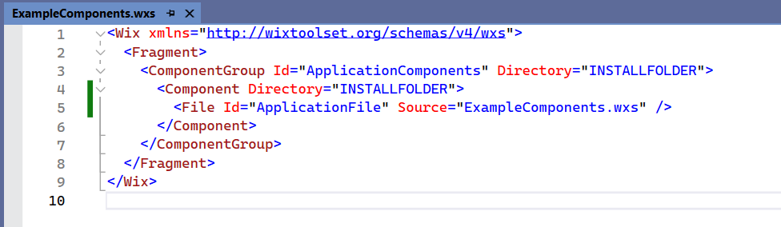

In this article we **create Desktop Icon** when MSI install application.

Please see below 👇🏻 image of **Desktop Icon** for reference.


---

## Update [ExampleComponents.wxs]

Below image show content of **`ExampleComponents.wxs`**






```xml {lineNos=true lineNoStart=1}
<Wix xmlns="http://wixtoolset.org/schemas/v4/wxs">
  <Fragment>
    <ComponentGroup Id="ApplicationComponents" Directory="INSTALLFOLDER">
      <Component Directory="INSTALLFOLDER">
        <File Id="ApplicationFile" Source="WPF_Application.exe" />
      </Component>
    </ComponentGroup>
  </Fragment>
</Wix>
```




---

### Add Output File

First, we need to add file for which we want to share icon.




```xml {lineNos=true lineNoStart=1}
<Component Directory="INSTALLFOLDER">
  <File Id="ApplicationFile" Source="WPF_Application.exe" />
</Component>
```




In above code we add output exe file.

This output file is **`WPF_Application.exe`**.

For this output file **`WPF_Application.exe`**, we want to show **Desktop icon**.

---

### Add Desktop Icon




```xml {lineNos=true lineNoStart=1 hl_lines="8-11"}
<Wix xmlns="http://wixtoolset.org/schemas/v4/wxs">
  <Fragment>
    <ComponentGroup Id="ApplicationComponents" Directory="INSTALLFOLDER">
      <Component Directory="INSTALLFOLDER">
        <!--Add output file-->
        <File Id="ApplicationFile" Source="WPF_Application.exe">
          <!--Add Desktop Shortcut-->
          <Shortcut Id="DesktopShortCut"
                    Directory="DesktopFolder"
                    Advertise="yes" Icon="icon.exe"
                    Name="!(bind.Property.ProductName)" />
        </File>
      </Component>
    </ComponentGroup>
  </Fragment>
</Wix>
```




In above code sample, we "__Add Desktop Shortcut__".

For this we use __`<Shortcut>`__ tag.

Please see below 👇🏻 code for reference.


After adding __`<Shortcut>`__ tag, we define some properties of __`<Shortcut>`__ tag.

Please see below list of properties for __`<Shortcut>`__ tag.

| Property Name   | Property Description                                                        |
| --------------- | --------------------------------------------------------------------------- |
| __`Id`__        | _Identifier for this tag, by which we can refer to this tag._               |
| __`Directory`__ | _Special Id, which define Directory where we want to show our shortcut._    |
| __`Advertise`__ | _Boolean variable which decide we want to advertise this shortcut or not._  |
| __`Icon`__      | _Id of Icon image. Please note that this is Id "NOT source of icon image"._ |
| __`Name`__      | _Name of Icon which we want to show with Icon image._                       |

Values we used in our code.

| Property Name   | Value Used                       | Value Comment                                                            |
| --------------- | -------------------------------- | ------------------------------------------------------------------------ |
| __`Id`__        | _`DesktopShortCut`_              | Id which I give.                                                         |
| __`Directory`__ | _`DesktopFolder`_                | Special Id for Desktop Folder. Since we want to create Desktop Shortcut. |
| __`Advertise`__ | _`yes`_                          | Always 'Yes' since this is the easy way.                                 |
| __`Icon`__      | _`icon.exe`_                     | Reference to Id of image in __`Package.wxs`__ file.                      |
| __`Name`__      | _`!(bind.Property.ProductName)`_ | Bind of Shortcut name to Product Name.s                                  |

---

## [Build] Solution

Now we need to build solution as shown below.


After building solution we need to go to folder where MSI is created.

Please see below 👇🏻 image for reference.


---

## Final Result

Run the MSI to install application.

Below image show final result after running installation.


---

That's it!!! 

Hope this post helps you.

*If you like the post then please share it with your friends also.*

*Do let me know by you like this post or not!*

*Till then, Happy learning!!!*