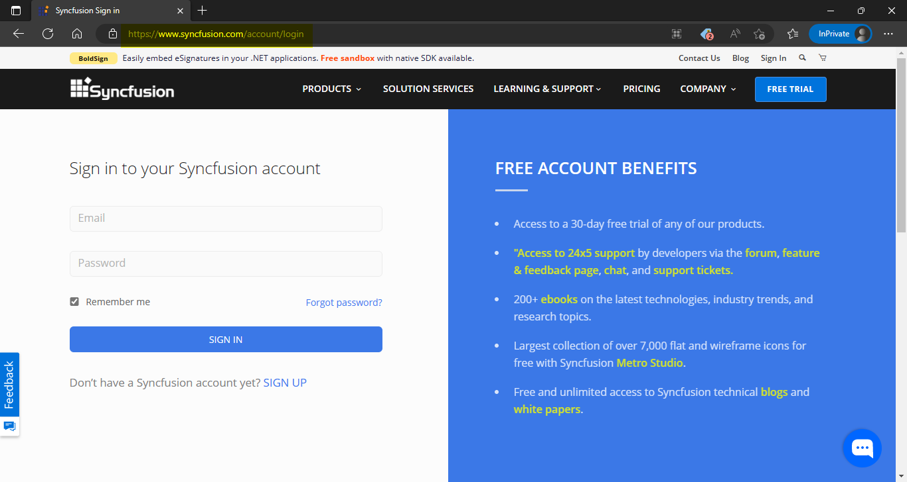
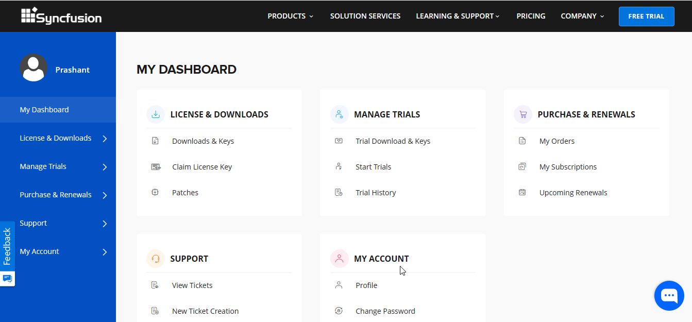
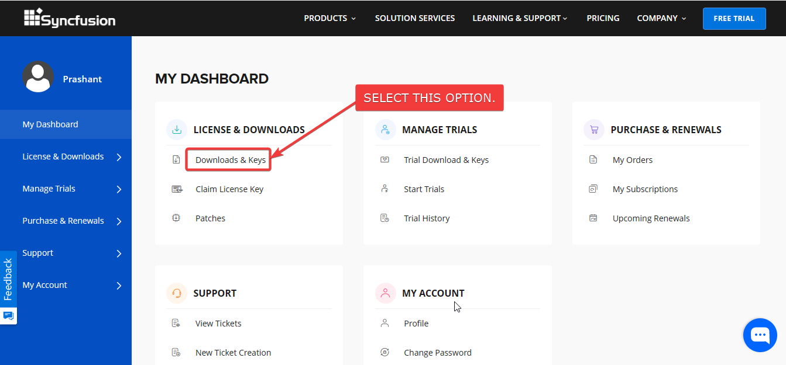
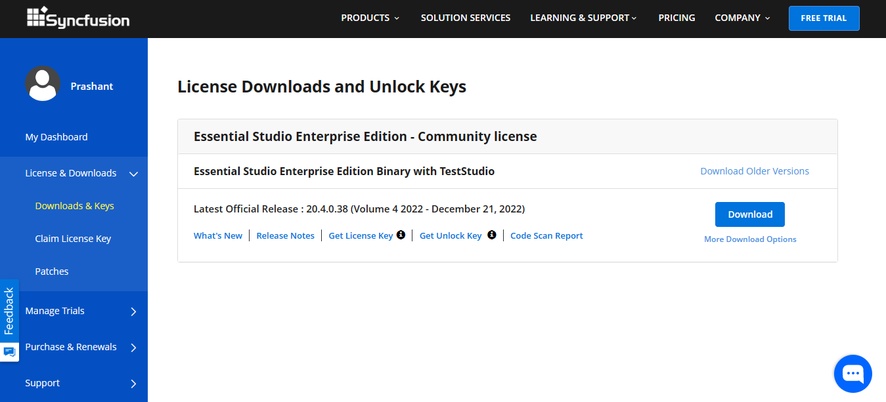
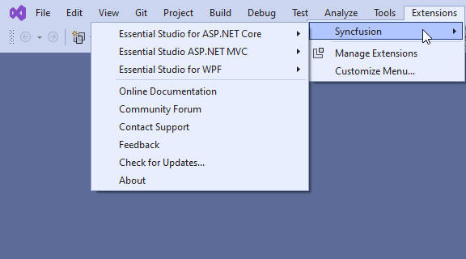

## Objective

I want to:

- Sign Up Syncfusion Account.
- Download Syncfusion Community Version Control.

## Sign Up Syncfusion Account

- *Sign Up Page*: 🚀 ****

Please see below image for reference.

## Download Syncfusion Community Version Control

- After Sign up, Sign-in to your account.
- You will see "**DASHBOARD**" as shown below.

- Select "**Download and Key**" option as shown below.

- This will show "**Download Page**" as shown below.

- From this page, Download and Run "**Essential Studio Enterprise Edition**".

- Select WPF from "**Essential Studio Enterprise Edition**" Installer.

- This will take time to install.

## Final Result

After WPF successfully installed from "**Essential Studio Enterprise Edition**" Installer.

We see following option in Visual Studio.

**This is it !!!**

*I hope my efforts will helpful to someone!*

If you found anything to **add or update**, please let me know on my *e-mail*.

Hope this post helps you to **Syncfusion Account Sign Up and Download Community Version**.

*If you like the post then please share it with your friends also.*

*Do let me know by you like this post or not!*

*Till then, Happy learning!!!*