## Objective

I want to:

1. ***Create WPF Prism Application Project***

2. ***Add Synchfusion Chromeless window***

## Demo Video

Below 🎬 video shows how to **Open Syncfusion Chromeless Window** in *Visual Studio 2022*.


 
## Create Project

- Open **Visual Studio 2022** in your machine.

- You will see a window as shown in below 👇🏻 image.

[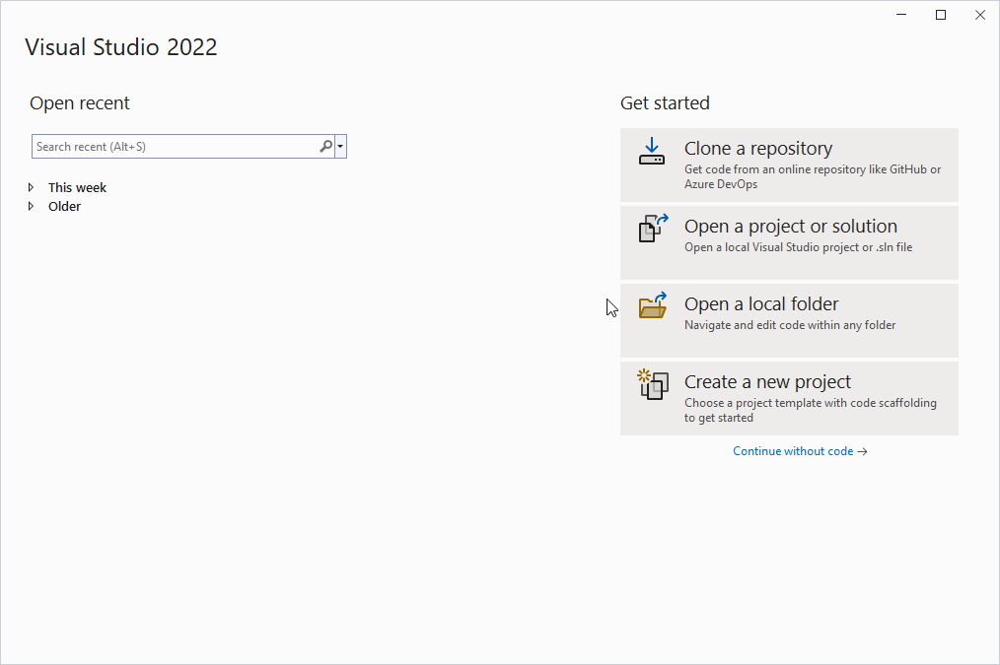](install-prism-project-template/visual-studio-home-page.png)

- Select "**Create a new project**" option as shown in below 👇🏻 image.

[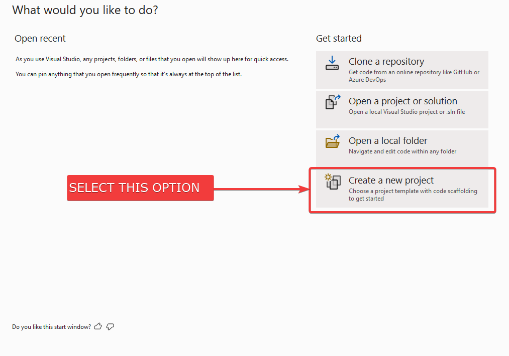](open-syncfusion-chromeless-window/create-a-new-project.png)

- This will open a new screen as shown in below 👇🏻 image.

[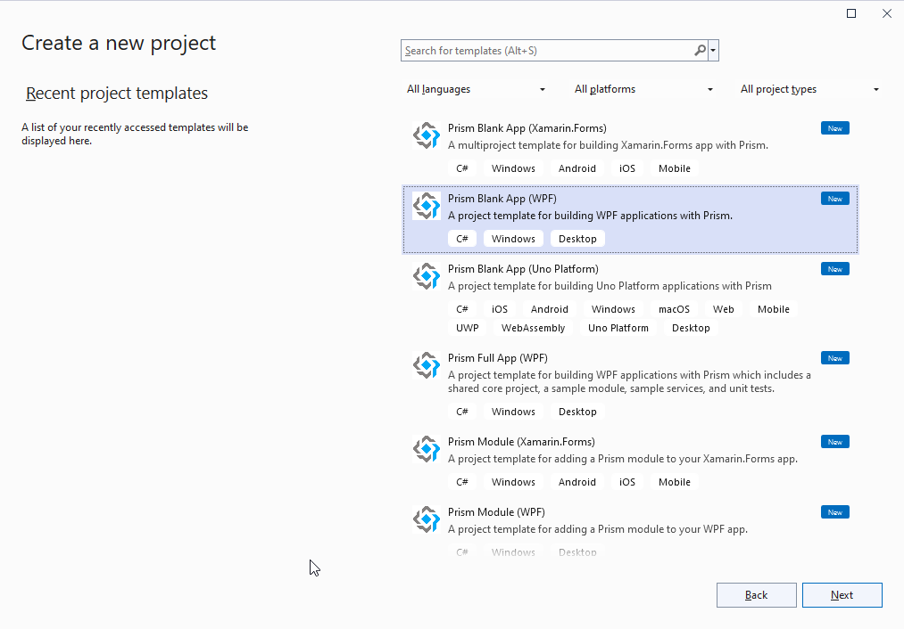](open-syncfusion-chromeless-window/project-options.png)

- In this screen, select "**Prism Blank App (WPF)**" project type then select "**Next**" button as shown in below 👇🏻 image.

[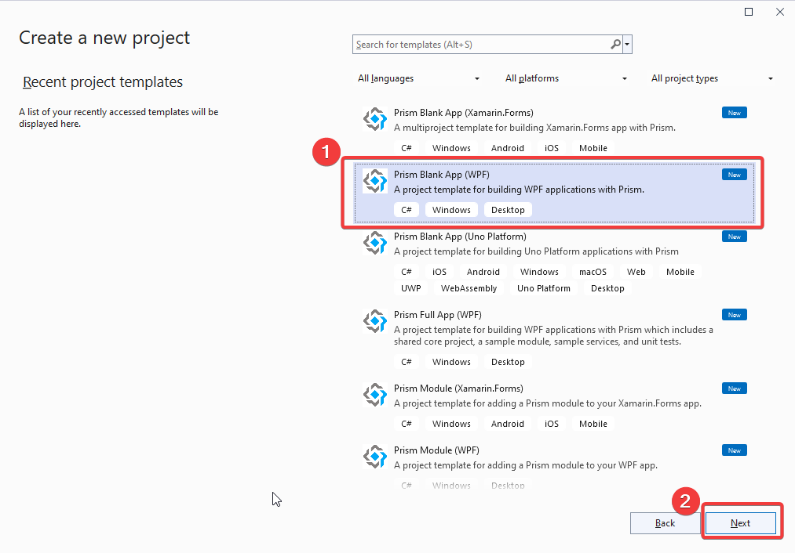](open-syncfusion-chromeless-window/select-prism-project.png)

- Now you will have below screen, where we need to configure our project as shown in below 👇🏻 image.

[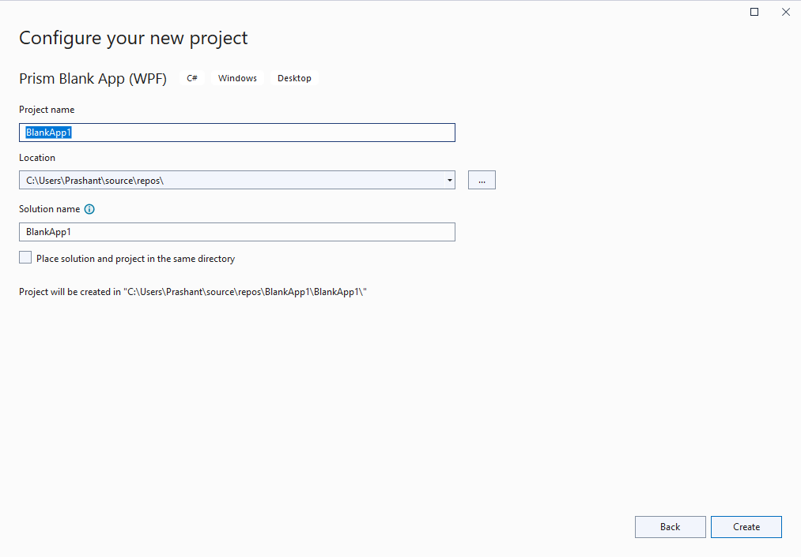](open-syncfusion-chromeless-window/project-configuration-screen.png)

- In this screen I use following values shown in below 👇🏻 image.

  - *Project Name*: "**BrowseSolidworksDocument**"
  - *Location*: "**`D:\Dev`**"
  - *Solution Name*: "**BrowseSolidworksDocument**"

[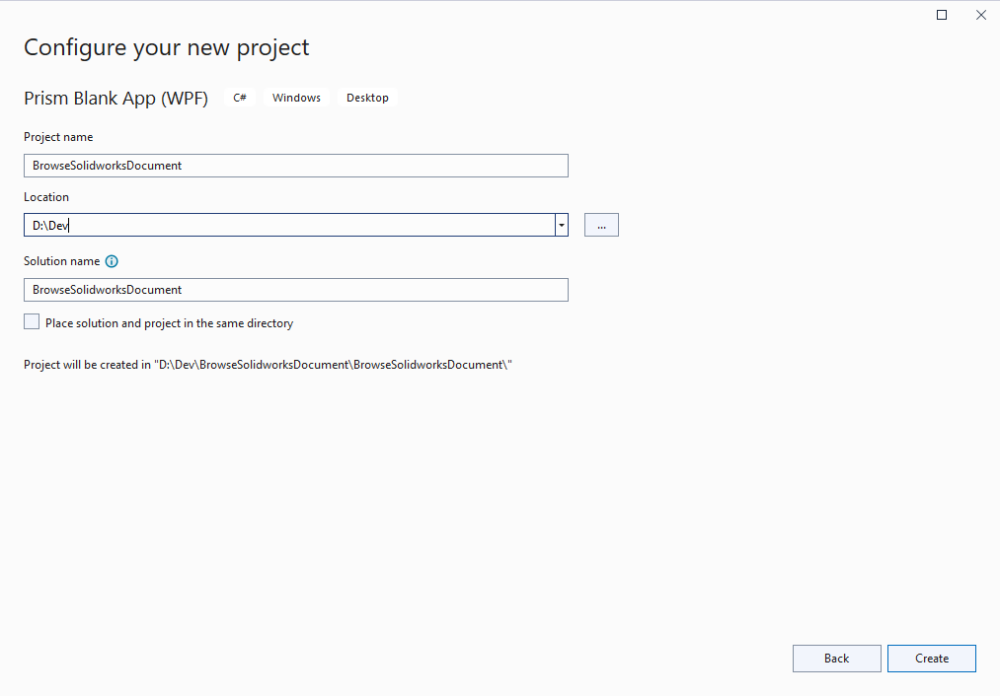](open-syncfusion-chromeless-window/configure-project.png)

- When select "**Next**", a new screen shows, selecting dependency injection container for project to use.

  - *Selected Option*: "**Unity**"

[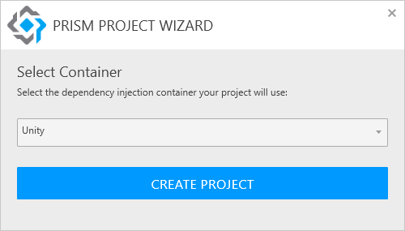](open-syncfusion-chromeless-window/select-container.png)

- A new project open in visual studio 2022 as shown in below 👇🏻 image.

[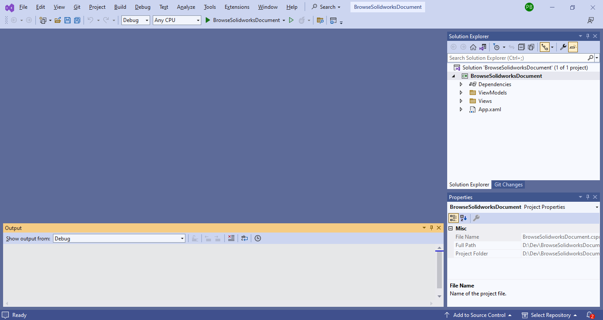](open-syncfusion-chromeless-window/new-project.png)

## Add Syncfusion Chromeless Window

In this section we add **Syncfusion Chromeless** Window.
- Build the project as shown in below 👇🏻 image. 

- Open "**NuGet Package**" window as shown in below 👇🏻 image.

[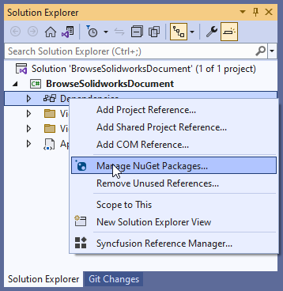](open-syncfusion-chromeless-window/select-manage-nuget-package.png)

- "**NuGet Package**" window will appear as shown in below 👇🏻 image.

[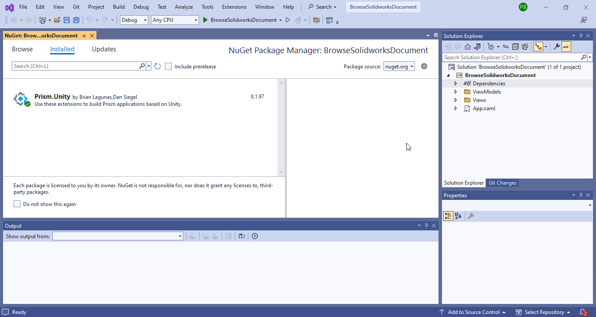](open-syncfusion-chromeless-window/nuget-window.png)

- In "**NuGet Package**" window, go to "**Browse**" tab and search for **`Syncfusion.Shared.WPF`** then install it as shown in below 👇🏻 image.

[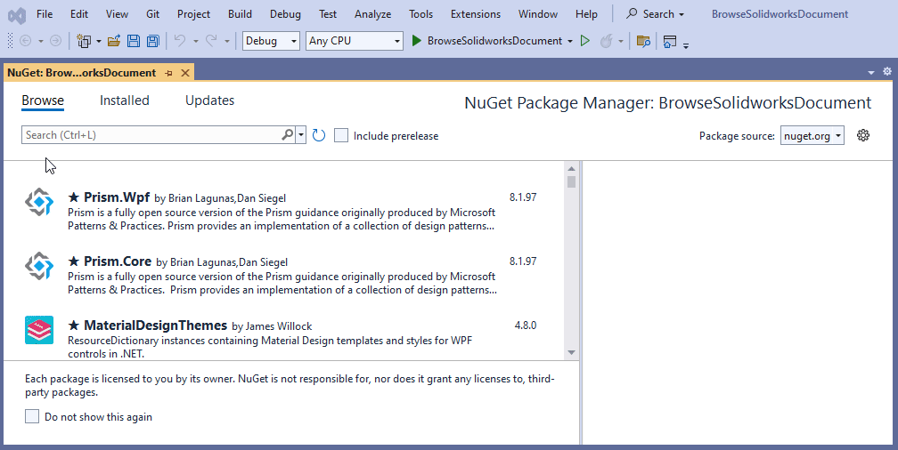](open-syncfusion-chromeless-window/install-syncfusion-wpf-package.gif)

- Now open "**`MainWindow.xaml`**" file as shown in below 👇🏻 image.

[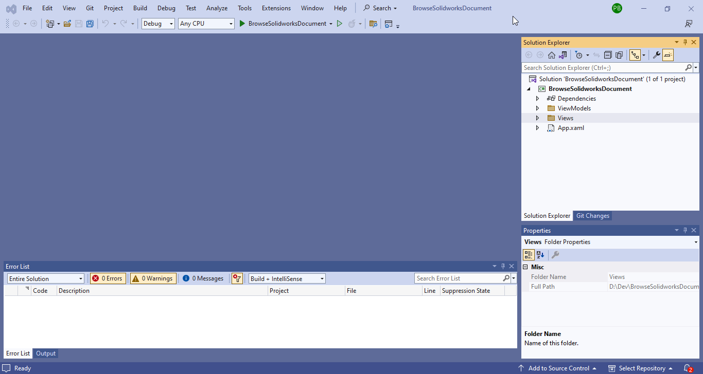](open-syncfusion-chromeless-window/open-mainwindow-file.gif)

- In "**`MainWindow.xaml`**" file add namespace as shown in below 👇🏻 image.

[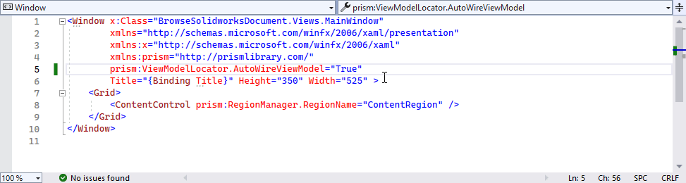](open-syncfusion-chromeless-window/add-syncfusin-namespace.gif)

- Change "**Window**" with "**ChromelessWindow**" as shown in below 👇🏻 image.

[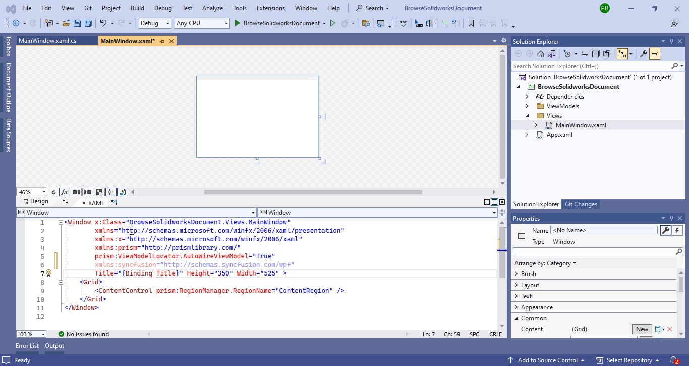](open-syncfusion-chromeless-window/add-chromeless-window.gif)

## Final Result

Now we run the application as shown in below 👇🏻 image.

We get a message related to Syncfusion License, just do as shown in below image.

[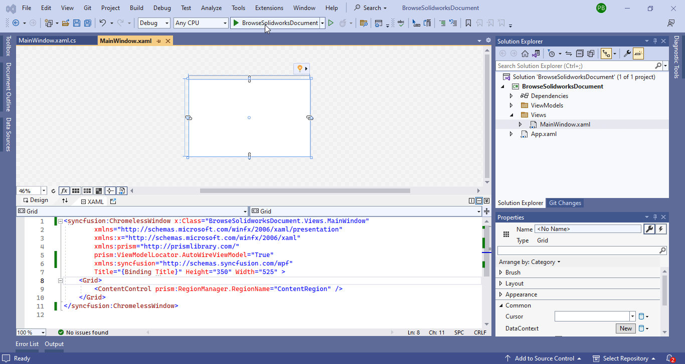](install-prism-project-template/run-application.gif)

**This is it !!!**

*I hope my efforts will helpful to someone!*

If you found anything to **add or update**, please let me know on my *e-mail*.

Hope this post helps you to **Open Syncfusion Chromeless Window**.

*If you like the post then please share it with your friends also.*

*Do let me know by you like this post or not!*

*Till then, Happy learning!!!*
