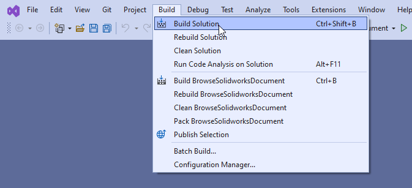
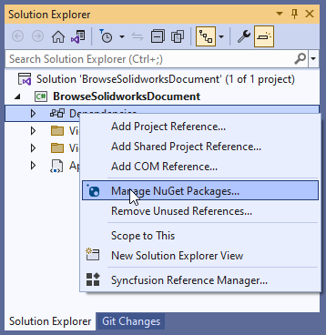
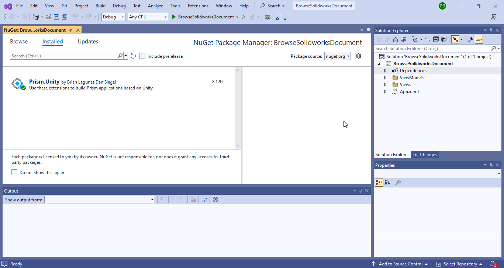
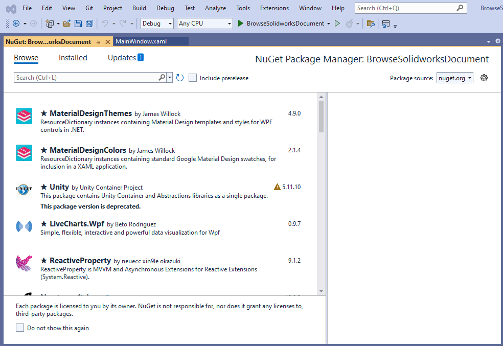
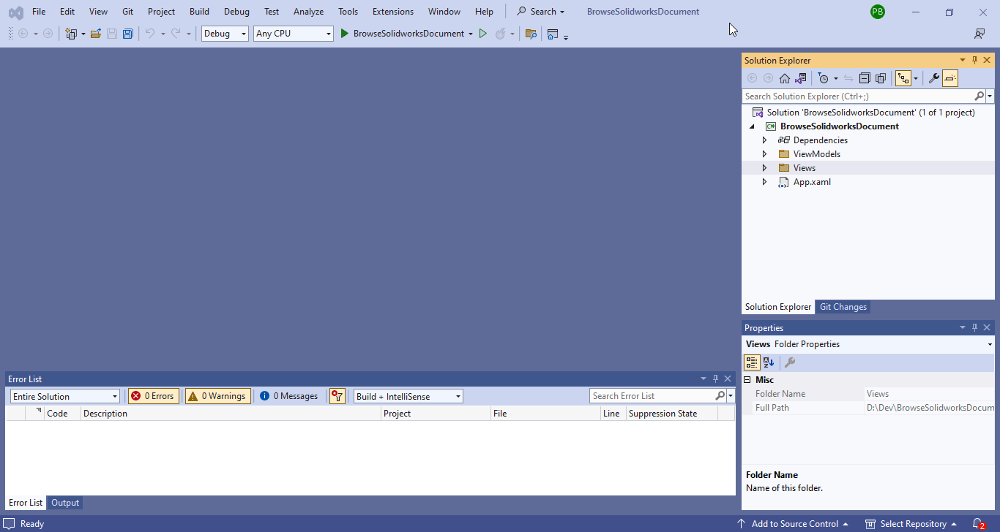
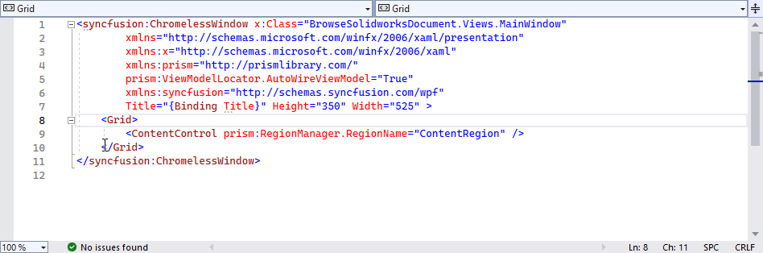

## Objective

I want to:

1. ***Add Syncfusion Busy Indicator***

2. ***Use Syncfusion Busy Indicator, for Long operation***

We will continue from previous article 🚀 **[Open Syncfusion Chromeless Window](/wpf-tutorials/open-syncfusion-chromeless-window/)**.

Add new controls to previous code.

## Demo Video

Below 🎬 video shows how to **Add Syncfusion Busy Indicator** in *Visual Studio 2022*.





## Add Syncfusion Busy Indicator

In this section we add **Busy Indicator** Window.
- Build the project as shown in below 👇🏻 image. 

[](open-syncfusion-chromeless-window/build-solution.png)

- Open "**NuGet Package**" window as shown in below 👇🏻 image.

[](open-syncfusion-chromeless-window/select-manage-nuget-package.png)

- "**NuGet Package**" window will appear as shown in below 👇🏻 image.

[](open-syncfusion-chromeless-window/nuget-window.png)

- In "**NuGet Package**" window, go to "**Browse**" tab and search for **`Syncfusion.SfBusyIndicator.WPF`** then install it as shown in below 👇🏻 image.

[](add-syncfusion-busy-indicator/install-syncfusion-SfBusyIndicator-package.gif)

- Now open "**`MainWindow.xaml`**" file as shown in below 👇🏻 image.

[](open-syncfusion-chromeless-window/open-mainwindow-file.gif)

- Change "**`MainWindow.xaml`**" file as shown in below 👇🏻 image.

[](add-syncfusion-busy-indicator/add-busy-indicator.gif)

Please see below 👇🏻 code.





```xml {lineNos=true lineNoStart=1}
<syncfusion:SfBusyIndicator IsBusy="{Binding IsBusy,Mode=TwoWay}" AnimationType="Gear">
    <ContentControl prism:RegionManager.RegionName="ContentRegion" />
</syncfusion:SfBusyIndicator>
```




- Add **`Button`** element with binding command and properties as shown in below 👇🏻 image.

[](/assets/wpf-tutorials/add-syncfusion-busy-indicator/add-button.gif)




```xml
<Button Content="{Binding ButtonContent}"
        Height="50" Width="300"
        Command="{Binding ClickCommand}" />
```




## Add Binding Properties And Command

- Open "**`MainWindowViewModel.cs`**" file as shown in below 👇🏻 image.

[](/assets/wpf-tutorials/add-syncfusion-busy-indicator/open-MainWindowViewModel.gif)

- Add **`IsBusy`** Property as shown in below 👇🏻 image.

[](/assets/wpf-tutorials/add-syncfusion-busy-indicator/add-isbusy-property.gif)




```cs
private bool _isBusy;
public bool IsBusy
{
    get { return _isBusy; }
    set { SetProperty(ref _isBusy, value); }
}
```




- Add **`ButtonContent`** Property as shown in below 👇🏻 image.

[](/assets/wpf-tutorials/add-syncfusion-busy-indicator/add-buttonContent-property.gif)




```cs
private string _buttonContent;
public string ButtonContent
{
    get { return _buttonContent; }
    set { SetProperty(ref _buttonContent, value); }
}
```




- Set value of **`_buttonContent`** field as shown in below 👇🏻 image.

[](/assets/wpf-tutorials/add-syncfusion-busy-indicator/set-buttonContent-value.gif)




```cs
private string _buttonContent = "Click me for long task!";
public string ButtonContent
{
    get { return _buttonContent; }
    set { SetProperty(ref _buttonContent, value); }
}
```




- Add **`ClickCommand`** _Prism Command_ as shown in below 👇🏻 image.

[](/assets/wpf-tutorials/add-syncfusion-busy-indicator/add-click-command.gif)




```cs
private DelegateCommand _clickCommand;
public DelegateCommand ClickCommand =>
    _clickCommand ?? (_clickCommand = new DelegateCommand(ExecuteClickCommand));

void ExecuteClickCommand()
{

}
```




## Click Command Statements

Now we add following statements to click command.

- First we set the value of **`IsBusy`** property to **`true`**.

- This means we want to show _Busy Indicator_.

- Please add below code as shown below 👇🏻.




```cs
void ExecuteClickCommand()
{
    // Show busy indicator
    IsBusy = true;
}
```




- Next we run a new **`Thread`**.

- This **`Thread`**, imitate a long task.

- Add new **`Thread`** as shown in below 👇🏻 image.

[](/assets/wpf-tutorials/add-syncfusion-busy-indicator/add-new-thread.gif)

- Please add below code as shown below 👇🏻.




```cs
async void ExecuteClickCommand()
{
    // Show busy indicator
    IsBusy = true;

    await Task.Run(() =>
    {

    });
}
```




- In above code, we use **`async`** and **`await`** keywords.

- These keywords, help us to do **asynchronous programming**.

- This **`Task.Run()`** method, run a new **`Thread`** and free **UI** thread.

- This **`await`** keyword, watch if this **`Task`** is completed or not.

- Now we add statement to make new Thread sleep for 5 sec.

- To sleep new **`Thread`**, add code as shown in below 👇🏻 image.

[](/assets/wpf-tutorials/add-syncfusion-busy-indicator/add-thread-sleeping.gif)




```cs
async void ExecuteClickCommand()
{
    // Show busy indicator
    IsBusy = true;

    await Task.Run(() =>
    {
        // Sleeping with 5 sec
        Thread.Sleep(5000);
    });
}
```




- Lastly, we set the value of **`IsBusy`** property to **`false`** as shown in below 👇🏻 image.

[](/assets/wpf-tutorials/add-syncfusion-busy-indicator/hide-busy-indicator.gif)

- This means we want to hide _Busy Indicator_.

- Please add below code as shown below 👇🏻.




```cs
async void ExecuteClickCommand()
{
    // Show busy indicator
    IsBusy = true;

    await Task.Run(() =>
    {
        // Sleeping with 5 sec
        Thread.Sleep(5000);
    });

    // Hide busy indicator
    IsBusy = false;
}
```




## Final Result

Now we run the application as shown in below 👇🏻 image.

[](/assets/wpf-tutorials/add-syncfusion-busy-indicator/run-application.gif)

Until the **`Thread`** is *sleeping* we able to see _Busy indicator_ to show user that some operation is running.

Until the operation complete, we see this _Busy indicator_.

**This is it !!!**

*I hope my efforts will helpful to someone!*

If you found anything to **add or update**, please let me know on my *e-mail*.

Hope this post helps you to **Add Syncfusion Busy Indicator**.

*If you like the post then please share it with your friends also.*

*Do let me know by you like this post or not!*

*Till then, Happy learning!!!*
