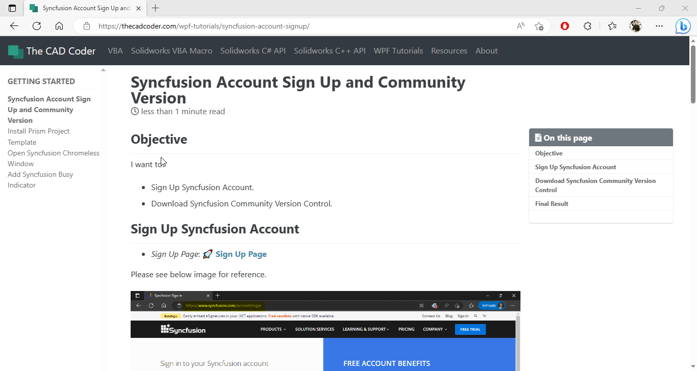
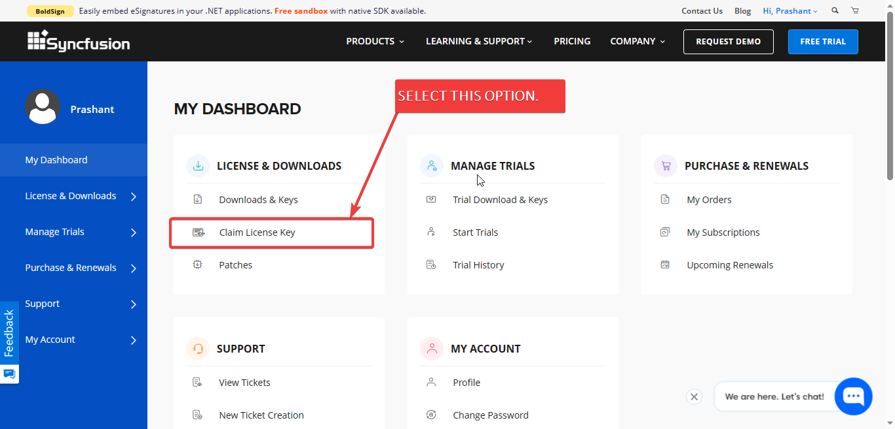
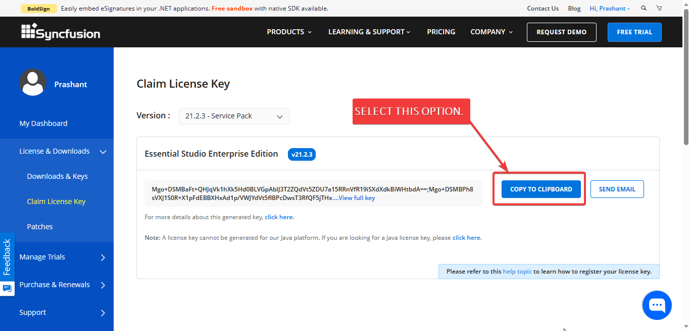
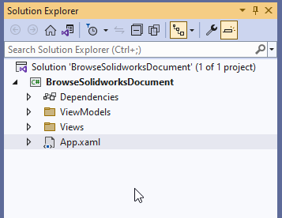
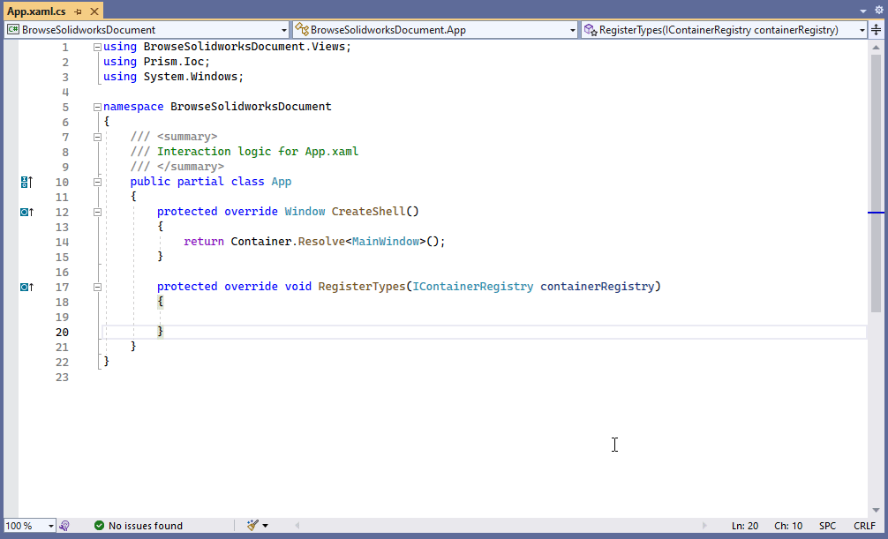
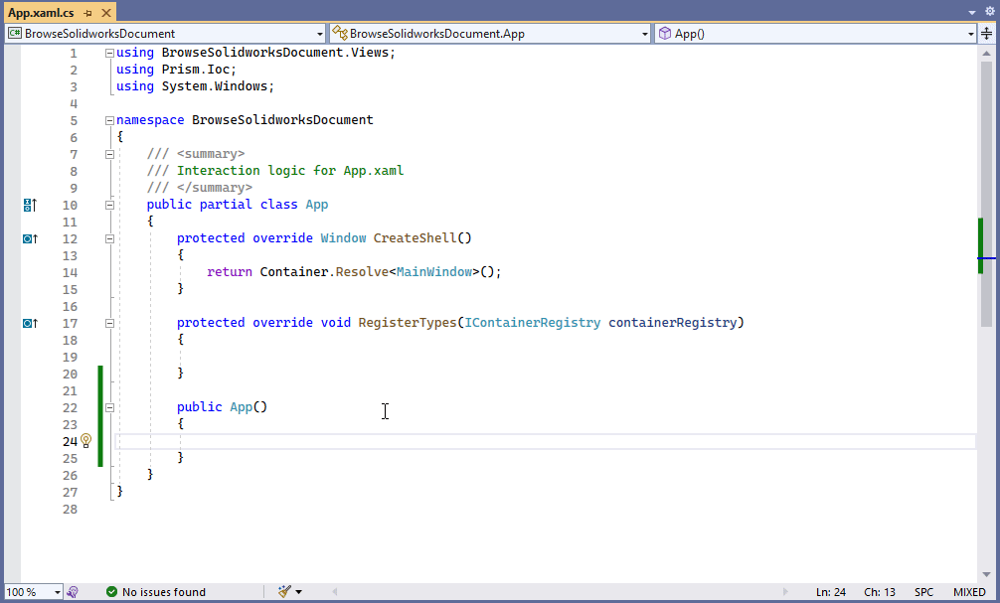
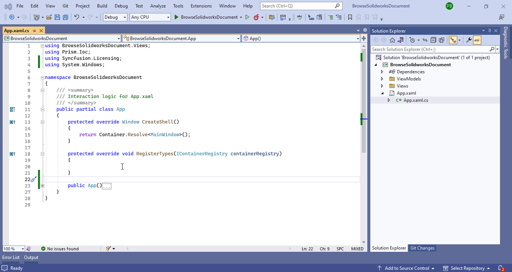

## Objective

I want to:

- ***Add Syncfusion License Key***

- ***We will continue from previous article 🚀 [Add Syncfusion Busy Indicator](/wpf-tutorials/add-syncfusion-busy-indicator/).***

- ***Will not add new controls to previous code.***  

## Demo Video

Below 🎬 video shows how to **Add Syncfusion License Key** in *Visual Studio 2022*.



## Get License Key

- Go to **Syncfusion Dashboard page**.

- I have a link in article 🚀 **[Syncfusion Account Sign Up and Community Version](/wpf-tutorials/syncfusion-account-signup/)**.

- This link will directly open **Syncfusion Dashboard page**.

- Please see below 👇🏻 image for reference.

[](add-syncfusion-license-key/open-syncfusion-dashboard.gif)

- Now go to "**Claim License Key**" as shown in below 👇🏻 image.

[](add-syncfusion-license-key/select-claim-license-option.png)

- A new page open and select "**COPY TO CLIPBOARD**" as shown in below 👇🏻 image.

[](add-syncfusion-license-key/select-copy-key-option.png)


---

## Add Syncfusion Key

In this section we add **Syncfusion Key** Window.

- Open "**`App.xaml.cs`**" file as shown in below 👇🏻 image.

[](add-syncfusion-license-key/open-app-xaml-file.gif)

- Create a Constructor for this  "**`App.xaml.cs`**" file as shown in below 👇🏻 image.

[](add-syncfusion-license-key/create-constructor.gif)

- Register Syncfusion license shown in below 👇🏻 image.

[](add-syncfusion-license-key/register-license-key.gif)





```cs
public App()
{
    SyncfusionLicenseProvider.RegisterLicense("YOUR LICENSE KEY");
}
```




## Final Result

Now we run the application as shown in below 👇🏻 image.

[](add-syncfusion-license-key/run-application.gif)

Now we did not see License message since we add our **License Key**.

**This is it !!!**

*I hope my efforts will helpful to someone!*

If you found anything to **add or update**, please let me know on my *e-mail*.

Hope this post helps you to **Add Syncfusion License Key**.

*If you like the post then please share it with your friends also.*

*Do let me know by you like this post or not!*

*Till then, Happy learning!!!*
