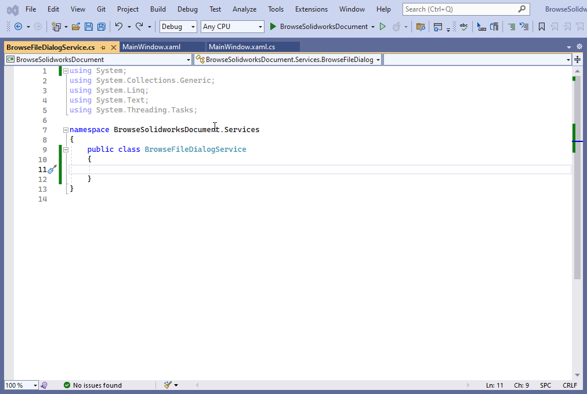
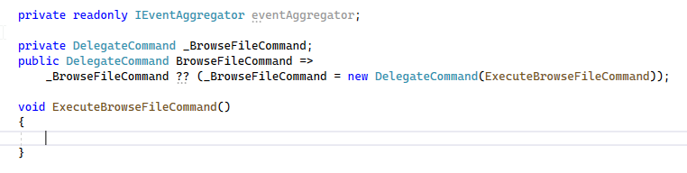

## Objective

I want to:

- ***Create Browse Solidworks Document User Interface***

- ***We will continue from previous article 🚀 [Add Syncfusion Busy Indicator](/wpf-tutorials/browse-solidworks-document-ui/).***

- ***extend article by adding new controls to previous code.***  

## Demo Video

Below 🎬 video shows how to **Browse Solidworks Document UI** in *Visual Studio 2022*.




## Update XAML File for UI

- Add **`WindowStartupLocation`** property to **`<syncfusion:ChromelessWindow>`** tag.

- Please see below 👇🏻 image for reference.

[](browse-solidworks-document-ui/add-WindowStartupLocation-property.png)

- Please see below 👇🏻 code sample for reference.




```xml {lineNos=true lineNoStart=1}
<syncfusion:ChromelessWindow x:Class="BrowseSolidworksDocument.Views.MainWindow"
        xmlns="http://schemas.microsoft.com/winfx/2006/xaml/presentation"
        xmlns:x="http://schemas.microsoft.com/winfx/2006/xaml"
        xmlns:prism="http://prismlibrary.com/"
        prism:ViewModelLocator.AutoWireViewModel="True"
        xmlns:syncfusion="http://schemas.syncfusion.com/wpf"
        Title="{Binding Title}" Height="350" Width="525" WindowStartupLocation="CenterScreen" >
```




---

- Now we add **`<Grid>`** tag inside **`<syncfusion:SfBusyIndicator>`** tag.

- Please see below 👇🏻 image for reference.

[](browse-solidworks-document-ui/add-grid-tag.png)

- Please see below 👇🏻 code sample for reference.




```xml {lineNos=true lineNoStart=1}
<syncfusion:ChromelessWindow x:Class="BrowseSolidworksDocument.Views.MainWindow"
        xmlns="http://schemas.microsoft.com/winfx/2006/xaml/presentation"
        xmlns:x="http://schemas.microsoft.com/winfx/2006/xaml"
        xmlns:prism="http://prismlibrary.com/"
        prism:ViewModelLocator.AutoWireViewModel="True"
        xmlns:syncfusion="http://schemas.syncfusion.com/wpf"
        Title="{Binding Title}" Height="350" Width="525" WindowStartupLocation="CenterScreen">
    <syncfusion:SfBusyIndicator IsBusy="{Binding IsBusy, Mode=TwoWay}" AnimationType="Gear">
        <Grid>
            <Grid.RowDefinitions>
                <RowDefinition Height="25" />
                <RowDefinition Height="Auto" />
                <RowDefinition Height="50" />
                <RowDefinition Height="Auto" />
                <RowDefinition Height="25" />
            </Grid.RowDefinitions>

            <Grid.ColumnDefinitions>
                <ColumnDefinition Width="25" />
                <ColumnDefinition Width="Auto" />
                <ColumnDefinition Width="50" />
                <ColumnDefinition Width="Auto" />
                <ColumnDefinition Width="25" />
            </Grid.ColumnDefinitions>

        </Grid>
    </syncfusion:SfBusyIndicator>
</syncfusion:ChromelessWindow>
```




---

- Add **Browse File** file button.

- Please see below 👇🏻 image for reference.

[](browse-solidworks-document-ui/add-browse-button.png)

- Please see below 👇🏻 code sample for reference.




```xml {lineNos=true lineNoStart=1}
<syncfusion:ChromelessWindow x:Class="BrowseSolidworksDocument.Views.MainWindow"
        xmlns="http://schemas.microsoft.com/winfx/2006/xaml/presentation"
        xmlns:x="http://schemas.microsoft.com/winfx/2006/xaml"
        xmlns:prism="http://prismlibrary.com/"
        prism:ViewModelLocator.AutoWireViewModel="True"
        xmlns:syncfusion="http://schemas.syncfusion.com/wpf"
        Title="{Binding Title}" Height="350" Width="525" WindowStartupLocation="CenterScreen">
    <syncfusion:SfBusyIndicator IsBusy="{Binding IsBusy, Mode=TwoWay}" AnimationType="Gear">
        <Grid>
            <Grid.RowDefinitions>
                <RowDefinition Height="25" />
                <RowDefinition Height="Auto" />
                <RowDefinition Height="50" />
                <RowDefinition Height="Auto" />
                <RowDefinition Height="25" />
            </Grid.RowDefinitions>

            <Grid.ColumnDefinitions>
                <ColumnDefinition Width="25" />
                <ColumnDefinition Width="Auto" />
                <ColumnDefinition Width="50" />
                <ColumnDefinition Width="Auto" />
                <ColumnDefinition Width="25" />
            </Grid.ColumnDefinitions>

            <syncfusion:ButtonAdv Grid.Column="1"
                    Grid.Row="1"
                    Height="30" Width="200" Command="{Binding BrowseFileCommand}"
                    Label="Browse File" IconHeight="0" IconWidth="0" />

        </Grid>
    </syncfusion:SfBusyIndicator>
</syncfusion:ChromelessWindow>
```





- In above code, we add **`BrowseFileCommand`** command.

---

- Now, we add **`<TextBox>`**, which shows browsed file path.

- Please see below 👇🏻 image for reference.

[](browse-solidworks-document-ui/add-text-box-tag.png)

- Please see below 👇🏻 code sample for reference.




```xml {lineNos=true lineNoStart=1}
<syncfusion:ChromelessWindow x:Class="BrowseSolidworksDocument.Views.MainWindow"
        xmlns="http://schemas.microsoft.com/winfx/2006/xaml/presentation"
        xmlns:x="http://schemas.microsoft.com/winfx/2006/xaml"
        xmlns:prism="http://prismlibrary.com/"
        prism:ViewModelLocator.AutoWireViewModel="True"
        xmlns:syncfusion="http://schemas.syncfusion.com/wpf"
        Title="{Binding Title}" Height="350" Width="525" WindowStartupLocation="CenterScreen">
    <syncfusion:SfBusyIndicator IsBusy="{Binding IsBusy, Mode=TwoWay}" AnimationType="Gear">
        <Grid>
            <Grid.RowDefinitions>
                <RowDefinition Height="25" />
                <RowDefinition Height="Auto" />
                <RowDefinition Height="50" />
                <RowDefinition Height="Auto" />
                <RowDefinition Height="25" />
            </Grid.RowDefinitions>

            <Grid.ColumnDefinitions>
                <ColumnDefinition Width="25" />
                <ColumnDefinition Width="Auto" />
                <ColumnDefinition Width="50" />
                <ColumnDefinition Width="Auto" />
                <ColumnDefinition Width="25" />
            </Grid.ColumnDefinitions>

            <syncfusion:ButtonAdv Grid.Column="1"
                    Grid.Row="1"
                    Height="30" Width="200" Command="{Binding BrowseFileCommand}"
                    Label="Browse File" IconHeight="0" IconWidth="0" />

            <TextBox Grid.Row="1"
                     Grid.Column="3"
                     Height="30" Width="200"
                     IsEnabled="False"
                     Text="{Binding FilePath, Mode=TwoWay, UpdateSourceTrigger=PropertyChanged}"
                     VerticalContentAlignment="Center"
                       />

        </Grid>
    </syncfusion:SfBusyIndicator>
</syncfusion:ChromelessWindow>
```





- In above code, we add **`Text`** property and bind with **`FilePath`** property in view model.

---

- Now, we add **Open File** button, which open browsed file path.

- Please see below 👇🏻 image for reference.

[](browse-solidworks-document-ui/add-open-file-button.png)

- Please see below 👇🏻 code sample for reference.




```xml {lineNos=true lineNoStart=1}
<syncfusion:ChromelessWindow x:Class="BrowseSolidworksDocument.Views.MainWindow"
        xmlns="http://schemas.microsoft.com/winfx/2006/xaml/presentation"
        xmlns:x="http://schemas.microsoft.com/winfx/2006/xaml"
        xmlns:prism="http://prismlibrary.com/"
        prism:ViewModelLocator.AutoWireViewModel="True"
        xmlns:syncfusion="http://schemas.syncfusion.com/wpf"
        Title="{Binding Title}" Height="350" Width="525" WindowStartupLocation="CenterScreen">
    <syncfusion:SfBusyIndicator IsBusy="{Binding IsBusy, Mode=TwoWay}" AnimationType="Gear">
        <Grid>
            <Grid.RowDefinitions>
                <RowDefinition Height="25" />
                <RowDefinition Height="Auto" />
                <RowDefinition Height="50" />
                <RowDefinition Height="Auto" />
                <RowDefinition Height="25" />
            </Grid.RowDefinitions>

            <Grid.ColumnDefinitions>
                <ColumnDefinition Width="25" />
                <ColumnDefinition Width="Auto" />
                <ColumnDefinition Width="50" />
                <ColumnDefinition Width="Auto" />
                <ColumnDefinition Width="25" />
            </Grid.ColumnDefinitions>

            <syncfusion:ButtonAdv Grid.Column="1"
                    Grid.Row="1"
                    Height="30" Width="200" Command="{Binding BrowseFileCommand}"
                    Label="Browse File" IconHeight="0" IconWidth="0" />

            <TextBox Grid.Row="1"
                     Grid.Column="3"
                     Height="30" Width="200"
                     IsEnabled="False"
                     Text="{Binding FilePath, Mode=TwoWay, UpdateSourceTrigger=PropertyChanged}"
                     VerticalContentAlignment="Center"
                       />

            <syncfusion:ButtonAdv Grid.Column="1"
                    Grid.Row="3" Grid.ColumnSpan="3"
                    Height="30" Width="200" 
                    Label="Open File" IconHeight="0" IconWidth="0" Command="{Binding ClickCommand}" />

        </Grid>
    </syncfusion:SfBusyIndicator>
</syncfusion:ChromelessWindow>
```




- In above code, we add **`ClickCommand`** command.

---

- Open **`MainWindowViewModel`** class.

- Add **`FilePath`** property.

- Please see below 👇🏻 image for reference.

[](browse-solidworks-document-ui/add-filepath-property.png)

- Please see below 👇🏻 code sample for reference.




```cs {lineNos=true lineNoStart=1}
private string _FilePath;
public string FilePath
{
    get { return _FilePath; }
    set { SetProperty(ref _FilePath, value); }
}
```




---

## Add Service for Browsing File Dialog

- In our project, we add new folder.

- Please see below 👇🏻 image for reference.

[](browse-solidworks-document-ui/add-new-folder.gif)

---

- Now we add **`BrowseFileDialogService`** class to "**`Service`**" folder.

- Please see below 👇🏻 image for reference.

[](browse-solidworks-document-ui/add-browsfile-service.gif)

---

- Now, we **inherit** this **`BrowseFileDialogService`** class from **`PubSubEvent`** class from **`Prism.Events`** namespace.

- Please see below 👇🏻 image for reference.

[](browse-solidworks-document-ui/inherit-from-prism-event.gif)

- Please see below 👇🏻 code sample for reference.




```cs {lineNos=true lineNoStart=1}
using System;
using System.Collections.Generic;
using System.Linq;
using System.Text;
using System.Threading.Tasks;
using Prism.Events;

namespace BrowseSolidworksDocument.Services
{
    public class BrowseFileDialogService : PubSubEvent
    {

    }
}
```




---

## Register Service

- Open **`MainWindow.xaml.cs`** file.

- Pass **`IEventAggregator`** to constructor, and assigned it to private field.

- Please see below 👇🏻 image for reference.

[](browse-solidworks-document-ui/pass-parameter-to-constructor.png)

- Please see below 👇🏻 code sample for reference.




```cs {lineNos=true lineNoStart=1}
using BrowseSolidworksDocument.Services;
using BrowseSolidworksDocument.ViewModels;
using Microsoft.Win32;
using Prism.Events;
using Syncfusion.Windows.Shared;
using System;
using System.Windows;

namespace BrowseSolidworksDocument.Views
{
    /// <summary>
    /// Interaction logic for MainWindow.xaml
    /// </summary>
    public partial class MainWindow : ChromelessWindow
    {
        private readonly IEventAggregator eventAggregator;

        public MainWindow(IEventAggregator eventAggregator)
        {
            InitializeComponent();
            this.eventAggregator = eventAggregator;
        }
    }
}
```




---

- Now, we **register** our service.

- When this service is called, a function is executed.

- This registration and execution is handle by **`eventAggregator`** field.

- Please see below 👇🏻 image for reference.

[](browse-solidworks-document-ui/register-event.png)

- Please see below 👇🏻 code sample for reference.




```cs {lineNos=true lineNoStart=1}
using BrowseSolidworksDocument.Services;
using BrowseSolidworksDocument.ViewModels;
using Microsoft.Win32;
using Prism.Events;
using Syncfusion.Windows.Shared;
using System;
using System.Windows;

namespace BrowseSolidworksDocument.Views
{
    /// <summary>
    /// Interaction logic for MainWindow.xaml
    /// </summary>
    public partial class MainWindow : ChromelessWindow
    {
        private readonly IEventAggregator eventAggregator;

        public MainWindow(IEventAggregator eventAggregator)
        {
            InitializeComponent();
            this.eventAggregator = eventAggregator;
            this.eventAggregator.GetEvent<BrowseFileDialogService>().Subscribe(BrowseFile);
        }

        private void BrowseFile()
        {
            OpenFileDialog openFileDialog = new OpenFileDialog();
            openFileDialog.Filter = "Solidworks Part|*.sldprt|Solidworks Assembly|*.sldasm|Solidworks Drawing|*.slddrw";
            openFileDialog.DefaultExt = "*.sldprt";

            bool? result = openFileDialog.ShowDialog();

            if (result == false || string.IsNullOrEmpty(openFileDialog.FileName))
                return;

            var viewModel = DataContext as MainWindowViewModel;
            viewModel.FilePath = openFileDialog.FileName;
        }
    }
}
```




---

## Understand Service Call Execute Function

In this section, let us understand **`BrowseFile()`** function.




```cs {lineNos=true lineNoStart=1}
OpenFileDialog openFileDialog = new OpenFileDialog();
```




- In above line, we create a variable of:

    - **Type**: **`OpenFileDialog`**
    - **Variable name**: **`openFileDialog`**


- We use this variable for **browsing Solidworks Files**.




```cs {lineNos=true lineNoStart=1}
openFileDialog.Filter = "Solidworks Part|*.sldprt|Solidworks Assembly|*.sldasm|Solidworks Drawing|*.slddrw";
```




- In above line, we set the **`Filter`** property of **`openFileDialog`** variable.

- **`Filter`** property value is Solidworks Part, Assembly and Drawing files.

- Only these file shown, when we browse for file.




```cs {lineNos=true lineNoStart=1}
openFileDialog.DefaultExt = "*.sldprt";
```




- In above line, we set the **Default file extension** for file browsing window.

- Default option is **Solidworks Part file**.

- We set default option by setting value of **`DefaultExt`** property.

- This **`DefaultExt`** property is part of **`openFileDialog`** variable.

- We set the value of **`DefaultExt`** property to "**`*.sldprt`**".




```cs {lineNos=true lineNoStart=1}
bool? result = openFileDialog.ShowDialog();
```




- In above line, we are doing followings:

    - We show the file browsing window by **`ShowDialog()`** method.
    
    - This **`ShowDialog()`** method is part of **`openFileDialog`** variable.

    - We create a **`nullable`** variable.

    - This new variable is **`bool?`** type variable.

    - Name of this new variable is **`result`**.

    - We store the result of **`ShowDialog()`** method in **`result`** variable.




```cs {lineNos=true lineNoStart=1}
if (result == false || string.IsNullOrEmpty(openFileDialog.FileName))
    return;
```




- In above we are checking 2 conditions.

    1. **Condition**: **`result == false`**

        - If this condition is **True**, then user cancel the function.

        - In this condition, we exit the function.

    2. **Condition**: **`string.IsNullOrEmpty(openFileDialog.FileName)`**

        - If this condition is **True**, then user did not select any file also.

        - In this condition also, we exit the function.

- If user select a file, and the value of **`result`** variable is **`true`**, then we continue to next line of code.




```cs {lineNos=true lineNoStart=1}
var viewModel = DataContext as MainWindowViewModel;
```




- In above line, we create a new variable.

    - **Variable Name**: **`viewModel`**

    - **Variable Type**: **`MainWindowViewModel`**

    - **Value of Variable**: **`DataContext`**

- This **`DataContext`** property gives us, view model of current view.

- We store this view model value into **`viewModel`** variable.




```cs {lineNos=true lineNoStart=1}
viewModel.FilePath = openFileDialog.FileName;
```




- In above line, we set the value of **`FilePath`** property.

- This **`FilePath`** property is part of **`viewModel`** variable.

- In our view model, we created this **`FilePath`** property.

- Value of **`FilePath`** property is set to full path of browsed file.

- We set the value of **`FilePath`** property to **`FileName`** property.

- This **`FileName`** property is part of **`openFileDialog`** variable.

---

## Use Browsing File Service

- Open **`MainWindowViewModel`** class.

- In constructor of **`MainWindowViewModel`** class, pass **`IEventAggregator`** interface.

- Please see below 👇🏻 image for reference.

[](browse-solidworks-document-ui/pass-parameter-to-viewmodel-constructor.png)

- Please see below 👇🏻 code sample for reference.




```cs {lineNos=true lineNoStart=1}
/// <summary>
/// Default Constructor
/// </summary>
/// <param name="eventAggregator"></param>
public MainWindowViewModel(IEventAggregator eventAggregator)
{
    
}
```




---

- This passing value to constructor is resolved during **Runtime**, by **Prism WPF framework**.

- We pass **`IEventAggregator`** type variable, named as **`eventAggregator`**.




```cs {lineNos=true lineNoStart=1}
private readonly IEventAggregator eventAggregator;
```




- In above line, we create a **private**, **read-only** field (variable).

    - **Field Name**: **`eventAggregator`**

    - **Field Type**: **`IEventAggregator`**

- Please see below 👇🏻 image for reference.

[](browse-solidworks-document-ui/priavte-event-aggregator-field.png)

- Please see below 👇🏻 code sample for reference.




```cs {lineNos=true lineNoStart=1}
/// <summary>
/// Default Constructor
/// </summary>
/// <param name="eventAggregator"></param>
public MainWindowViewModel(IEventAggregator eventAggregator)
{
    
}

private readonly IEventAggregator eventAggregator;
```




- Now we assign the constructor **`eventAggregator`** variable to this **private**, **read-only** field (variable).

- Please see below 👇🏻 code sample for reference.




```cs {lineNos=true lineNoStart=1}
/// <summary>
/// Default Constructor
/// </summary>
/// <param name="eventAggregator"></param>
public MainWindowViewModel(IEventAggregator eventAggregator)
{
    this.eventAggregator = eventAggregator;
}

private readonly IEventAggregator eventAggregator;
```




- Now, we create BrowseFileCommand command, which we bind to Browse button.

- Please see below 👇🏻 image for reference.

[](browse-solidworks-document-ui/add-browse-command.png)

- Please see below 👇🏻 code sample for reference.




```cs {lineNos=true lineNoStart=1}
private DelegateCommand _BrowseFileCommand;
public DelegateCommand BrowseFileCommand =>
    _BrowseFileCommand ?? (_BrowseFileCommand = new DelegateCommand(ExecuteBrowseFileCommand));

void ExecuteBrowseFileCommand()
{
    
}
```




- In above code, we create a **Prism Command**.

- Type of this command is **`DelegateCommand`**.

- Name of command: **`BrowseFileCommand`**

- When this command is asked to run, we execute **`ExecuteBrowseFileCommand`** method.

---

- Now, in this **`ExecuteBrowseFileCommand`** method, we publish the service.

- Please see below 👇🏻 image for reference.

[](browse-solidworks-document-ui/publish-browse-file-service.png)

- Please see below 👇🏻 code sample for reference.




```cs {lineNos=true lineNoStart=1}
private DelegateCommand _BrowseFileCommand;
public DelegateCommand BrowseFileCommand =>
    _BrowseFileCommand ?? (_BrowseFileCommand = new DelegateCommand(ExecuteBrowseFileCommand));

void ExecuteBrowseFileCommand()
{
    eventAggregator.GetEvent<BrowseFileDialogService>().Publish();
}
```




---




```cs {lineNos=true lineNoStart=1}
eventAggregator.GetEvent<BrowseFileDialogService>().Publish();
```




- In above code line, we publish the **`BrowseFileDialogService`** service.

- By publish, we mean, we are calling a method, which we want to execute whenever this **`BrowseFileDialogService`** service called for publish.

- In our case, in **`MainWindow.xaml.cs`** file has **`BrowseFile()`** method.

- This **`BrowseFile()`** method will run when we publish the **`BrowseFileDialogService`**.

## Final Result

Now we run the application as shown in below 👇🏻 image.

[](browse-solidworks-document-ui/run-application.gif)

Now we are able to browse file in MVVM pattern successfully.

**This is it !!!**

*I hope my efforts will helpful to someone!*

If you found anything to **add or update**, please let me know on my *e-mail*.

Hope this post helps you to **Browse Solidworks Document UI**.

*If you like the post then please share it with your friends also.*

*Do let me know by you like this post or not!*

*Till then, Happy learning!!!*
