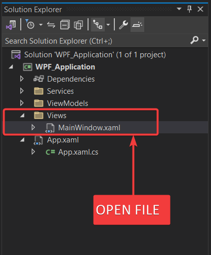
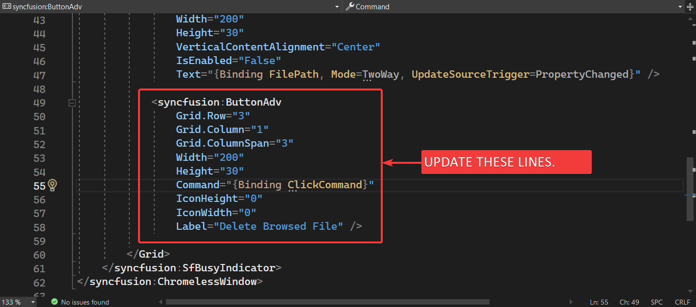
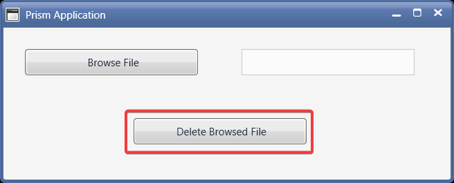
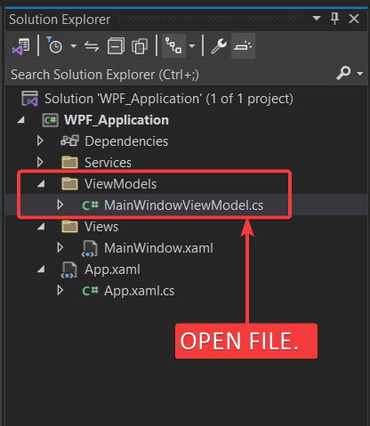
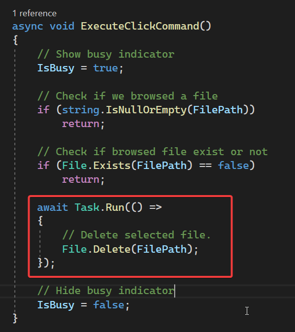
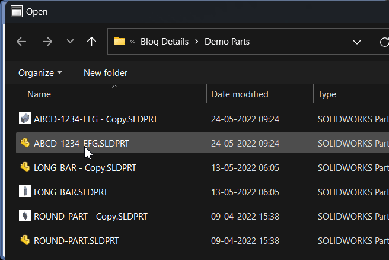

## Objective

I want to:

- ***Browse Solidworks Document File.***

- ***Delete selected browsed file.***

- ***We will continue from previous article 🚀 .***

## Demo Video

Below 🎬 video shows how to **Delete Browse Solidworks Document File** in *Visual Studio 2022*.




## Update XAML File for UI

- In this article, we will update button text only.

- Open "**`MainWindow.xaml`**" as shown in below 👇🏻 image.



- Update "**`MainWindow.xaml`**" as shown in below 👇🏻 image.



- Please see below 👇🏻 code sample for reference.




```xml
<syncfusion:ButtonAdv
    Grid.Row="3"
    Grid.Column="1"
    Grid.ColumnSpan="3"
    Width="200"
    Height="30"
    Command="{Binding ClickCommand}"
    IconHeight="0"
    IconWidth="0"
    Label="Delete Browsed File" />
```




- Please see below 👇🏻 image for update UI.



---

## Update MainWindowViewModel

- In this section, we will update **`MainWindowViewModel.cs {lineNos=true}`** file.

- Open "**`MainWindowViewModel.xaml`**" as shown in below 👇🏻 image.



- Go to "**`ExecuteClickCommand()`**" method.

- Add below 👇🏻 code.




```cs {lineNos=true}
async void ExecuteClickCommand()
{
    // Show busy indicator
    IsBusy = true;

    // Check if we browsed a file
    if (string.IsNullOrEmpty(FilePath))
        return;

    // Check if browsed file exist or not
    if (File.Exists(FilePath) == false)
        return;

    await Task.Run(() =>
    {
        // Delete selected file.
        File.Delete(FilePath);
    });

    // Hide busy indicator
    IsBusy = false;
}
```




- Please see below 👇🏻 image for update UI.



## Final Result

Now we run the application as shown in below 👇🏻 image.



Now we are able to browse file in MVVM pattern successfully.

**This is it !!!**

*I hope my efforts will helpful to someone!*

If you found anything to **add or update**, please let me know on my *e-mail*.

Hope this post helps you to **Browse Solidworks Document UI**.

*If you like the post then please share it with your friends also.*

*Do let me know by you like this post or not!*

*Till then, Happy learning!!!*
