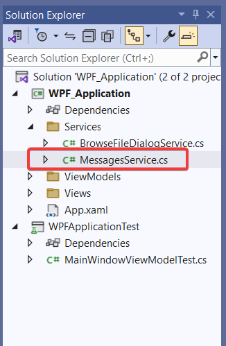
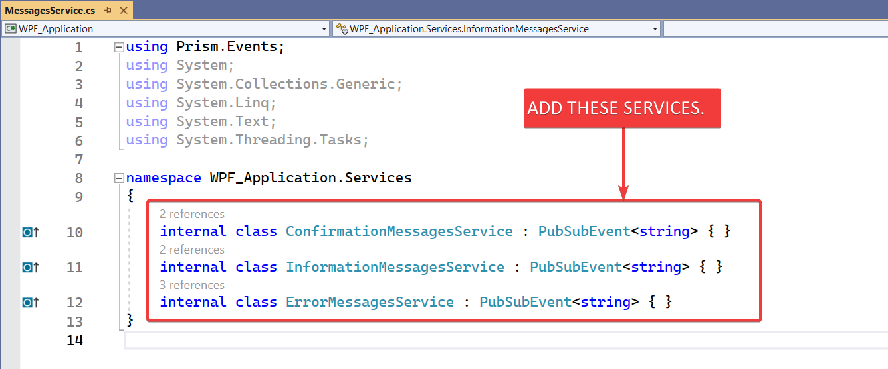
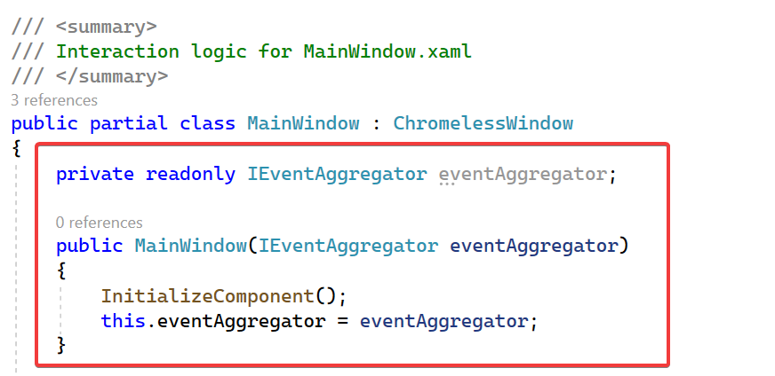
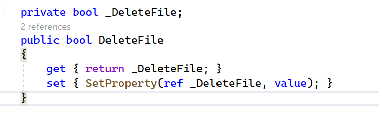
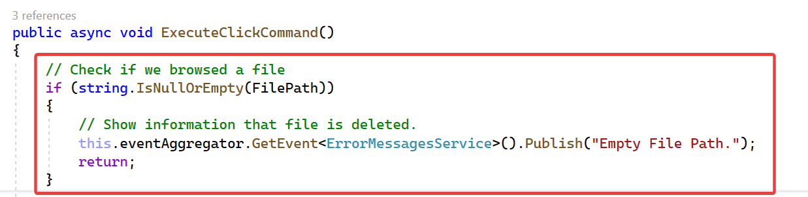
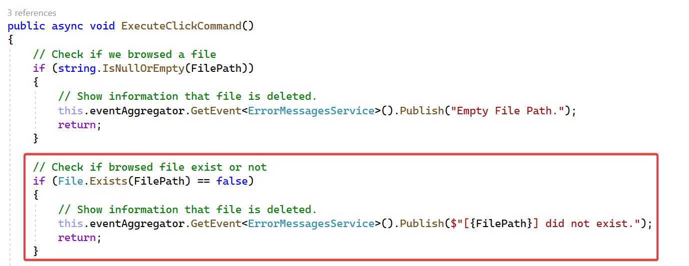
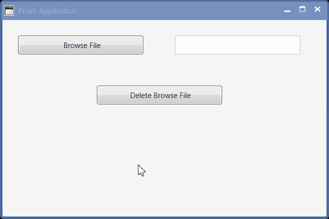

## Objective

I want to:

- ***Show Confirmation message to user before deleting browsed file.***

- ***After deleting file, show information message to user.***

- ***We will continue from previous article 🚀 [Delete Browse Solidworks Document File](/wpf-tutorials/delete-browse-file/).***

## Demo Video

Below 🎬 video shows how to **Add Message Service** in *Visual Studio 2022*.




---

## Add Service for Messaging in application

- Now we add **`MessagesService`** class to "**`Service`**" folder.

- Please see below 👇🏻 image for reference.

[](add-message-service/add-messageservicefile-service.png)

For reference, how to add *Service class*, please visit 🚀 ***[Add Service for Browsing File Dialog](/wpf-tutorials/browse-solidworks-document-ui/#add-service-for-browsing-file-dialog)*** article.

Now we will add following services to this newly created **`MessagesService`** class.

  - **`ConfirmationMessagesService`**

  - **`InformationMessagesService`**

  - **`ErrorMessagesService`**

Please see below 👇🏻 image for reference.

[](add-message-service/add-services.png)

- Please see below 👇🏻 code sample for reference.




```cs
using Prism.Events;
using System;
using System.Collections.Generic;
using System.Linq;
using System.Text;
using System.Threading.Tasks;

namespace WPF_Application.Services
{
    internal class ConfirmationMessagesService : PubSubEvent<string> { }
    internal class InformationMessagesService : PubSubEvent<string> { }
    internal class ErrorMessagesService : PubSubEvent<string> { }
}
```




- For more details on how to add *Services*, please visit 🚀 ***[Add Service for Browsing File Dialog](/wpf-tutorials/browse-solidworks-document-ui/#add-service-for-browsing-file-dialog)*** article.

- In above line, we add **`<string>`** to all **`PubSubEvent`** class.

- This indicate that, when we **Publish** our service, we need to give a **`string`** as passing parameter to **Publish** service.

- For example, we will pass a **question** as **`string`** when we **Publish** **`ConfirmationMessagesService`** service.

---

## Register Services

- Open **`MainWindow.xaml.cs`** file.

- Pass **`IEventAggregator`** to constructor, and assigned it to private field.

- Please see below 👇🏻 image for reference.

[](add-message-service/pass-parameter-to-constructor.png)

- Please see below 👇🏻 code sample for reference.




```cs
using Microsoft.Win32;
using Prism.Events;
using Syncfusion.Windows.Shared;
using System;
using System.Windows;
using WPF_Application.Services;
using WPF_Application.ViewModels;

namespace WPF_Application.Views
{
    /// <summary>
    /// Interaction logic for MainWindow.xaml
    /// </summary>
    public partial class MainWindow : ChromelessWindow
    {
        private readonly IEventAggregator eventAggregator;

        public MainWindow(IEventAggregator eventAggregator)
        {
            InitializeComponent();
            this.eventAggregator = eventAggregator;
        }
    }
}
```




- Now, we **register** our services.

- When these service is called, some functions will gets executed.

- These registration and execution is handle by **`eventAggregator`** field.

- Please see below 👇🏻 code sample for reference.




```cs
using Microsoft.Win32;
using Prism.Events;
using Syncfusion.Windows.Shared;
using System;
using System.Windows;
using WPF_Application.Services;
using WPF_Application.ViewModels;

namespace WPF_Application.Views
{
    /// <summary>
    /// Interaction logic for MainWindow.xaml
    /// </summary>
    public partial class MainWindow : ChromelessWindow
    {
        private readonly IEventAggregator eventAggregator;

        public MainWindow(IEventAggregator eventAggregator)
        {
            InitializeComponent();
            this.eventAggregator = eventAggregator;
            this.eventAggregator.GetEvent<BrowseFileDialogService>().Subscribe(BrowseFile);
            this.eventAggregator.GetEvent<ConfirmationMessagesService>().Subscribe(ConfirmationMessages);
            this.eventAggregator.GetEvent<InformationMessagesService>().Subscribe(InformationMessages);
            this.eventAggregator.GetEvent<ErrorMessagesService>().Subscribe(ErrorMessages);
        }

        private void BrowseFile()
        {
            OpenFileDialog openFileDialog = new OpenFileDialog();
            openFileDialog.Filter = "Solidworks Part|*.sldprt|Solidworks Assembly|*.sldasm|Solidworks Drawing|*.slddrw";
            openFileDialog.DefaultExt = "*.sldprt";

            bool? result = openFileDialog.ShowDialog();

            if (result == false || string.IsNullOrEmpty(openFileDialog.FileName))
                return;

            var viewModel = DataContext as MainWindowViewModel;
            viewModel.FilePath = openFileDialog.FileName;
        }

        private void ConfirmationMessages(string messageToShow)
        {
            var result = MessageBox.Show(messageToShow, "Confirmation", MessageBoxButton.YesNo, MessageBoxImage.Question);
            var viewModel = DataContext as MainWindowViewModel;
            viewModel.DeleteFile = (result == MessageBoxResult.Yes) ? true : false;
        }

        private void InformationMessages(string messageToShow)
        {
            MessageBox.Show(messageToShow, "Information", MessageBoxButton.OK, MessageBoxImage.Information);
        }

        private void ErrorMessages(string messageToShow)
        {
            MessageBox.Show(messageToShow, "Error", MessageBoxButton.OK, MessageBoxImage.Error);
        }
    }
}
```




## Understand Service Methods

- In above code, we register 4 services. They are as follows:

  - **`BrowseFileDialogService`**
  - **`ConfirmationMessagesService`**
  - **`InformationMessagesService`**
  - **`ErrorMessagesService`**

- **`BrowseFileDialogService`** is already explained in 🚀 ***[Understand Service Call Execute Function](/wpf-tutorials/browse-solidworks-document-ui/#understand-service-call-execute-function)*** article.

- Please visit 🚀 ***[Understand Service Call Execute Function](/wpf-tutorials/browse-solidworks-document-ui/#understand-service-call-execute-function)*** article for more details.

- In this section, we will understand remaining 3 service and their respective execution methods.

### Understand `ConfirmationMessages` method

- In **`MainWindow.xaml.cs`** contructor, we register **`ConfirmationMessagesService`** service.

- When we call for **`ConfirmationMessagesService`** service, we execute **`ConfirmationMessages`** method.

- Now let us understand **`ConfirmationMessages`** method as follows.

```cs
private void ConfirmationMessages(string messageToShow)
{
    var result = MessageBox.Show(messageToShow, "Confirmation", MessageBoxButton.YesNo, MessageBoxImage.Question);
    var viewModel = DataContext as MainWindowViewModel;
    viewModel.DeleteFile = (result == MessageBoxResult.Yes) ? true : false;
}
```

- In  **`ConfirmationMessages`** method, we pass a **`string`** as parameter.

    - **Parameter Name**: **`messageToShow`**
    - **Variable Type**: **`string`**
    - **Return Type**: **`Void`**

```cs
var result = MessageBox.Show(messageToShow, "Confirmation", MessageBoxButton.YesNo, MessageBoxImage.Question);
```

- In above line, we create a variable as follows:

  - **Variable Name**: **`result`**
  - **Variable Type**: **`var`**

- In above line, we store result of **`MessageBox.Show`** method into **`result`** variable.

- This **`MessageBox.Show`** method takes following parameters.

  - **messageBoxText**: *A String that specifies the text to display*.
  - **caption**: A String that specifies the title bar caption to display.
  - **button**: A **`MessageBoxButtons`** values that specifies which buttons to display in the message box. These buttons are as follows.

      | Member                | Description                                                                           |
      | --------------------- | ------------------------------------------------------------------------------------- |
      | **AbortRetryIgnore**  | `2: The message box contains Abort, Retry, and Ignore buttons.`                       |
      | **CancelTryContinue** | `6: Specifies that the message box contains Cancel, Try Again, and Continue buttons.` |
      | **OK**                | `0: The message box contains an OK button.`                                           |
      | **OKCancel**          | `1: The message box contains OK and Cancel buttons.`                                  |
      | **RetryCancel**       | `5: The message box contains Retry and Cancel buttons.`                               |
      | **YesNo**             | `4: The message box contains Yes and No buttons.`                                     |
      | **YesNoCancel**       | `3: The message box contains Yes, No, and Cancel buttons.`                            |

  - **icon**: A **`MessageBoxImage`** value that specifies the icon to display. These buttons are as follows.
      
      | Member          | Description                                                                                                        |
      | --------------- | ------------------------------------------------------------------------------------------------------------------ |
      | **Asterisk**    | `64: The message box contains a symbol consisting of a lowercase letter i in a circle.`                            |
      | **Error**       | `16: The message box contains a symbol consisting of white X in a circle with a red background.`                   |
      | **Exclamation** | `48: The message box contains a symbol consisting of an exclamation point in a triangle with a yellow background.` |
      | **Hand**        | `16: The message box contains a symbol consisting of white X in a circle with a red background.`                   |
      | **Information** | `64: The message box contains a symbol consisting of a lowercase letter i in a circle.`                            |
      | **None**        | `0: The message box contains no symbols.`                                                                          |
      | **Stop**        | `16: The message box contains a symbol consisting of white X in a circle with a red background.`                   |
      | **Warning**     | `48: The message box contains a symbol consisting of an exclamation point in a triangle with a yellow background.` |

  - Result Value: This **`MessageBox.Show`** method return **`MessageBoxResult`** value that specifies which message box button is clicked by the user as follows.

    | Member     | Description                                             |
    | ---------- | ------------------------------------------------------- |
    | **Cancel** | **`2: The result value of the message box is Cancel.`** |
    | **No**     | **`7: The result value of the message box is No.`**     |
    | **None**   | **`0: The message box returns no result.`**             |
    | **OK**     | **`1: The result value of the message box is OK.`**     |
    | **Yes**    | **`6: The result value of the message box is Yes.`**    |

- Parameter values we used in our code are as follows:

    | Parameter Name     | Value Used                     |
    | ------------------ | ------------------------------ |
    | **messageBoxText** | **`messageToShow`**            |
    | **caption**        | **`"Confirmation"`**           |
    | **button**         | **`MessageBoxButton.YesNo`**   |
    | **icon**           | **`MessageBoxImage.Question`** |

- Please visit 🚀 ***[MessageBox.Show Method](https://learn.microsoft.com/en-us/dotnet/api/system.windows.messagebox.show?view=windowsdesktop-7.0)*** article for more details.

```cs
var viewModel = DataContext as MainWindowViewModel;
```

- In above line of code, we create a variable as follows:

  - **Variable Name**: **`viewModel`**
  - **Variable Type**: **`MainWindowViewModel`**
  - **Value**: **`DataContext`** property of **`MainWindow`**.

```cs
viewModel.DeleteFile = (result == MessageBoxResult.Yes) ? true : false;
```

- In above line, we set the value of **`DeleteFile`** property.

- This property is part of **`viewModel`** variable.



Please note that **we still not created this propery**, so Visual studio will show error.



- We set the value of **`DeleteFile`** property to **`true`** or **`false`**, based on condition.
  - **Condition**: **`(result == MessageBoxResult.Yes)`**
  - If above condition is **`true`**, then final value is **`true`**.
  - If above condition is **`false`**, then final value is **`false`**.

### Understand `InformationMessages` method

- Now let us understand **`InformationMessages`** method as follows.

```cs
private void InformationMessages(string messageToShow)
{
    MessageBox.Show(messageToShow, "Information", MessageBoxButton.OK, MessageBoxImage.Information);
}
```

- In above line of code, we *show* a **`MessageBox`** to user.

- For this, we use **`MessageBox.Show`** method.

- For more details on **`MessageBox.Show`** method please read previous section of this article.

- Parameter values we used in our code are as follows:

| Parameter Name     | Value Used                        |
| ------------------ | --------------------------------- |
| **messageBoxText** | **`messageToShow`**               |
| **caption**        | **`"Information"`**               |
| **button**         | **`MessageBoxButton.OK`**         |
| **icon**           | **`MessageBoxImage.Information`** |

### Understand `ErrorMessages` method

- Now let us understand **`ErrorMessages`** method as follows.

```cs
private void ErrorMessages(string messageToShow)
{
    MessageBox.Show(messageToShow, "Error", MessageBoxButton.OK, MessageBoxImage.Error);
}
```

- In above line of code, we *show* a **`MessageBox`** to user.

- For this, we use **`MessageBox.Show`** method.

- For more details on **`MessageBox.Show`** method please read previous section of this article.

- Parameter values we used in our code are as follows:

| Parameter Name     | Value Used                  |
| ------------------ | --------------------------- |
| **messageBoxText** | **`messageToShow`**         |
| **caption**        | **`"Error"`**               |
| **button**         | **`MessageBoxButton.OK`**   |
| **icon**           | **`MessageBoxImage.Error`** |

## Update `MainWindowViewModel` For Message Service

- Open **`MainWindowViewModel.cs`** file.

- Add **`DeleteFile`** property as shown below.

[](add-message-service/add-delete-property.png)

- Please see below code for adding **`DeleteFile`** property.




```cs
private bool _DeleteFile;
public bool DeleteFile
{
    get { return _DeleteFile; }
    set { SetProperty(ref _DeleteFile, value); }
}
```




### Show message for Empty `FilePath` property

- Show *error message* to user *if we browsed a file or not*.

- Please see below 👇🏻 image for how to add code for *showing error message*.

[](add-message-service/show-message-for-empty-file.png)

- Please see below code for *showing error message* on empty browsed file.




```cs
// Check if we browsed a file
if (string.IsNullOrEmpty(FilePath))
{
    // Show information that file is deleted.
    this.eventAggregator.GetEvent<ErrorMessagesService>().Publish("Empty File Path.");
    return;
}
```




### Show message if browsed file exist or not

- Show *error message* to user *if browsed file exist or not*.

- Please see below 👇🏻 image for how to add code for *showing error message*.

[](add-message-service/browse-file-did-not-exit.png)

- Please see below code for *showing error message* on empty browsed file.




```cs
// Check if browsed file exist or not
if (File.Exists(FilePath) == false)
{
    // Show information that file is deleted.
    this.eventAggregator.GetEvent<ErrorMessagesService>().Publish($"[{FilePath}] did not exist.");
    return;
}
```




### Get Confirmation From User

- Please see below code for *Get confirmation from user*.




```cs
// Get confirmation from user
this.eventAggregator.GetEvent<ConfirmationMessagesService>().Publish($"Do you want to delete [{FilePath}]?");
```




### When User Declined Confirmation

- In this section, we check, if user **`not give confirmation`** for deleting file.




```cs
// Not confirmed then clear data and exit function.
if (!DeleteFile)
{
    ClearData();
    return;
}

/// <summary>
/// Method for clearing <see cref="FilePath"/> property.
/// </summary>
void ClearData() => FilePath = string.Empty;
```




### When User Give Confirmation for Deleting File




```cs
// Show busy indicator
IsBusy = true;

await Task.Run(() =>
{
    // Delete Selected File
    File.Delete(FilePath);

});

// Hide busy indicator
IsBusy = false;
```




### Show Success Message To User

- Please see below code for *Show information that file is deleted.*




```cs
// Show information that file is deleted.
this.eventAggregator.GetEvent<InformationMessagesService>().Publish("File sucessfully deleted.");
```




## Final Result

Now we run the application as shown in below 👇🏻 image.

[](add-message-service/final)-result.gif

Now we are able to **delete browsed file** in MVVM pattern successfully.

**This is it !!!**

*I hope my efforts will helpful to someone!*

If you found anything to **add or update**, please let me know on my *e-mail*.

Hope this post helps you to **show message services to users in WPF Prism application**.

*If you like the post then please share it with your friends also.*

*Do let me know by you like this post or not!*

*Till then, Happy learning!!!*
