## Objective

I want to:

- ***Create User Interface for Inserting Solidworks Sketch into Sketch Document.***

- ***Share method which allowed us to use 'Properties and methods' of 'ViewModel' as 'IntelliSense' in 'XAML UI'.***

Important Note:

- ***We will reference previous articles for adding controls and services.*** 

- ***Hence reading previous WPF artices is highly suggested.***

---

## Demo Video

Below 🎬 video shows how to **Insert Solidworks Sketch into Solidworks Document UI** in *Visual Studio 2022*.




---

## Setting Project

We need to **add some required UI changes** as part of **Project Setup**.

Please follow below sections for this.

### Add [Prism Project]

- First, we **add Prism Project** for our requirement.

- We already **have an article** where we **add Prism Project**.

- Please see 🚀 ****** section of 🚀 ****** article for creating **New Prism project**.

- Please see below image for folder structure.

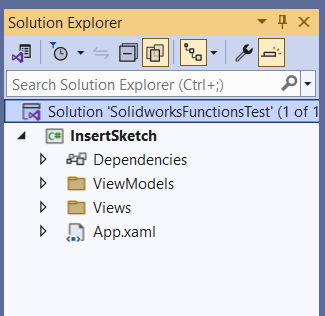


---

### Add [Syncfusion Chromeless Window]

-	Now, we need to add **“Syncfusion Chromeless Window”** into our View.

-	We already **have an article** where we add **“Syncfusion Chromeless Window”** into our View.

- Please see 🚀 ****** section of 🚀 ****** article for creating **New Prism project**.

---

### Add [Design Time DataContext]

- Now, we need to enable **“IntelliSense”** for our **ViewModel**.

- This will **enable** us to see **Public Properties and Methods** of **ViewModel** class into our **xaml** file.

- For that, first open **“MainWindow.xaml”** file.

- Now we need to **add below namespace** into **“MainWindow.xaml”** file.




```xml {lineNos=true}
xmlns:d="http://schemas.microsoft.com/expression/blend/2008"
xmlns:mc="http://schemas.openxmlformats.org/markup-compatibility/2006"
```




- Please see below 👇🏻 image for reference.

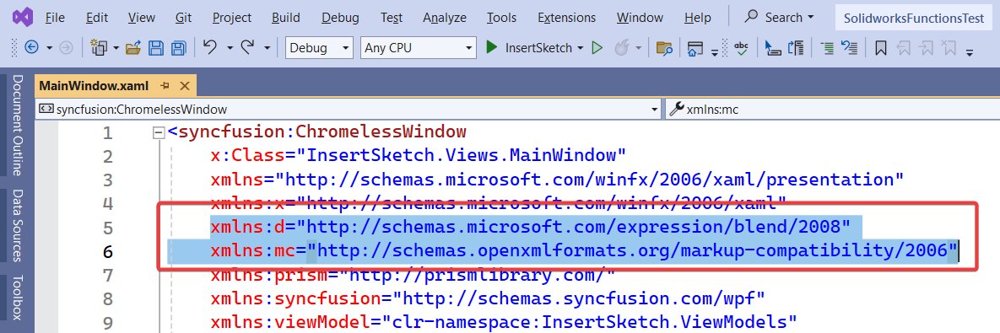


- After *adding namespace*, we need **define Design Time DataContext**.

- For our **“MainWindow”** view, *DataContext* is **“MainWindowViewModel”** class. 

- Hence, we also need to define **“MainWindowViewModel”** as Design Time DataContext.

- For this we need to add below line.




```xml {lineNos=true}
d:DataContext="{d:DesignInstance viewModel:MainWindowViewModel}"
```




- Please see below 👇🏻 image for reference.

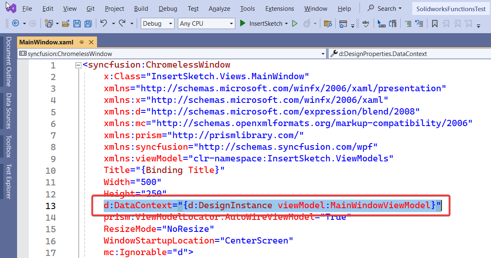


- After *setting Design Time DataContext*, we need to **ignore Design time values while executing**.

- For this we need to add below line.




```xml {lineNos=true}
mc:Ignorable="d"
```




- Please see below 👇🏻 image for reference.

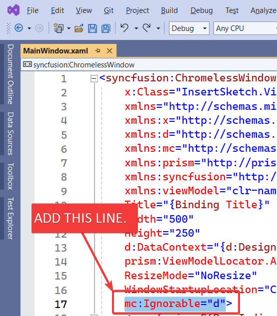


- Full code same is give below.




```xml {lineNos=true}
<syncfusion:ChromelessWindow
    x:Class="InsertSketch.Views.MainWindow"
    xmlns="http://schemas.microsoft.com/winfx/2006/xaml/presentation"
    xmlns:x="http://schemas.microsoft.com/winfx/2006/xaml"
    xmlns:d="http://schemas.microsoft.com/expression/blend/2008"
    xmlns:mc="http://schemas.openxmlformats.org/markup-compatibility/2006"
    xmlns:prism="http://prismlibrary.com/"
    xmlns:syncfusion="http://schemas.syncfusion.com/wpf"
    xmlns:viewModel="clr-namespace:InsertSketch.ViewModels"
    Title="{Binding Title}"
    Width="500"
    Height="250"
    d:DataContext="{d:DesignInstance viewModel:MainWindowViewModel}"
    prism:ViewModelLocator.AutoWireViewModel="True"
    ResizeMode="NoResize"
    WindowStartupLocation="CenterScreen"
    mc:Ignorable="d">
```




- As *an example* to show, how IntelliSense work, just **remove any existing Binding properties**.

- We remove **`Title`** property and re-add it.

- While adding, you will notice **`Title`** property of **“MainWindowViewModel”** in **Blue color**.

- Please see below 👇🏻 image for reference.

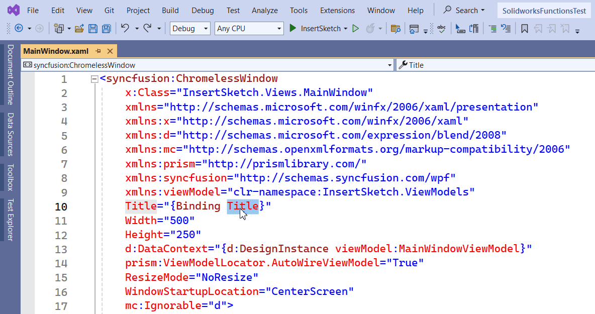


---

### Add [Syncfusion Busy Indicator]

- Now, we need to add **“Syncfusion Busy Indicator”** into our View.

- We already **have an article** where we add **“Syncfusion Busy Indicator”** into our View.

- Please see 🚀 ****** article for adding **“Syncfusion Busy Indicator”**.

---

## Add Controls For UI

We will some Controls to arrange and show them in UI.

Please follow below section to add them.

### Add [Grid]

- First, we add **`<Grid>`** tag inside **`<syncfusion:SfBusyIndicator>`** tag.

- Please see below 👇🏻 image for reference.

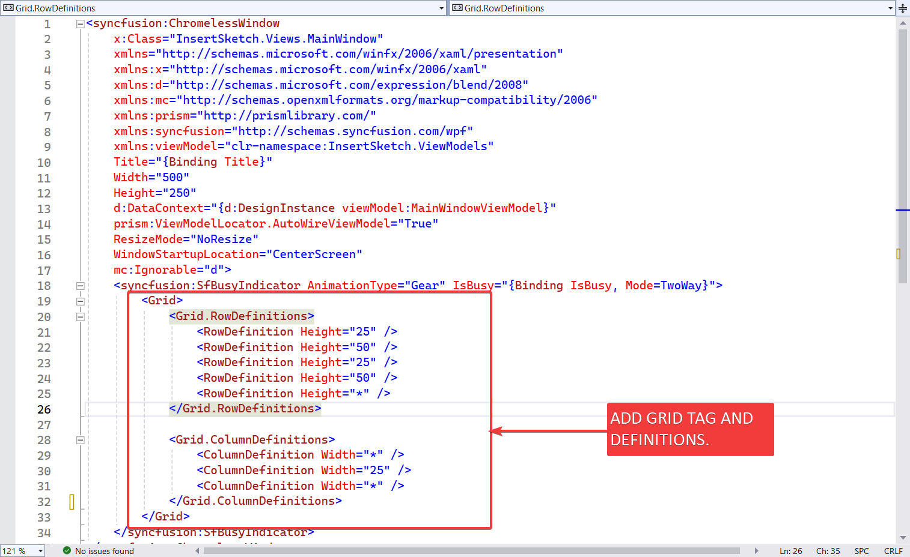

- Please see below 👇🏻 code sample for reference.




```xml {lineNos=true}
<syncfusion:ChromelessWindow
    x:Class="InsertSketch.Views.MainWindow"
    xmlns="http://schemas.microsoft.com/winfx/2006/xaml/presentation"
    xmlns:x="http://schemas.microsoft.com/winfx/2006/xaml"
    xmlns:d="http://schemas.microsoft.com/expression/blend/2008"
    xmlns:mc="http://schemas.openxmlformats.org/markup-compatibility/2006"
    xmlns:prism="http://prismlibrary.com/"
    xmlns:syncfusion="http://schemas.syncfusion.com/wpf"
    xmlns:viewModel="clr-namespace:InsertSketch.ViewModels"
    Title="{Binding Title}"
    Width="500"
    Height="250"
    d:DataContext="{d:DesignInstance viewModel:MainWindowViewModel}"
    prism:ViewModelLocator.AutoWireViewModel="True"
    ResizeMode="NoResize"
    WindowStartupLocation="CenterScreen"
    mc:Ignorable="d">
    <syncfusion:SfBusyIndicator AnimationType="Gear" IsBusy="{Binding IsBusy, Mode=TwoWay}">
        <Grid>
            <Grid.RowDefinitions>
                <RowDefinition Height="25" />
                <RowDefinition Height="50" />
                <RowDefinition Height="25" />
                <RowDefinition Height="50" />
                <RowDefinition Height="*" />
            </Grid.RowDefinitions>

            <Grid.ColumnDefinitions>
                <ColumnDefinition Width="*" />
                <ColumnDefinition Width="25" />
                <ColumnDefinition Width="*" />
            </Grid.ColumnDefinitions>
        </Grid>
    </syncfusion:SfBusyIndicator>
</syncfusion:ChromelessWindow>
```




---

### Add [TextBlock]

- Now add a Label for "**Select Plane**" as shown below.




```xml {lineNos=true}
<TextBlock
    Grid.Row="1"
    Grid.Column="0"
    HorizontalAlignment="Right"
    VerticalAlignment="Center"
    FontSize="24"
    Foreground="Black"
    Text="Select Plane :" />
```




- Please see below 👇🏻 image for reference.

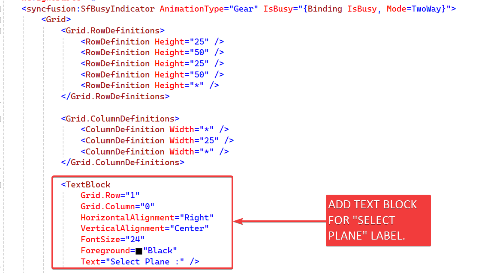

- Please see below 👇🏻 full code sample for reference.




```xml {lineNos=true}
<syncfusion:ChromelessWindow
    x:Class="InsertSketch.Views.MainWindow"
    xmlns="http://schemas.microsoft.com/winfx/2006/xaml/presentation"
    xmlns:x="http://schemas.microsoft.com/winfx/2006/xaml"
    xmlns:d="http://schemas.microsoft.com/expression/blend/2008"
    xmlns:mc="http://schemas.openxmlformats.org/markup-compatibility/2006"
    xmlns:prism="http://prismlibrary.com/"
    xmlns:syncfusion="http://schemas.syncfusion.com/wpf"
    xmlns:viewModel="clr-namespace:InsertSketch.ViewModels"
    Title="{Binding Title}"
    Width="500"
    Height="250"
    d:DataContext="{d:DesignInstance viewModel:MainWindowViewModel}"
    prism:ViewModelLocator.AutoWireViewModel="True"
    ResizeMode="NoResize"
    WindowStartupLocation="CenterScreen"
    mc:Ignorable="d">
    <syncfusion:SfBusyIndicator AnimationType="Gear" IsBusy="{Binding IsBusy, Mode=TwoWay}">
        <Grid>
            <Grid.RowDefinitions>
                <RowDefinition Height="25" />
                <RowDefinition Height="50" />
                <RowDefinition Height="25" />
                <RowDefinition Height="50" />
                <RowDefinition Height="*" />
            </Grid.RowDefinitions>

            <Grid.ColumnDefinitions>
                <ColumnDefinition Width="*" />
                <ColumnDefinition Width="25" />
                <ColumnDefinition Width="*" />
            </Grid.ColumnDefinitions>

            <TextBlock
                Grid.Row="1"
                Grid.Column="0"
                HorizontalAlignment="Right"
                VerticalAlignment="Center"
                FontSize="24"
                Foreground="Black"
                Text="Select Plane :" />

        </Grid>
    </syncfusion:SfBusyIndicator>
</syncfusion:ChromelessWindow>
```




- Please see below 👇🏻 image as *how does this label look* in application.

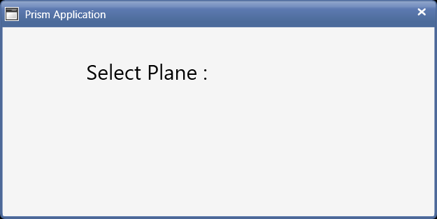


---

### Add [syncfusion:ComboBoxAdv]

- Now we add **`syncfusion:ComboBoxAdv`** for *showing list of Planes*.

- Please see below 👇🏻 image for reference.

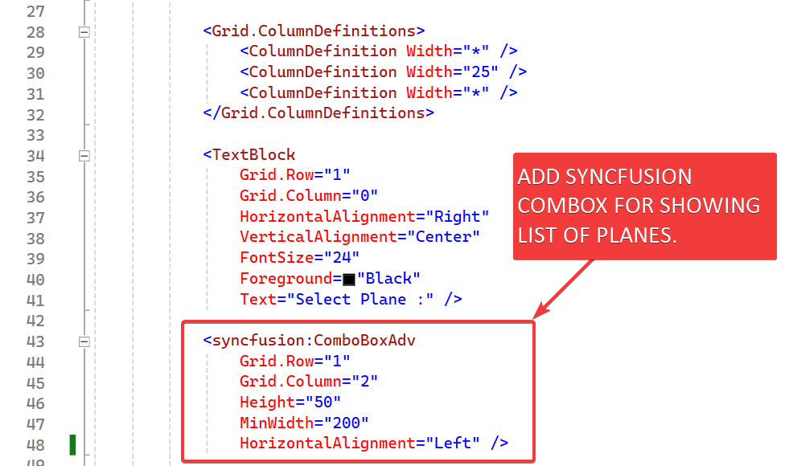


- Please see below 👇🏻 code sample for reference.




```xml {lineNos=true}
<syncfusion:ChromelessWindow
    x:Class="InsertSketch.Views.MainWindow"
    xmlns="http://schemas.microsoft.com/winfx/2006/xaml/presentation"
    xmlns:x="http://schemas.microsoft.com/winfx/2006/xaml"
    xmlns:d="http://schemas.microsoft.com/expression/blend/2008"
    xmlns:mc="http://schemas.openxmlformats.org/markup-compatibility/2006"
    xmlns:prism="http://prismlibrary.com/"
    xmlns:syncfusion="http://schemas.syncfusion.com/wpf"
    xmlns:viewModel="clr-namespace:InsertSketch.ViewModels"
    Title="{Binding Title}"
    Width="500"
    Height="250"
    d:DataContext="{d:DesignInstance viewModel:MainWindowViewModel}"
    prism:ViewModelLocator.AutoWireViewModel="True"
    ResizeMode="NoResize"
    WindowStartupLocation="CenterScreen"
    mc:Ignorable="d">
    <syncfusion:SfBusyIndicator AnimationType="Gear" IsBusy="{Binding IsBusy, Mode=TwoWay}">
        <Grid>
            <Grid.RowDefinitions>
                <RowDefinition Height="25" />
                <RowDefinition Height="50" />
                <RowDefinition Height="25" />
                <RowDefinition Height="50" />
                <RowDefinition Height="*" />
            </Grid.RowDefinitions>

            <Grid.ColumnDefinitions>
                <ColumnDefinition Width="*" />
                <ColumnDefinition Width="25" />
                <ColumnDefinition Width="*" />
            </Grid.ColumnDefinitions>

            <TextBlock
                Grid.Row="1"
                Grid.Column="0"
                HorizontalAlignment="Right"
                VerticalAlignment="Center"
                FontSize="24"
                Foreground="Black"
                Text="Select Plane :" />

            <syncfusion:ComboBoxAdv
                Grid.Row="1"
                Grid.Column="2"
                Height="50"
                MinWidth="200"
                HorizontalAlignment="Left" />

        </Grid>
    </syncfusion:SfBusyIndicator>
</syncfusion:ChromelessWindow>
```




- Please see below 👇🏻 image as *how Plane list look* in application.

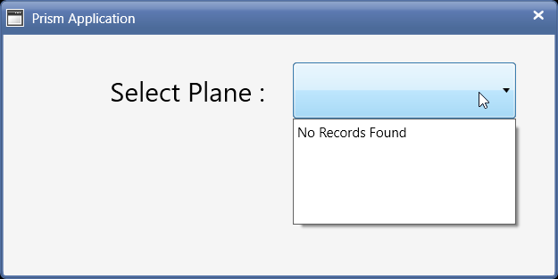

---

### Add [syncfusion:ButtonAdv]

- Now we add **`syncfusion:ButtonAdv`** button.

- This button **execute function** for **Inserting Sketch into Solidworks Part Document**.

- Please see below 👇🏻 image for reference.

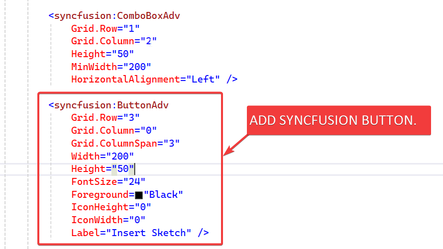


- Please see below 👇🏻 code sample for reference.




```xml {lineNos=true}
<syncfusion:ChromelessWindow
    x:Class="InsertSketch.Views.MainWindow"
    xmlns="http://schemas.microsoft.com/winfx/2006/xaml/presentation"
    xmlns:x="http://schemas.microsoft.com/winfx/2006/xaml"
    xmlns:d="http://schemas.microsoft.com/expression/blend/2008"
    xmlns:mc="http://schemas.openxmlformats.org/markup-compatibility/2006"
    xmlns:prism="http://prismlibrary.com/"
    xmlns:syncfusion="http://schemas.syncfusion.com/wpf"
    xmlns:viewModel="clr-namespace:InsertSketch.ViewModels"
    Title="{Binding Title}"
    Width="500"
    Height="250"
    d:DataContext="{d:DesignInstance viewModel:MainWindowViewModel}"
    prism:ViewModelLocator.AutoWireViewModel="True"
    ResizeMode="NoResize"
    WindowStartupLocation="CenterScreen"
    mc:Ignorable="d">
    <syncfusion:SfBusyIndicator AnimationType="Gear" IsBusy="{Binding IsBusy, Mode=TwoWay}">
        <Grid>
            <Grid.RowDefinitions>
                <RowDefinition Height="25" />
                <RowDefinition Height="50" />
                <RowDefinition Height="25" />
                <RowDefinition Height="50" />
                <RowDefinition Height="*" />
            </Grid.RowDefinitions>

            <Grid.ColumnDefinitions>
                <ColumnDefinition Width="*" />
                <ColumnDefinition Width="25" />
                <ColumnDefinition Width="*" />
            </Grid.ColumnDefinitions>

            <TextBlock
                Grid.Row="1"
                Grid.Column="0"
                HorizontalAlignment="Right"
                VerticalAlignment="Center"
                FontSize="24"
                Foreground="Black"
                Text="Select Plane :" />

            <syncfusion:ComboBoxAdv
                Grid.Row="1"
                Grid.Column="2"
                Height="50"
                MinWidth="200"
                HorizontalAlignment="Left" />

            <syncfusion:ButtonAdv
                Grid.Row="3"
                Grid.Column="0"
                Grid.ColumnSpan="3"
                Width="200"
                Height="50"
                FontSize="24"
                Foreground="Black"
                IconHeight="0"
                IconWidth="0"
                Label="Insert Sketch" />

        </Grid>
    </syncfusion:SfBusyIndicator>
</syncfusion:ChromelessWindow>
```




- Please see below 👇🏻 image as *how Insert Sketch* looks in application.

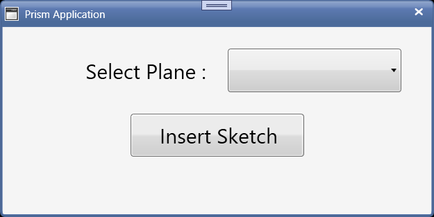


---

## Set Message Services

In this section, we **setup Message Services** to **communicate in our application**.

For this please follow below 👇🏻 sections.

### Add Message Services

- Now, we need to **“Add Message Services”** into our application.

- We already **have an article** where we **“Add Message Services”** into our application.

- Please see 🚀 ****** section of 🚀 ***[Add Message Service](/wpf-tutorials/add-messages-service/)*** article for adding **Message Services**.

- Following Services added:

  - **`ConfirmationMessagesService`**
  - **`InformationMessagesService`**
  - **`ErrorMessagesService`**

- Please see below 👇🏻 code sample for reference.




```cs {lineNos=true}
using Prism.Events;

namespace InsertSketch.Services
{
    internal class ConfirmationMessagesService : PubSubEvent<string> { }
    internal class InformationMessagesService : PubSubEvent<string> { }
    internal class ErrorMessagesService : PubSubEvent<string> { }
}
```




---

### Register Message Services

- Now, we need to **“Register Message Services”** into our application.

- We already **have an article** where we **“Register Message Services”** into our application.

- Please see 🚀 ****** section of 🚀 ****** article for adding **Message Services**.

- Please see below 👇🏻 code sample for reference.




```cs {lineNos=true}
using InsertSketch.Services;
using InsertSketch.ViewModels;
using Prism.Events;
using Syncfusion.Windows.Shared;
using System.Windows;

namespace InsertSketch.Views
{
    /// <summary>
    /// Interaction logic for MainWindow.xaml
    /// </summary>
    public partial class MainWindow : ChromelessWindow
    {
        private readonly IEventAggregator eventAggregator;

        public MainWindow(IEventAggregator eventAggregator)
        {
            InitializeComponent();
            this.eventAggregator = eventAggregator;
            this.eventAggregator.GetEvent<ConfirmationMessagesService>().Subscribe(ConfirmationMessages);
            this.eventAggregator.GetEvent<InformationMessagesService>().Subscribe(InformationMessages);
            this.eventAggregator.GetEvent<ErrorMessagesService>().Subscribe(ErrorMessages);
        }

        private void ConfirmationMessages(string messageToShow)
        {
            var result = MessageBox.Show(messageToShow, "Confirmation", MessageBoxButton.YesNo, MessageBoxImage.Question);
        }

        private void InformationMessages(string messageToShow)
        {
            MessageBox.Show(messageToShow, "Information", MessageBoxButton.OK, MessageBoxImage.Information);
        }

        private void ErrorMessages(string messageToShow)
        {
            MessageBox.Show(messageToShow, "Error", MessageBoxButton.OK, MessageBoxImage.Error);
        }
    }
}
```




---

### Understand Message Services

- If you want to **“understand Message Services”**, then please visit below article.

- Reference Article: 🚀 ******

---

## Update ViewModel

- Now we need to **“add Properties and Methods”** for **“Binding”** with our view.

  - *View*: **`MainWindow`**
  - *ViewModel*: **`MainWindowViewModel`**

- Please see below 👇🏻 image for **“Properties and Methods”** required.

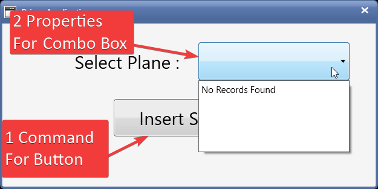


### Add [Properties]

- We need to 2 **“Properties”** for **“Syncfusion ComboBox”**.

  1. *For List of Planes to show in drop down.*
  2. *For Selected Item in drop down.*

- Please see below 👇🏻 code sample for **“Properties”** in **`MainWindowViewModel`**.




```cs {lineNos=true}
private List<string> _planeNames;
public List<string> PlaneNames
{
    get { return _planeNames; }
    set { SetProperty(ref _planeNames, value); }
}

private string _selectedPlane;
public string SelectedPlane
{
    get { return _selectedPlane; }
    set { SetProperty(ref _selectedPlane, value); }
}
```




- Please see below 👇🏻 image for **“Properties and Methods”** required.

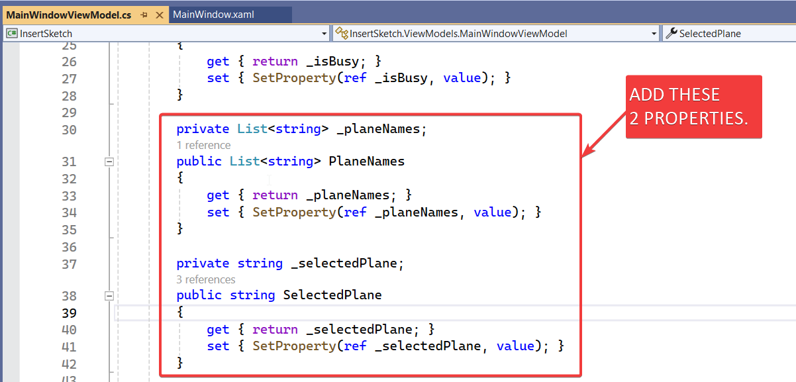

- Now we need to fill, "**Plane Names**" in **`SelectedPlane`** variable.

- We add "**Plane Names**" in Constructor.

- Please see below 👇🏻 code sample for adding "**Plane Names**" in Constructor.




```cs {lineNos=true}
public MainWindowViewModel(IEventAggregator eventAggregator)
{
    PlaneNames = new List<string> { "Front Plane", "Right Plane", "Top Plane" };
    this.eventAggregator = eventAggregator;
}
```




- Please see below 👇🏻 image for adding "**Plane Names**" in Constructor.

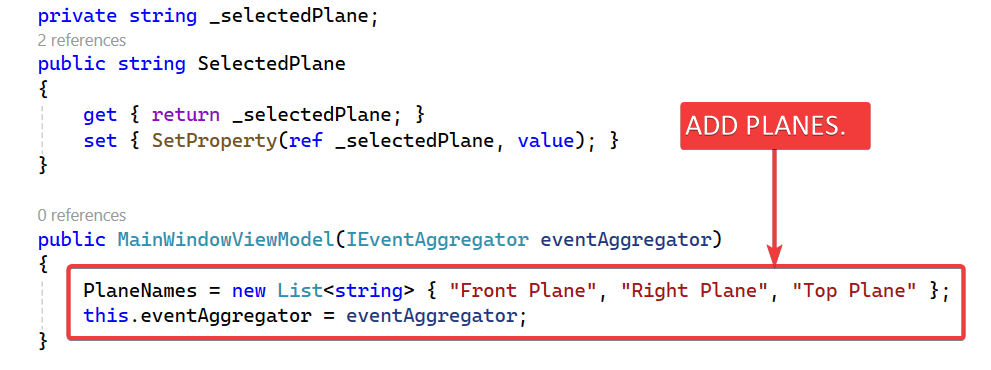


---

### Add [Prism Command]

- We need 1 Prism Command for **syncfusion Button**.

- This command will be *responsible* for **Inserting Sketch** in *Solidworks Part Document*.

- Please see below 👇🏻 code sample for adding **“Prism Command”** in **`MainWindowViewModel`**.




```cs {lineNos=true}
private DelegateCommand _insertSketchCommand;

public DelegateCommand InsertSketchCommand =>
    _insertSketchCommand ?? (_insertSketchCommand = new DelegateCommand(ExecuteInsertSketchCommand));

void ExecuteInsertSketchCommand()
{
    
}
```




- Please see below 👇🏻 image for adding **“Prism Command”** in **`MainWindowViewModel`**.

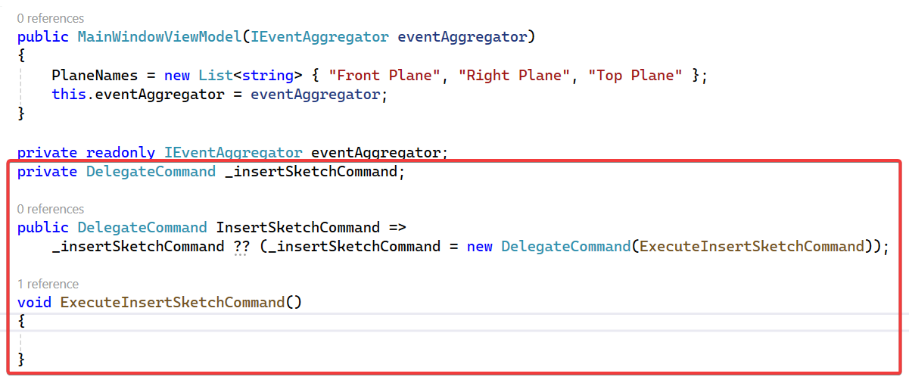


---

### Add Code To Function

- Now we will add some code **`ExecuteInsertSketchCommand`** function.

- We already used this code for in various articles.

- Please see below 👇🏻 code sample for waiting code to add.




```cs {lineNos=true}
private DelegateCommand _insertSketchCommand;

public DelegateCommand InsertSketchCommand =>
    _insertSketchCommand ?? (_insertSketchCommand = new DelegateCommand(ExecuteInsertSketchCommand));

async void ExecuteInsertSketchCommand()
{
    // Show busy indicator
    IsBusy = true;

    await Task.Run(() =>
    {
        // Sleeping with 5 sec
        Thread.Sleep(5000);
    });

    // Hide busy indicator
    IsBusy = false;
}
```




- Please see below 👇🏻 image for waiting code to add.

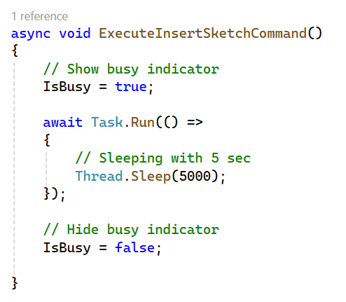





```xml {lineNos=true}
<syncfusion:ComboBoxAdv
    Grid.Row="1"
    Grid.Column="2"
    Height="50"
    MinWidth="200"
    HorizontalAlignment="Left" />
```




---

## Add [Bindings]

In this section we will add Bindings to Syncfusion Combo Box and Syncfusion Button.

### Add [Property Binding]

- We need to Bind previously created **“Properties”** with **“Syncfusion ComboBox”**.

- Please see below 👇🏻 image for adding **“Binding Properties”**.

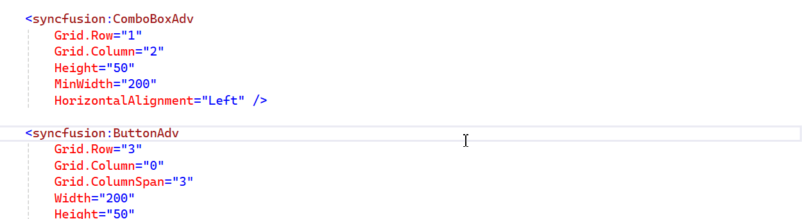


- Please see below 👇🏻 code for adding **“Binding Properties”**.




```xml {lineNos=true}
<syncfusion:ComboBoxAdv
    Grid.Row="1"
    Grid.Column="2"
    Height="50"
    MinWidth="200"
    HorizontalAlignment="Left"
    ItemsSource="{Binding PlaneNames}"
    SelectedItem="{Binding SelectedPlane, Mode=TwoWay, UpdateSourceTrigger=PropertyChanged}" />
```




---

### Add [Command Binding]

- We need to Bind previously created **“Command”** with **“Syncfusion Button”**.

- Please see below 👇🏻 image for adding **“Command”**.

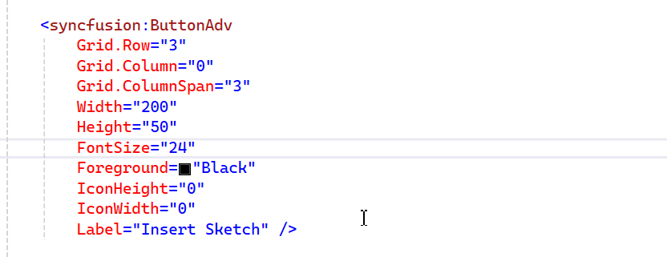

- Please see below 👇🏻 code for adding **“Command”**.




```xml {lineNos=true}
<syncfusion:ButtonAdv
    Grid.Row="3"
    Grid.Column="0"
    Grid.ColumnSpan="3"
    Width="200"
    Height="50"
    Command="{Binding InsertSketchCommand}"
    FontSize="24"
    Foreground="Black"
    IconHeight="0"
    IconWidth="0"
    Label="Insert Sketch" />
```




---

## Update [Syncfusion ComboBox]

- We need to **update Syncfusion ComboBox** for following reasons.

  1. *There is no Default value selected in Syncfusion ComboBox*.

  2. *Font Size of Text in Dropdown in very small*.

Please see below 👇🏻 image for reference.

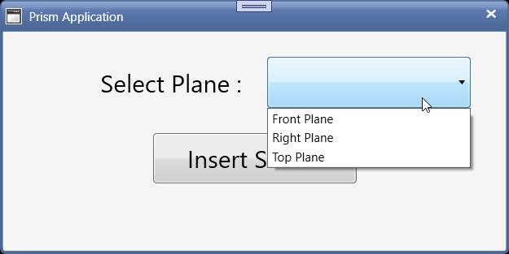


Let us handle them 1 by 1.

### Add Default Value

- For adding *Default Value*, we need to define **`SelectedIndex`** property of **`syncfusion:ComboBoxAdv`**.

- Please see below 👇🏻 image for adding *Default Value*.

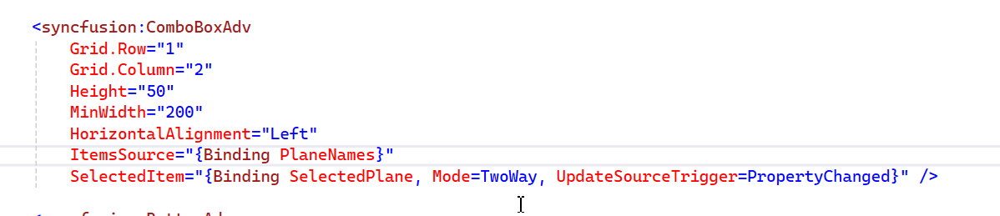

- Please see below 👇🏻 code for adding *Default Value*.




```xml {lineNos=true}
<syncfusion:ComboBoxAdv
    Grid.Row="1"
    Grid.Column="2"
    Height="50"
    MinWidth="200"
    HorizontalAlignment="Left"
    ItemsSource="{Binding PlaneNames}"
    SelectedIndex="0"
    SelectedItem="{Binding SelectedPlane, Mode=TwoWay, UpdateSourceTrigger=PropertyChanged}" />
```




---

### Update Font Size

- For update *Font Size* of Text in Dropdown, we need to define **`ItemTemplate`** of **`syncfusion:ComboBoxAdv`**.

- Please see below 👇🏻 image for adding *Default Value*.

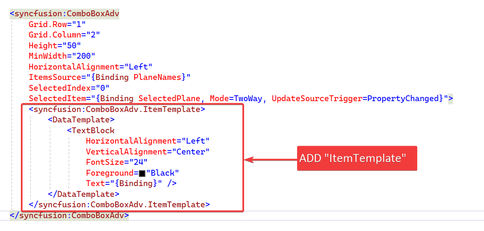


- Please see below 👇🏻 code for adding *Default Value*.




```xml {lineNos=true}
<syncfusion:ComboBoxAdv
    Grid.Row="1"
    Grid.Column="2"
    Height="50"
    MinWidth="200"
    HorizontalAlignment="Left"
    ItemsSource="{Binding PlaneNames}"
    SelectedIndex="0"
    SelectedItem="{Binding SelectedPlane, Mode=TwoWay, UpdateSourceTrigger=PropertyChanged}" />
```




---

## Final Result

Now we run the application as shown in below 👇🏻 image.

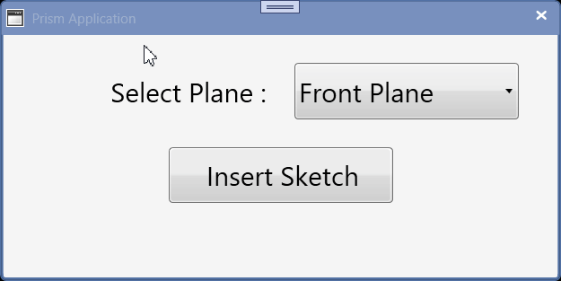

Now **UI part** is completed for *Inserting Sketch in Solidworks Document* in *WPF Prism Application*.

**This is it !!!**

*I hope my efforts will helpful to someone!*

If you found anything to **add or update**, please let me know on my *e-mail*.

Hope this post helps you to **Inserting Sketch in Solidworks Document UI**.

*If you like the post then please share it with your friends also.*

*Do let me know by you like this post or not!*

*Till then, Happy learning!!!*
