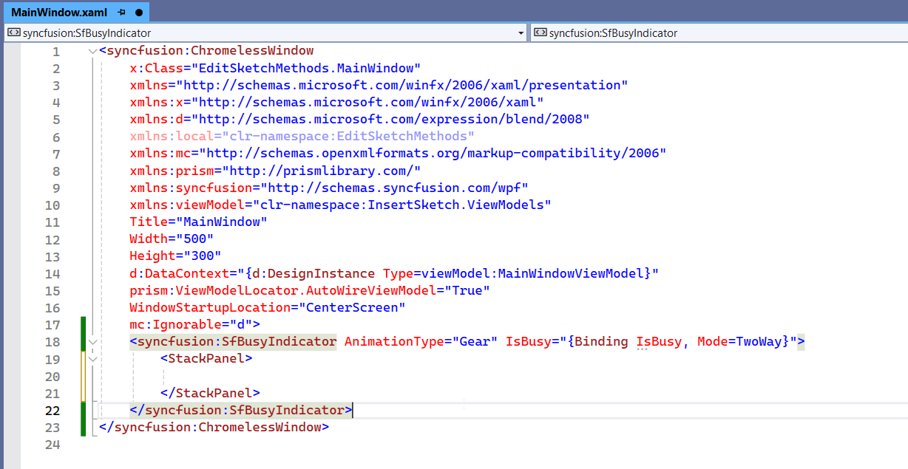
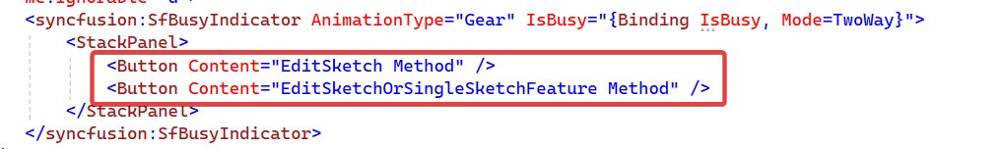
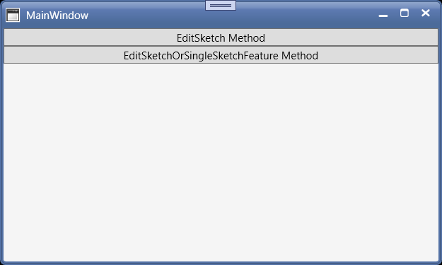
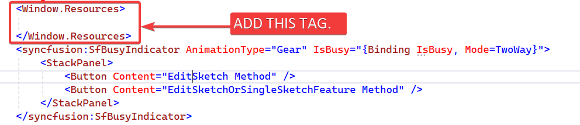
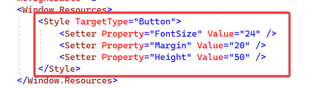
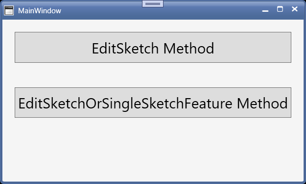
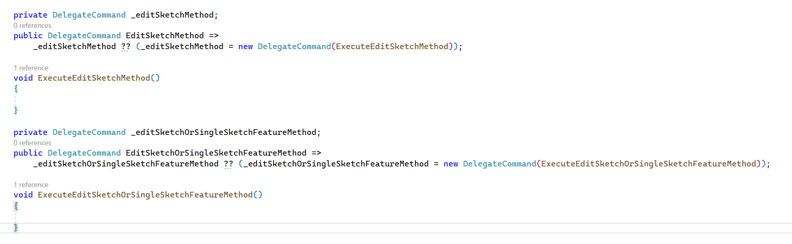
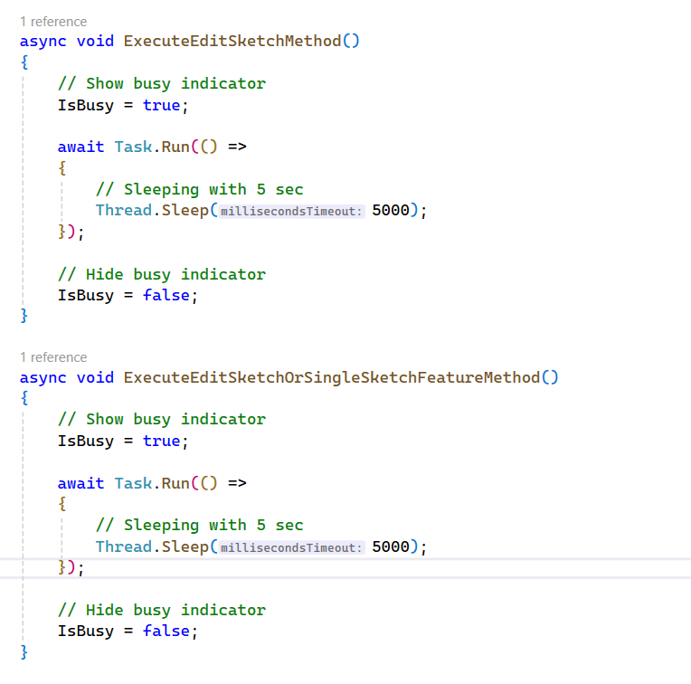
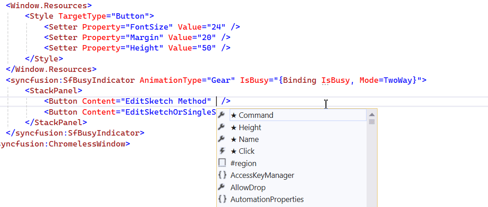
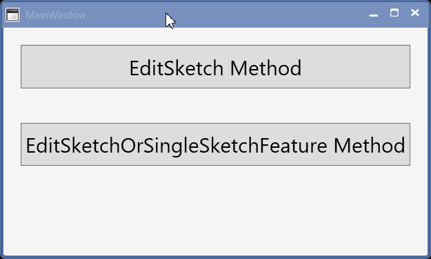

## Objective

I want to:

- ***Create User Interface for Invoking Edit Solidworks Sketch.***

Important Note:

- ***We will use same setup as done in 🚀.*** 

- ***Hence reading previous 🚀 artice is highly recommended.***

---

## Demo Video

Below 🎬 video shows how to **Invoking Edit Solidworks Sketch** in *Visual Studio 2022*.




---

## Setting Project

We need to **add some required UI changes** as part of **Project Setup**.

Please follow below sections for this.

### Add [Prism Project]

- First, we **add Prism Project** for our requirement.

- We already **have an article** where we **add Prism Project**.

- Please see 🚀 ****** section of 🚀 ****** article for creating **New Prism project**.

- Please see below image for folder structure.


---

### Add [Syncfusion Chromeless Window]

-	Now, we need to add **“Syncfusion Chromeless Window”** into our View.

-	We already **have an article** where we add **“Syncfusion Chromeless Window”** into our View.

- Please see 🚀 ****** section of 🚀 ****** article for creating **New Prism project**.

---

### Add [Design Time DataContext]

- In previous 🚀**** section of 🚀**** article, this section is already explained.

- Please visit 🚀**** section of 🚀**** article for more detail on this section.

---

### Add [Syncfusion Busy Indicator]

- Now, we need to add **“Syncfusion Busy Indicator”** into our View.

- We already **have an article** where we add **“Syncfusion Busy Indicator”** into our View.

- Please see 🚀 ****** article for adding **“Syncfusion Busy Indicator”**.

---

## Add Controls For UI

We will some Controls to arrange and show them in UI.

Please follow below section to add them.

### Add [StackPanel]

- First, we add **`<StackPanel>`** tag inside **`<syncfusion:SfBusyIndicator>`** tag.

- Please see below 👇🏻 image for reference.



- Please see below 👇🏻 code sample for reference.




```xml {lineNos=true hl_lines="19-21"}
<syncfusion:ChromelessWindow
    x:Class="EditSketchMethods.MainWindow"
    xmlns="http://schemas.microsoft.com/winfx/2006/xaml/presentation"
    xmlns:x="http://schemas.microsoft.com/winfx/2006/xaml"
    xmlns:d="http://schemas.microsoft.com/expression/blend/2008"
    xmlns:local="clr-namespace:EditSketchMethods"
    xmlns:mc="http://schemas.openxmlformats.org/markup-compatibility/2006"
    xmlns:prism="http://prismlibrary.com/"
    xmlns:syncfusion="http://schemas.syncfusion.com/wpf"
    xmlns:viewModel="clr-namespace:InsertSketch.ViewModels"
    Title="MainWindow"
    Width="500"
    Height="300"
    d:DataContext="{d:DesignInstance Type=viewModel:MainWindowViewModel}"
    prism:ViewModelLocator.AutoWireViewModel="True"
    WindowStartupLocation="CenterScreen"
    mc:Ignorable="d">
    <syncfusion:SfBusyIndicator AnimationType="Gear" IsBusy="{Binding IsBusy, Mode=TwoWay}">
        <StackPanel>
            
        </StackPanel>
    </syncfusion:SfBusyIndicator>
</syncfusion:ChromelessWindow>
```




---

### Add [Button]

- Now add __2__ [**`Button`**] as shown below.




```xml {lineNos=true hl_lines="2-3"}
<StackPanel>
    <Button Content="EditSketch Method" />
    <Button Content="EditSketchOrSingleSketchFeature Method" />
</StackPanel>
```




- Please see below 👇🏻 image for reference.



- Please see below 👇🏻 full code sample for reference.




```xml {lineNos=true hl_lines="20-21"}
<syncfusion:ChromelessWindow
    x:Class="EditSketchMethods.MainWindow"
    xmlns="http://schemas.microsoft.com/winfx/2006/xaml/presentation"
    xmlns:x="http://schemas.microsoft.com/winfx/2006/xaml"
    xmlns:d="http://schemas.microsoft.com/expression/blend/2008"
    xmlns:local="clr-namespace:EditSketchMethods"
    xmlns:mc="http://schemas.openxmlformats.org/markup-compatibility/2006"
    xmlns:prism="http://prismlibrary.com/"
    xmlns:syncfusion="http://schemas.syncfusion.com/wpf"
    xmlns:viewModel="clr-namespace:InsertSketch.ViewModels"
    Title="MainWindow"
    Width="500"
    Height="300"
    d:DataContext="{d:DesignInstance Type=viewModel:MainWindowViewModel}"
    prism:ViewModelLocator.AutoWireViewModel="True"
    WindowStartupLocation="CenterScreen"
    mc:Ignorable="d">
    <syncfusion:SfBusyIndicator AnimationType="Gear" IsBusy="{Binding IsBusy, Mode=TwoWay}">
        <StackPanel>
            <Button Content="EditSketch Method" />
            <Button Content="EditSketchOrSingleSketchFeature Method" />
        </StackPanel>
    </syncfusion:SfBusyIndicator>
</syncfusion:ChromelessWindow>
```




- Please see below 👇🏻 image as *how does these buttons look* in application.




---

### Add [Window.Resources]

In this section, we apply some styles to our buttons.

- For this we add **`Window.Resources`**.

- This **`Window.Resources`** tag contains styles for buttons globally.

- Please see below 👇🏻 image for reference.




- Please see below 👇🏻 code sample for reference.




```xml {lineNos=true hl_lines="18-20"}
<syncfusion:ChromelessWindow
    x:Class="EditSketchMethods.MainWindow"
    xmlns="http://schemas.microsoft.com/winfx/2006/xaml/presentation"
    xmlns:x="http://schemas.microsoft.com/winfx/2006/xaml"
    xmlns:d="http://schemas.microsoft.com/expression/blend/2008"
    xmlns:local="clr-namespace:EditSketchMethods"
    xmlns:mc="http://schemas.openxmlformats.org/markup-compatibility/2006"
    xmlns:prism="http://prismlibrary.com/"
    xmlns:syncfusion="http://schemas.syncfusion.com/wpf"
    xmlns:viewModel="clr-namespace:InsertSketch.ViewModels"
    Title="MainWindow"
    Width="500"
    Height="300"
    d:DataContext="{d:DesignInstance Type=viewModel:MainWindowViewModel}"
    prism:ViewModelLocator.AutoWireViewModel="True"
    WindowStartupLocation="CenterScreen"
    mc:Ignorable="d">
    <Window.Resources>

    </Window.Resources>
    <syncfusion:SfBusyIndicator AnimationType="Gear" IsBusy="{Binding IsBusy, Mode=TwoWay}">
        <StackPanel>
            <Button Content="EditSketch Method" />
            <Button Content="EditSketchOrSingleSketchFeature Method" />
        </StackPanel>
    </syncfusion:SfBusyIndicator>
</syncfusion:ChromelessWindow>
```




---

### Add [Style]

- Now we add **`Style`** tag.

- This tag contains styles for buttons.

- Please see below 👇🏻 image for reference.



- Please see below 👇🏻 code sample for reference.




```xml {lineNos=true hl_lines="19-23"}
<syncfusion:ChromelessWindow
    x:Class="EditSketchMethods.MainWindow"
    xmlns="http://schemas.microsoft.com/winfx/2006/xaml/presentation"
    xmlns:x="http://schemas.microsoft.com/winfx/2006/xaml"
    xmlns:d="http://schemas.microsoft.com/expression/blend/2008"
    xmlns:local="clr-namespace:EditSketchMethods"
    xmlns:mc="http://schemas.openxmlformats.org/markup-compatibility/2006"
    xmlns:prism="http://prismlibrary.com/"
    xmlns:syncfusion="http://schemas.syncfusion.com/wpf"
    xmlns:viewModel="clr-namespace:InsertSketch.ViewModels"
    Title="MainWindow"
    Width="500"
    Height="300"
    d:DataContext="{d:DesignInstance Type=viewModel:MainWindowViewModel}"
    prism:ViewModelLocator.AutoWireViewModel="True"
    WindowStartupLocation="CenterScreen"
    mc:Ignorable="d">
    <Window.Resources>
        <Style TargetType="Button">
            <Setter Property="FontSize" Value="24" />
            <Setter Property="Margin" Value="20" />
            <Setter Property="Height" Value="50" />
        </Style>
    </Window.Resources>
    <syncfusion:SfBusyIndicator AnimationType="Gear" IsBusy="{Binding IsBusy, Mode=TwoWay}">
        <StackPanel>
            <Button Content="EditSketch Method" />
            <Button Content="EditSketchOrSingleSketchFeature Method" />
        </StackPanel>
    </syncfusion:SfBusyIndicator>
</syncfusion:ChromelessWindow>
```




- Please see below 👇🏻 image as *how Insert Sketch* looks in application.



---

## Set Message Services

- In previous 🚀**** section of 🚀**** article, this section is already explained.

- Please visit 🚀**** section of 🚀**** article for more detail on this section.

---

## Update ViewModel

- Now we need to **“add Methods”** for **“Binding”** with our view.

  - *View*: **`MainWindow`**
  - *ViewModel*: **`MainWindowViewModel`**

---

### Add [Prism Command]

- We need __2 Prism__ Commands for **Buttons**.

- These commands will be *responsible* for **Editing Sketch** in *Solidworks Part Document*.

- Please see below 👇🏻 code sample for adding **“Prism Command”** in **`MainWindowViewModel`**.




```cs {lineNos=true}
private DelegateCommand _editSketchMethod;
public DelegateCommand EditSketchMethod =>
    _editSketchMethod ?? (_editSketchMethod = new DelegateCommand(ExecuteEditSketchMethod));

void ExecuteEditSketchMethod()
{
    
} 

private DelegateCommand _editSketchOrSingleSketchFeatureMethod;
public DelegateCommand EditSketchOrSingleSketchFeatureMethod =>
    _editSketchOrSingleSketchFeatureMethod ?? (_editSketchOrSingleSketchFeatureMethod = new DelegateCommand(ExecuteEditSketchOrSingleSketchFeatureMethod));

void ExecuteEditSketchOrSingleSketchFeatureMethod()
{
    
}
```




- Please see below 👇🏻 image for adding **“Prism Command”** in **`MainWindowViewModel`**.




---

### Add Code To Function

- Now we will add some code to **`ExecuteEditSketchMethod`** & **`ExecuteEditSketchOrSingleSketchFeatureMethod`** methods.

- Please see below 👇🏻 code sample for waiting code to add.




```cs {lineNos=true}
async void ExecuteEditSketchMethod()
{
    // Show busy indicator
    IsBusy = true;

    await Task.Run(() =>
    {
        // Sleeping with 5 sec
        Thread.Sleep(5000);
    });

    // Hide busy indicator
    IsBusy = false;
} 

async void ExecuteEditSketchOrSingleSketchFeatureMethod()
{
    // Show busy indicator
    IsBusy = true;

    await Task.Run(() =>
    {
        // Sleeping with 5 sec
        Thread.Sleep(5000);
    });

    // Hide busy indicator
    IsBusy = false;
}
```




- Please see below 👇🏻 image for waiting code to add.



---

## Add [Bindings]

In this section we will add Bindings to Buttons.

### Add [Command Binding]

- We need to Bind previously created **“Command”** with **“Buttons”**.

- Please see below 👇🏻 image for adding **“Command”**.



- Please see below 👇🏻 code for adding **“Command”**.




```xml {lineNos=true}
<StackPanel>
    <Button Command="{Binding EditSketchMethod}" Content="EditSketch Method" />
    <Button Command="{Binding EditSketchOrSingleSketchFeatureMethod}" Content="EditSketchOrSingleSketchFeature Method" />
</StackPanel>
```




---

## Final Result

Now we run the application as shown in below 👇🏻 image.



Now **UI part** is completed for *Editing Sketch in Solidworks Document* in *WPF Prism Application*.

**This is it !!!**

*I hope my efforts will helpful to someone!*

If you found anything to **add or update**, please let me know on my *e-mail*.

Hope this post helps you to **Edit Sketch in Solidworks Document UI**.

*If you like the post then please share it with your friends also.*

*Do let me know by you like this post or not!*

*Till then, Happy learning!!!*
