## Objective

I want to:

- ***Change Selected Sketch Name in Solidworks Part Document.***

Important Note:

- ***We will use same setup as done in 🚀[Insert Solidworks Sketch UI](/wpf-tutorials/insert-solidworks-sketch-ui/){:target="_blank"}.*** 

- ***Hence reading previous 🚀[Insert Solidworks Sketch UI](/wpf-tutorials/insert-solidworks-sketch-ui/){:target="_blank"} artice is highly recommended.***

## Demo Video

Below 🎬 video shows how to **Change Sketch Name UI** in *Visual Studio 2022*.




---

## Setting Project

We need to **add some required UI changes** as part of **Project Setup**.

Please follow below sections for this.

### Add [Prism Project]

- First, we **add Prism Project** for our requirement.

- We already **have an article** where we **add Prism Project**.

- Please see 🚀 ***[Create Project](/wpf-tutorials/open-syncfusion-chromeless-window/#create-project){:target="_blank"}*** section of 🚀 ***[Open Syncfusion Chromeless Window](/wpf-tutorials/open-syncfusion-chromeless-window/){:target="_blank"}*** article for creating **New Prism project**.

- Please see below image for folder structure.

[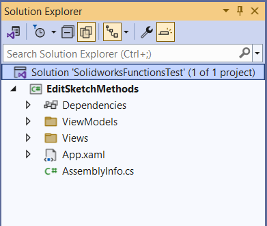](edit-solidworks-sketch-ui/new-edit-sketch-project.png)

---

### Add [Syncfusion Chromeless Window]

-	Now, we need to add **“Syncfusion Chromeless Window”** into our View.

-	We already **have an article** where we add **“Syncfusion Chromeless Window”** into our View.

- Please see 🚀 ***[Add Syncfusion Chromeless Window](/wpf-tutorials/open-syncfusion-chromeless-window/#add-syncfusion-chromeless-window){:target="_blank"}*** section of 🚀 ***[Open Syncfusion Chromeless Window](/wpf-tutorials/open-syncfusion-chromeless-window/){:target="_blank"}*** article for creating **New Prism project**.

---

### Add [Design Time DataContext]

- In previous 🚀**[Add [Design Time DataContext]](/wpf-tutorials/insert-solidworks-sketch-ui/#add-design-time-datacontext){:target="_blank"}** section of 🚀**[Insert Solidworks Sketch UI](/wpf-tutorials/insert-solidworks-sketch-ui/){:target="_blank"}** article, this section is already explained.

- Please visit 🚀**[Add [Design Time DataContext]](/wpf-tutorials/insert-solidworks-sketch-ui/#add-design-time-datacontext){:target="_blank"}** section of 🚀**[Insert Solidworks Sketch UI](/wpf-tutorials/insert-solidworks-sketch-ui/){:target="_blank"}** article for more detail on this section.

---

### Add [Syncfusion Busy Indicator]

- Now, we need to add **“Syncfusion Busy Indicator”** into our View.

- We already **have an article** where we add **“Syncfusion Busy Indicator”** into our View.

- Please see 🚀 ***[Add Syncfusion Busy Indicator](/wpf-tutorials/add-syncfusion-busy-indicator/){:target="_blank"}*** article for adding **“Syncfusion Busy Indicator”**.

---

## Add Controls For UI

We will some Controls to arrange and show them in UI.

Please follow below section to add them.

### Add [Grid]

- First, we add **`<Grid>`** tag inside **`<syncfusion:SfBusyIndicator>`** tag.

- Please see below 👇🏻 image for reference.

[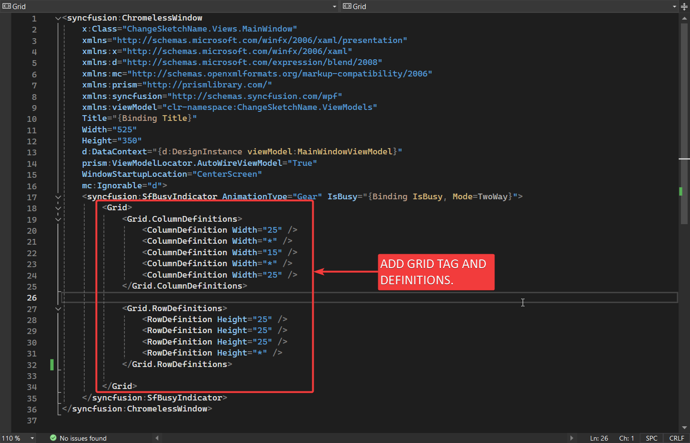](change-sketch-name-ui/add-grid-tag.png)

- Please see below 👇🏻 code sample for reference.

```xml
<syncfusion:ChromelessWindow
    x:Class="ChangeSketchName.Views.MainWindow"
    xmlns="http://schemas.microsoft.com/winfx/2006/xaml/presentation"
    xmlns:x="http://schemas.microsoft.com/winfx/2006/xaml"
    xmlns:d="http://schemas.microsoft.com/expression/blend/2008"
    xmlns:mc="http://schemas.openxmlformats.org/markup-compatibility/2006"
    xmlns:prism="http://prismlibrary.com/"
    xmlns:syncfusion="http://schemas.syncfusion.com/wpf"
    xmlns:viewModel="clr-namespace:ChangeSketchName.ViewModels"
    Title="{Binding Title}"
    Width="525"
    Height="350"
    d:DataContext="{d:DesignInstance viewModel:MainWindowViewModel}"
    prism:ViewModelLocator.AutoWireViewModel="True"
    WindowStartupLocation="CenterScreen"
    mc:Ignorable="d">
    <syncfusion:SfBusyIndicator AnimationType="Gear" IsBusy="{Binding IsBusy, Mode=TwoWay}">
        <Grid>
            <Grid.ColumnDefinitions>
                <ColumnDefinition Width="25" />
                <ColumnDefinition Width="*" />
                <ColumnDefinition Width="15" />
                <ColumnDefinition Width="*" />
                <ColumnDefinition Width="25" />
            </Grid.ColumnDefinitions>

            <Grid.RowDefinitions>
                <RowDefinition Height="25" />
                <RowDefinition Height="25" />
                <RowDefinition Height="25" />
                <RowDefinition Height="*" />
            </Grid.RowDefinitions>

        </Grid>
    </syncfusion:SfBusyIndicator>
</syncfusion:ChromelessWindow>
```
---

### Add [TextBlock]

- Now add a Label for "**New Sketch Name**" as shown below.

```xml
<TextBlock
    Grid.Row="1"
    Grid.Column="1"
    HorizontalAlignment="Right"
    VerticalAlignment="Center"
    Foreground="Black"
    Text="Please give new Name:" />
```

- Please see below 👇🏻 image for reference.

[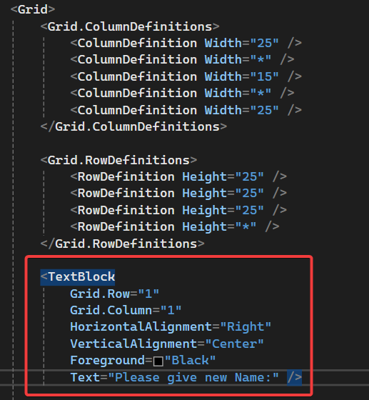](change-sketch-name-ui/add-label.png)

- Please see below 👇🏻 full code sample for reference.

```xml
<syncfusion:ChromelessWindow
    x:Class="ChangeSketchName.Views.MainWindow"
    xmlns="http://schemas.microsoft.com/winfx/2006/xaml/presentation"
    xmlns:x="http://schemas.microsoft.com/winfx/2006/xaml"
    xmlns:d="http://schemas.microsoft.com/expression/blend/2008"
    xmlns:mc="http://schemas.openxmlformats.org/markup-compatibility/2006"
    xmlns:prism="http://prismlibrary.com/"
    xmlns:syncfusion="http://schemas.syncfusion.com/wpf"
    xmlns:viewModel="clr-namespace:ChangeSketchName.ViewModels"
    Title="{Binding Title}"
    Width="525"
    Height="350"
    d:DataContext="{d:DesignInstance viewModel:MainWindowViewModel}"
    prism:ViewModelLocator.AutoWireViewModel="True"
    WindowStartupLocation="CenterScreen"
    mc:Ignorable="d">
    <syncfusion:SfBusyIndicator AnimationType="Gear" IsBusy="{Binding IsBusy, Mode=TwoWay}">
        <Grid>
            <Grid.ColumnDefinitions>
                <ColumnDefinition Width="25" />
                <ColumnDefinition Width="*" />
                <ColumnDefinition Width="15" />
                <ColumnDefinition Width="*" />
                <ColumnDefinition Width="25" />
            </Grid.ColumnDefinitions>

            <Grid.RowDefinitions>
                <RowDefinition Height="25" />
                <RowDefinition Height="25" />
                <RowDefinition Height="25" />
                <RowDefinition Height="*" />
            </Grid.RowDefinitions>

            <TextBlock
                Grid.Row="1"
                Grid.Column="1"
                HorizontalAlignment="Right"
                VerticalAlignment="Center"
                Foreground="Black"
                Text="Please give new Name:" />

        </Grid>
    </syncfusion:SfBusyIndicator>
</syncfusion:ChromelessWindow>
```

- Please see below 👇🏻 image as *how does this label look* in application.

[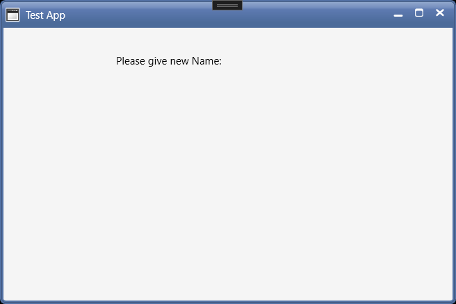](change-sketch-name-ui/label-in-application.png)

---

### Add [TextBox]

- Now we add **`TextBox`** for *showing list of Planes*.

- Please see below 👇🏻 image for reference.

[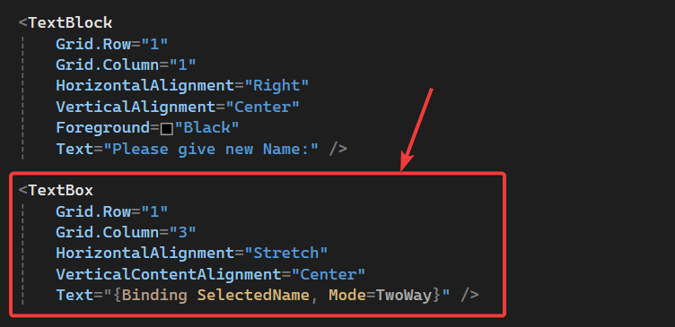](
change-sketch-name-ui/add-TextBox.png)

- Please see below 👇🏻 code sample for reference.

```xml
<syncfusion:ChromelessWindow
    x:Class="InsertSketch.Views.MainWindow"
    xmlns="http://schemas.microsoft.com/winfx/2006/xaml/presentation"
    xmlns:x="http://schemas.microsoft.com/winfx/2006/xaml"
    xmlns:d="http://schemas.microsoft.com/expression/blend/2008"
    xmlns:mc="http://schemas.openxmlformats.org/markup-compatibility/2006"
    xmlns:prism="http://prismlibrary.com/"
    xmlns:syncfusion="http://schemas.syncfusion.com/wpf"
    xmlns:viewModel="clr-namespace:InsertSketch.ViewModels"
    Title="{Binding Title}"
    Width="500"
    Height="250"
    d:DataContext="{d:DesignInstance viewModel:MainWindowViewModel}"
    prism:ViewModelLocator.AutoWireViewModel="True"
    ResizeMode="NoResize"
    WindowStartupLocation="CenterScreen"
    mc:Ignorable="d">
    <syncfusion:SfBusyIndicator AnimationType="Gear" IsBusy="{Binding IsBusy, Mode=TwoWay}">
        <Grid>
            <Grid.RowDefinitions>
                <RowDefinition Height="25" />
                <RowDefinition Height="50" />
                <RowDefinition Height="25" />
                <RowDefinition Height="50" />
                <RowDefinition Height="*" />
            </Grid.RowDefinitions>

            <Grid.ColumnDefinitions>
                <ColumnDefinition Width="*" />
                <ColumnDefinition Width="25" />
                <ColumnDefinition Width="*" />
            </Grid.ColumnDefinitions>

            <TextBlock
                Grid.Row="1"
                Grid.Column="0"
                HorizontalAlignment="Right"
                VerticalAlignment="Center"
                FontSize="24"
                Foreground="Black"
                Text="Select Plane :" />

            <syncfusion:ComboBoxAdv
                Grid.Row="1"
                Grid.Column="2"
                Height="50"
                MinWidth="200"
                HorizontalAlignment="Left" />

        </Grid>
    </syncfusion:SfBusyIndicator>
</syncfusion:ChromelessWindow>
```

- Please see below 👇🏻 image as *how Plane list look* in application.

[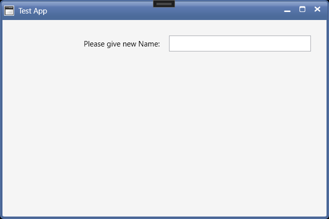](change-sketch-name-ui/add-input-textbox.png)

---

### Add [Button]

- Now we add **`Button`** button.

- This button **execute function** for **Change Name of Solidworks Sketch.**

- Please see below 👇🏻 image for reference.

[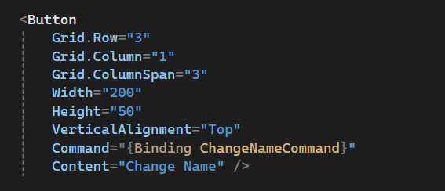](change-sketch-name-ui/add-button-for-change-name.png)

- Please see below 👇🏻 code sample for reference.

```xml
<syncfusion:ChromelessWindow
    x:Class="ChangeSketchName.Views.MainWindow"
    xmlns="http://schemas.microsoft.com/winfx/2006/xaml/presentation"
    xmlns:x="http://schemas.microsoft.com/winfx/2006/xaml"
    xmlns:d="http://schemas.microsoft.com/expression/blend/2008"
    xmlns:mc="http://schemas.openxmlformats.org/markup-compatibility/2006"
    xmlns:prism="http://prismlibrary.com/"
    xmlns:syncfusion="http://schemas.syncfusion.com/wpf"
    xmlns:viewModel="clr-namespace:ChangeSketchName.ViewModels"
    Title="{Binding Title}"
    Width="525"
    Height="350"
    d:DataContext="{d:DesignInstance viewModel:MainWindowViewModel}"
    prism:ViewModelLocator.AutoWireViewModel="True"
    WindowStartupLocation="CenterScreen"
    mc:Ignorable="d">
    <syncfusion:SfBusyIndicator AnimationType="Gear" IsBusy="{Binding IsBusy, Mode=TwoWay}">
        <Grid>
            <Grid.ColumnDefinitions>
                <ColumnDefinition Width="25" />
                <ColumnDefinition Width="*" />
                <ColumnDefinition Width="15" />
                <ColumnDefinition Width="*" />
                <ColumnDefinition Width="25" />
            </Grid.ColumnDefinitions>

            <Grid.RowDefinitions>
                <RowDefinition Height="25" />
                <RowDefinition Height="25" />
                <RowDefinition Height="25" />
                <RowDefinition Height="*" />
            </Grid.RowDefinitions>

            <TextBlock
                Grid.Row="1"
                Grid.Column="1"
                HorizontalAlignment="Right"
                VerticalAlignment="Center"
                Foreground="Black"
                Text="Please give new Name:" />

            <TextBox
                Grid.Row="1"
                Grid.Column="3"
                HorizontalAlignment="Stretch"
                VerticalContentAlignment="Center"
                Text="{Binding SelectedName, Mode=TwoWay}" />

            <Button
                Grid.Row="3"
                Grid.Column="1"
                Grid.ColumnSpan="3"
                Width="200"
                Height="50"
                VerticalAlignment="Top"
                Command="{Binding ChangeNameCommand}"
                Content="Change Name" />

        </Grid>
    </syncfusion:SfBusyIndicator>
</syncfusion:ChromelessWindow>
```

- Please see below 👇🏻 image as *how Insert Sketch* looks in application.

[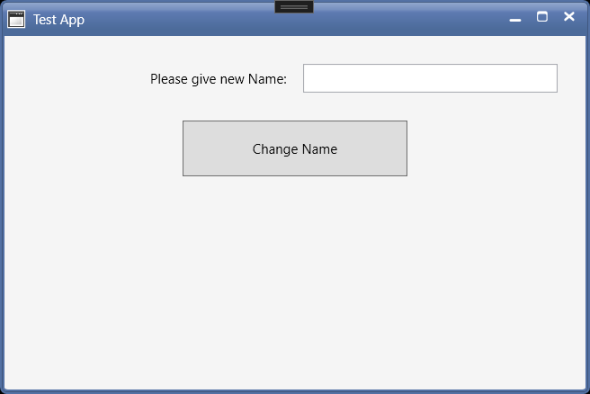](change-sketch-name-ui/insert-sketch-change-name-button.png)

---

## Set Message Services

In this section, we **setup Message Services** to **communicate in our application**.

For this please follow below 👇🏻 sections.

### Add Message Services

- Now, we need to **“Add Message Services”** into our application.

- We already **have an article** where we **“Add Message Services”** into our application.

- Please see 🚀 ***[Add Service for Messaging in application](/wpf-tutorials/add-messages-service/#add-service-for-messaging-in-application){:target="_blank"}*** section of 🚀 ***[Add Message Service](/wpf-tutorials/add-messages-service/){:target="_blank"}*** article for adding **Message Services**.

- Following Services added:

  - **`ConfirmationMessagesService`**
  - **`InformationMessagesService`**
  - **`ErrorMessagesService`**

- Please see below 👇🏻 code sample for reference.

```cs
using Prism.Events;

namespace InsertSketch.Services
{
    internal class ConfirmationMessagesService : PubSubEvent<string> { }
    internal class InformationMessagesService : PubSubEvent<string> { }
    internal class ErrorMessagesService : PubSubEvent<string> { }
}
```


---

### Register Message Services

- Now, we need to **“Register Message Services”** into our application.

- We already **have an article** where we **“Register Message Services”** into our application.

- Please see 🚀 ***[Register Services](/wpf-tutorials/add-messages-service/#register-services){:target="_blank"}*** section of 🚀 ***[Add Message Service](/wpf-tutorials/add-messages-service/){:target="_blank"}*** article for adding **Message Services**.

- Please see below 👇🏻 code sample for reference.

```cs
using InsertSketch.Services;
using InsertSketch.ViewModels;
using Prism.Events;
using Syncfusion.Windows.Shared;
using System.Windows;

namespace InsertSketch.Views
{
    /// <summary>
    /// Interaction logic for MainWindow.xaml
    /// </summary>
    public partial class MainWindow : ChromelessWindow
    {
        private readonly IEventAggregator eventAggregator;

        public MainWindow(IEventAggregator eventAggregator)
        {
            InitializeComponent();
            this.eventAggregator = eventAggregator;
            this.eventAggregator.GetEvent<InformationMessagesService>().Subscribe(InformationMessages);
            this.eventAggregator.GetEvent<ErrorMessagesService>().Subscribe(ErrorMessages);
        }

        private void InformationMessages(string messageToShow)
        {
            MessageBox.Show(messageToShow, "Information", MessageBoxButton.OK, MessageBoxImage.Information);
        }

        private void ErrorMessages(string messageToShow)
        {
            MessageBox.Show(messageToShow, "Error", MessageBoxButton.OK, MessageBoxImage.Error);
        }
    }
}
```

---

### Understand Message Services

- If you want to **“understand Message Services”**, then please visit below article.

- Reference Article: 🚀 ***[Add Message Service](/wpf-tutorials/add-messages-service/){:target="_blank"}***

---

## Update ViewModel

- Now we need to **“add Properties and Methods”** for **“Binding”** with our view.

  - *View*: **`MainWindow`**
  - *ViewModel*: **`MainWindowViewModel`**

- Please see below 👇🏻 image for **“Properties and Methods”** required.

[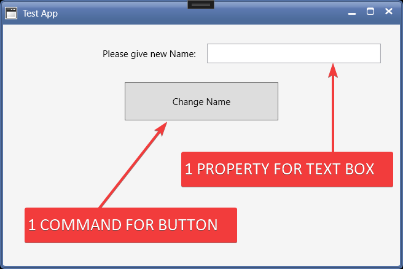](change-sketch-name-ui/properties-and-method-required.png)

### Add [Property]

- We need to 1 **Property** for **TextBox**.

- Please see below 👇🏻 code sample for **“Properties”** in **`MainWindowViewModel`**.

```cs
private string _selectedName;

public string SelectedName
{
    get { return _selectedName; }
    set { SetProperty(ref _selectedName, value); }
}
```

- Please see below 👇🏻 image for **Property** required.

[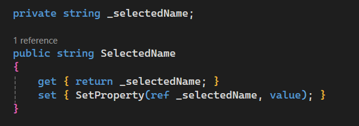](change-sketch-name-ui/add-property.png)

- Now we need to fill, "**Sketch Name**" in **`SelectedName`** variable.

---

---

### Add [Prism Command]

- We need 1 Prism Command for **Change Sketch Button**.

- This command will be *responsible* for **Changing Sketch** in *Solidworks Part Document*.

- Please see below 👇🏻 code sample for adding **“Prism Command”** in **`MainWindowViewModel`**.

```cs
private DelegateCommand _changeNameCommand;

public DelegateCommand ChangeNameCommand =>
    _changeNameCommand ?? (_changeNameCommand = new DelegateCommand(ExecuteChangeNameCommand));

void ExecuteChangeNameCommand()
{
    
}
```

- Please see below 👇🏻 image for adding **“Prism Command”** in **`MainWindowViewModel`**.

[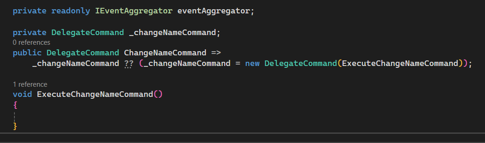](change-sketch-name-ui/add-command-in-viewmodel.png)

---

### Add Code To Function

- Now we will add some code **`ExecuteChangeNameCommand`** function.

- We already used this code for in various articles.

- Please see below 👇🏻 code sample for waiting code to add.

```cs
private DelegateCommand _changeNameCommand;

public DelegateCommand ChangeNameCommand =>
    _changeNameCommand ?? (_changeNameCommand = new DelegateCommand(ExecuteChangeNameCommand));

async void ExecuteChangeNameCommand()
{
    // Show busy indicator
    IsBusy = true;

    await Task.Run(() =>
    {
        // Sleeping with 5 sec
        Thread.Sleep(5000);
    });

    // Hide busy indicator
    IsBusy = false;
}
```

- Please see below 👇🏻 image for waiting code to add.

[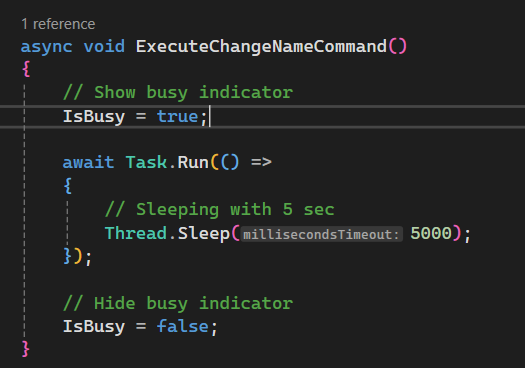](change-sketch-name-ui/add-code-to-command.png)

---

## Add [Bindings]

In this section we will add Bindings to **WPF TextBox and WPF Button**.

- Please see below 👇🏻 image for adding **“Binding Property”**.

[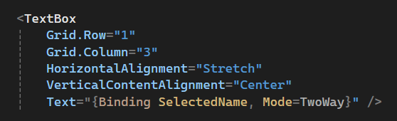](change-sketch-name-ui/add-property-bindings.png)

- Please see below 👇🏻 code for adding **“Binding Property”**.

```xml
<TextBox
    Grid.Row="1"
    Grid.Column="3"
    HorizontalAlignment="Stretch"
    VerticalContentAlignment="Center"
    Text="{Binding SelectedName, Mode=TwoWay}" />
```

---

### Add [Command Binding]

- We need to Bind previously created **“Command”** with **“WPF Button”**.

- Please see below 👇🏻 image for adding **“Command”**.

[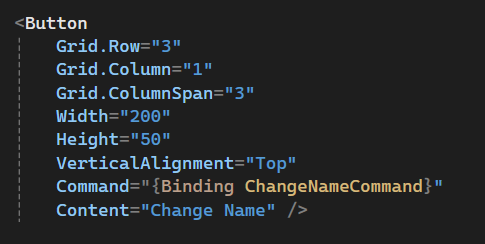](change-sketch-name-ui/add-command-binding.png)

- Please see below 👇🏻 code for adding **“Command”**.

```xml
<Button
    Grid.Row="3"
    Grid.Column="1"
    Grid.ColumnSpan="3"
    Width="200"
    Height="50"
    VerticalAlignment="Top"
    Command="{Binding ChangeNameCommand}"
    Content="Change Name" />
```

---

## Final Result

Now we run the application as shown in below 👇🏻 image.

[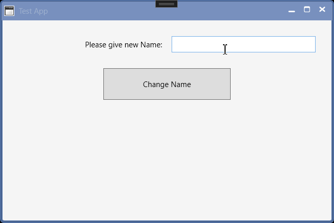](change-sketch-name-ui/final)-result.gif

Now we are able to **Change Sketch Name** in MVVM pattern successfully.

**This is it !!!**

*I hope my efforts will helpful to someone!*

If you found anything to **add or update**, please let me know on my *e-mail*.

Hope this post helps you to **Change Sketch Name in WPF application**.

*If you like the post then please share it with your friends also.*

*Do let me know by you like this post or not!*

*Till then, Happy learning!!!*
