## Objective

I want to

- _Create a UI for "__Create Line UI__" article._

Since I want to make the UI in __modular way__, hence I will create the UI in parts.

_This is part 1 of Create Line UI._

---

## Demo Video

Below 🎬 video shows how to **Create Line UI - Part 1** in *Visual Studio 2022*.




---

## Setting Project

We need to **add some required UI changes** as part of **Project Setup**.

Please follow below sections for this.

### Add [Prism Project]

- First, we **add Prism Project** for our requirement.

- We already **have an article** where we **add Prism Project**.

- Please see 🚀 ****** section of 🚀 ****** article for creating **New Prism project**.

- _Name of our Project_: **`SolidworksTest`**

---

### Add [Syncfusion Chromeless Window]

-	Now, we need to add **“Syncfusion Chromeless Window”** into our View.

-	We already **have an article** where we add **“Syncfusion Chromeless Window”** into our View.

- Please see 🚀 ****** section of 🚀 ****** article for creating **New Prism project**.

---

### Add [Design Time DataContext]

- In previous 🚀**** section of 🚀**** article, this section is already explained.

- Please visit 🚀**** section of 🚀**** article for more detail on this section.

---

### Add [Syncfusion Busy Indicator]

- Now, we need to add **“Syncfusion Busy Indicator”** into our View.

- We already **have an article** where we add **“Syncfusion Busy Indicator”** into our View.

- Please see 🚀 ****** article for adding **“Syncfusion Busy Indicator”**.

---

### Add Message Services

- Now, we need to **“Add Message Services”** into our application.

- We already **have an article** where we **“Add Message Services”** into our application.

- Please see 🚀 ****** section of 🚀 ****** article for adding **Message Services**.


---

### Register Message Services

- Now, we need to **“Register Message Services”** into our application.

- We already **have an article** where we **“Register Message Services”** into our application.

- Please see 🚀 ****** section of 🚀 ****** article for adding **Message Services**.


---

### Understand Message Services

- If you want to **“understand Message Services”**, then please visit below article.

- Reference Article: 🚀 ******

---

### Add [Solidworks References]

- Now, we need to **“Add [Solidworks References]”** into our application.

- We already **have an article** where we **“Add [Solidworks References]”** into our application.

- Please see 🚀 ****** section of 🚀 ****** article for **Adding [Solidworks References]**.

---

### Add Constructor

- Now, we need to **Add Constructor** into our application.

- We already **have an article** where we **Add Constructor** into our application.

- Please see 🚀 ****** section of 🚀 ****** article for **Adding Constructor**.

---

### Add Private Fields

- Now, we need to **Add Private Fields** into our application.

- We already **have an article** where we **Add Private Fields** into our application.

- Please see 🚀 ****** section of 🚀 ****** article for **Adding Constructor**.

---

## Add View [PointViewModel]

Now we need to add a **[ViewModel]** for **[PointView]** control.

__ViewModel Name__ - **`PointViewModel`**

- Please see below 👇🏻 image for reference.

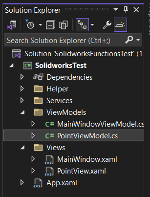

---

### Add Properties

Now in **[`PointViewModel`]**, we need to add _properties_.

We need below properties.




```cs {lineNos=true}
private string _header;
public string Header
{
    get { return _header; }
    set { SetProperty(ref _header, value); }
}

private double _xpoint;
public double XPoint
{
    get { return _xpoint; }
    set { SetProperty(ref _xpoint, value); }
}

private double _ypoint;
public double YPoint
{
    get { return _ypoint; }
    set { SetProperty(ref _ypoint, value); }
}

private double _zpoint;
public double ZPoint
{
    get { return _zpoint; }
    set { SetProperty(ref _zpoint, value); }
}
```




Below property we use for showing header of group box which we create in **`GroupBox`**.




```cs {lineNos=true}
private string _header;
public string Header
{
    get { return _header; }
    set { SetProperty(ref _header, value); }
}
```




Below properties we use for point co-ordinates.




```cs {lineNos=true}
private double _xpoint;
public double XPoint
{
    get { return _xpoint; }
    set { SetProperty(ref _xpoint, value); }
}

private double _ypoint;
public double YPoint
{
    get { return _ypoint; }
    set { SetProperty(ref _ypoint, value); }
}

private double _zpoint;
public double ZPoint
{
    get { return _zpoint; }
    set { SetProperty(ref _zpoint, value); }
}
```




---

### Add Constructor

Now in **[`PointViewModel`]**, we need to add _constructor_.




```cs {lineNos=true}
#region Constructor

public PointViewModel()
{

}

#endregion
```




In above code, first we create a region.




```cs {lineNos=true}
#region Constructor

#endregion
```




Then we add constuctor as shown below.




```cs {lineNos=true}
#region Constructor

public PointViewModel()
{

}

#endregion
```




---

## Add View [PointView]

Now we need to add a **[WPF UserControl]**.

__UserControl Name__ - **`PointView`**

- Please see below 👇🏻 image for reference.

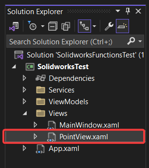

---

### Add [Design Time DataContext]

- In previous 🚀**** section of 🚀**** article, this section is already explained.

- Please visit 🚀**** section of 🚀**** article for more detail on this section.

- Design time Data context = **`PointViewModel`**

- Please see below 👇🏻 image for reference.

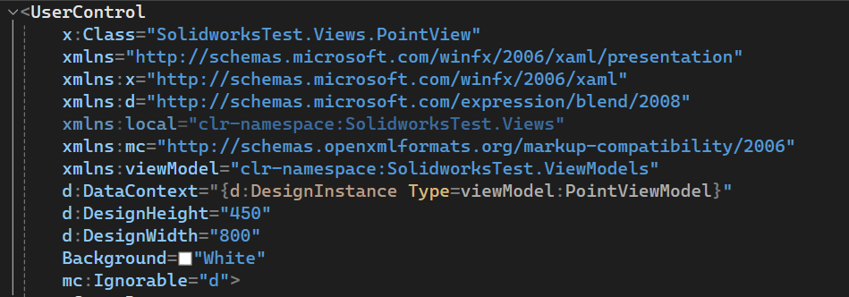

---

### Add [GroupBox]

- Now we add **`<GroupBox>`** tag inside **`<UserControl>`** tag.

- This GroupBox will hold controls for Points Co-ordinates.

- Please see below 👇🏻 image for reference.

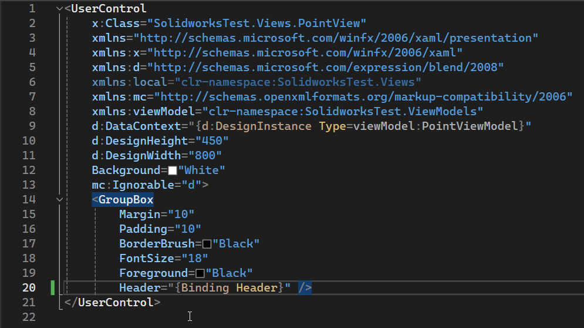

- Please see below 👇🏻 code sample for reference.




```xml {lineNos=true}
<UserControl
    x:Class="SolidworksTest.Views.PointView"
    xmlns="http://schemas.microsoft.com/winfx/2006/xaml/presentation"
    xmlns:x="http://schemas.microsoft.com/winfx/2006/xaml"
    xmlns:d="http://schemas.microsoft.com/expression/blend/2008"
    xmlns:local="clr-namespace:SolidworksTest.Views"
    xmlns:mc="http://schemas.openxmlformats.org/markup-compatibility/2006"
    xmlns:viewModel="clr-namespace:SolidworksTest.ViewModels"
    d:DataContext="{d:DesignInstance Type=viewModel:PointViewModel}"
    d:DesignHeight="450"
    d:DesignWidth="800"
    Background="White"
    mc:Ignorable="d">
    <GroupBox
        Margin="10"
        Padding="10"
        BorderBrush="Black"
        FontSize="18"
        Foreground="Black"
        Header="{Binding Header}" />
</UserControl>
```




- In above code, we set values of following properties.

  - **`Margin`**="**10**"
  - **`Padding`**="**10**"
  - **`BorderBrush`**="**Black**"
  - **`FontSize`**="**18**"
  - **`Foreground`**="**Black**"
  - **`Header`** property of **`<GroupBox>`**, we bind it with **`Header`** property in our **`PointViewModel`** class.

---

### Add [Grid]

- Now we add **`<Grid>`** tag inside **`<GroupBox>`** tag.

- Below are the definition for **`Grid Columns`**.




```xml {lineNos=true}
<Grid.ColumnDefinitions>
    <ColumnDefinition Width="125" />
    <ColumnDefinition Width="25" />
    <ColumnDefinition Width="*" />
</Grid.ColumnDefinitions>
```




- Below are the definition for **`Grid Rows`**.




```xml {lineNos=true}
<Grid.RowDefinitions>
    <RowDefinition Height="25" />
    <RowDefinition Height="15" />
    <RowDefinition Height="25" />
</Grid.RowDefinitions>
```




- Please see below 👇🏻 image for reference.

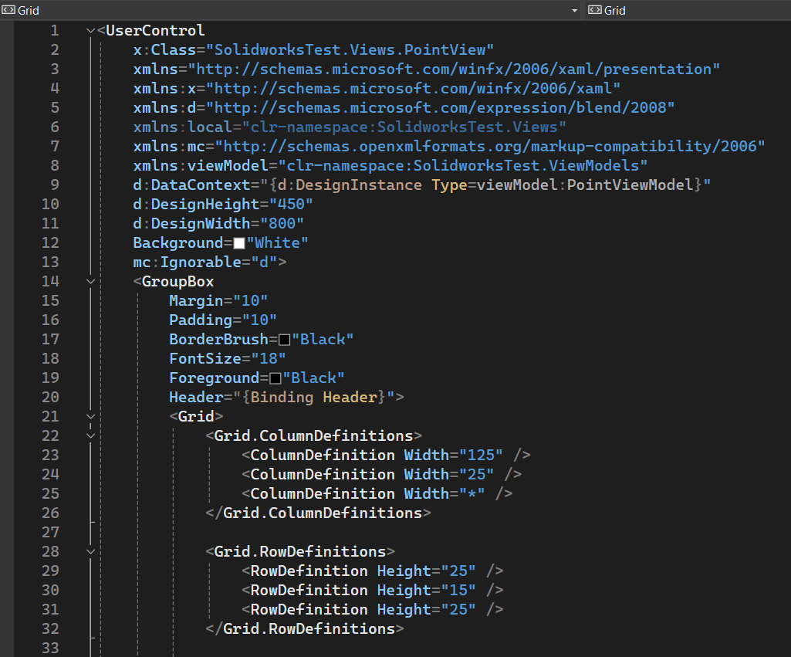

- Please see below 👇🏻 code sample for reference.




```xml {lineNos=true}
<UserControl
    x:Class="SolidworksTest.Views.PointView"
    xmlns="http://schemas.microsoft.com/winfx/2006/xaml/presentation"
    xmlns:x="http://schemas.microsoft.com/winfx/2006/xaml"
    xmlns:d="http://schemas.microsoft.com/expression/blend/2008"
    xmlns:local="clr-namespace:SolidworksTest.Views"
    xmlns:mc="http://schemas.openxmlformats.org/markup-compatibility/2006"
    xmlns:viewModel="clr-namespace:SolidworksTest.ViewModels"
    d:DataContext="{d:DesignInstance Type=viewModel:PointViewModel}"
    d:DesignHeight="450"
    d:DesignWidth="800"
    Background="White"
    mc:Ignorable="d">
    <GroupBox
        Margin="10"
        Padding="10"
        BorderBrush="Black"
        FontSize="18"
        Foreground="Black"
        Header="{Binding Header}">
        <Grid>
            <Grid.ColumnDefinitions>
                <ColumnDefinition Width="125" />
                <ColumnDefinition Width="25" />
                <ColumnDefinition Width="*" />
            </Grid.ColumnDefinitions>

            <Grid.RowDefinitions>
                <RowDefinition Height="25" />
                <RowDefinition Height="15" />
                <RowDefinition Height="25" />
            </Grid.RowDefinitions>

        </Grid>
    </GroupBox>
</UserControl>
```




---

### Add [XPoint] Label

- Now we add **`<TextBlock>`** tag inside **`<Grid>`** tag.

- **`<TextBlock>`** tag shows label for **XPoint**.

- Below 👇🏻 is code for **`<TextBlock>`** tag.




```xml {lineNos=true}
<TextBlock
    Grid.Row="0"
    Grid.Column="0"
    HorizontalAlignment="Right"
    VerticalAlignment="Center"
    Text="X Co-ordinate:" />
```




- In above code, we set values of following properties.

  - **`Grid.Row`**="**0**"
  - **`Grid.Column`**="**0**"
  - **`HorizontalAlignment`**="**Right**"
  - **`VerticalAlignment`**="**Center**"
  - **`Text`**="**X Co-ordinate:**"

- In above code, **`Grid.Row`** and **`Grid.Column`** are attached properties and they define the position of **`<TextBlock>`** inside **`<Grid>`** control.

- In above code, **`HorizontalAlignment`** and **`VerticalAlignment`** define _[**Alignment**]_ of control.

- In above code, **`Text`** property define label of **`<TextBlock>`** control. 

- Lable of **`<TextBlock>`** control: **[`X Co-ordinate:`]**

- Please see below 👇🏻 image for reference.

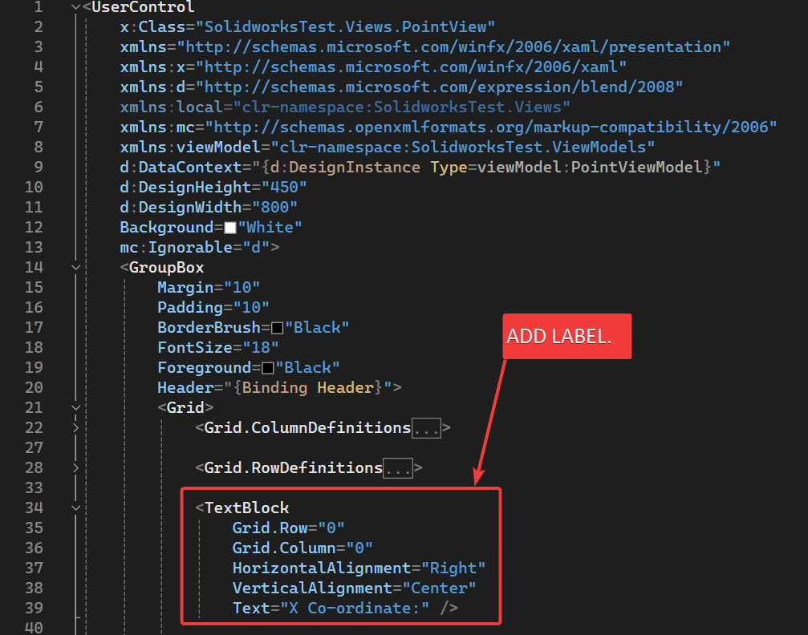

- Please see below 👇🏻 code sample for reference.




```xml {lineNos=true}
<UserControl
    x:Class="SolidworksTest.Views.PointView"
    xmlns="http://schemas.microsoft.com/winfx/2006/xaml/presentation"
    xmlns:x="http://schemas.microsoft.com/winfx/2006/xaml"
    xmlns:d="http://schemas.microsoft.com/expression/blend/2008"
    xmlns:local="clr-namespace:SolidworksTest.Views"
    xmlns:mc="http://schemas.openxmlformats.org/markup-compatibility/2006"
    xmlns:viewModel="clr-namespace:SolidworksTest.ViewModels"
    d:DataContext="{d:DesignInstance Type=viewModel:PointViewModel}"
    d:DesignHeight="450"
    d:DesignWidth="800"
    Background="White"
    mc:Ignorable="d">
    <GroupBox
        Margin="10"
        Padding="10"
        BorderBrush="Black"
        FontSize="18"
        Foreground="Black"
        Header="{Binding Header}">
        <Grid>
            <Grid.ColumnDefinitions>
                <ColumnDefinition Width="125" />
                <ColumnDefinition Width="25" />
                <ColumnDefinition Width="*" />
            </Grid.ColumnDefinitions>

            <Grid.RowDefinitions>
                <RowDefinition Height="25" />
                <RowDefinition Height="15" />
                <RowDefinition Height="25" />
            </Grid.RowDefinitions>

            <TextBlock
                Grid.Row="0"
                Grid.Column="0"
                HorizontalAlignment="Right"
                VerticalAlignment="Center"
                Text="X Co-ordinate:" />

        </Grid>
    </GroupBox>
</UserControl>
```




---

### Add [XPoint] TextBox

- Now we add **`<TextBox>`** tag inside **`<Grid>`** tag.

- **`<TextBox>`** tag shows label for **XPoint**.

- Below 👇🏻 is code for **`<TextBox>`** tag.




```xml {lineNos=true}
<TextBox
    Grid.Row="0"
    Grid.Column="2"
    HorizontalAlignment="Stretch"
    VerticalAlignment="Center"
    PreviewTextInput="InputTextBox_PreviewTextInput"
    Text="{Binding XPoint}" />
```




- In above code, we set values of following properties.

  - **`Grid.Row`**="**0**"
  - **`Grid.Column`**="**2**"
  - **`HorizontalAlignment`**="**Stretch**"
  - **`VerticalAlignment`**="**Center**"
  - **`Text`**="**X Co-ordinate:**"
  - **`Text`** property of **`<TextBox>`**, we bind it with **`XPoint`** property in our **`PointViewModel`** class.

- Event method we define.

  - In above code we define a method for **`PreviewTextInput`** event.
  - __Name of method__: **`InputTextBox_PreviewTextInput`**
  - This **`InputTextBox_PreviewTextInput`** method will enforce the user to input only Numbers. So that we avoid errors.
  - Implementation of **`InputTextBox_PreviewTextInput`** method will discuss later.

- Please see below 👇🏻 image for reference.

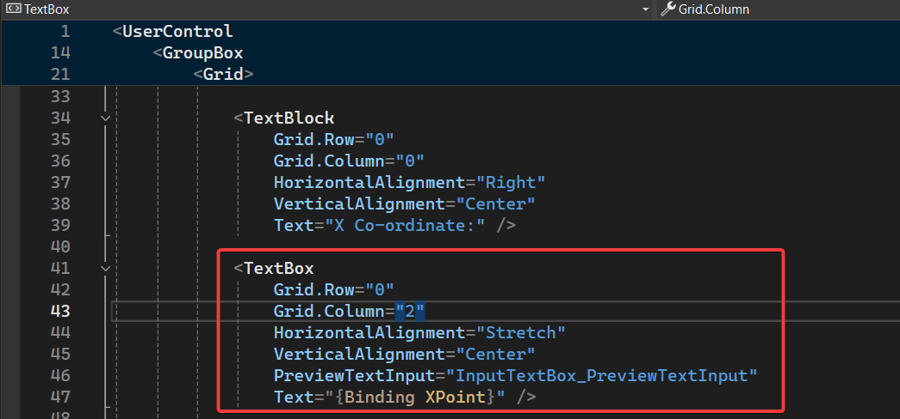


- Please see below 👇🏻 code sample for reference.




```xml {lineNos=true}
<UserControl
    x:Class="SolidworksTest.Views.PointView"
    xmlns="http://schemas.microsoft.com/winfx/2006/xaml/presentation"
    xmlns:x="http://schemas.microsoft.com/winfx/2006/xaml"
    xmlns:d="http://schemas.microsoft.com/expression/blend/2008"
    xmlns:local="clr-namespace:SolidworksTest.Views"
    xmlns:mc="http://schemas.openxmlformats.org/markup-compatibility/2006"
    xmlns:viewModel="clr-namespace:SolidworksTest.ViewModels"
    d:DataContext="{d:DesignInstance Type=viewModel:PointViewModel}"
    d:DesignHeight="450"
    d:DesignWidth="800"
    Background="White"
    mc:Ignorable="d">
    <GroupBox
        Margin="10"
        Padding="10"
        BorderBrush="Black"
        FontSize="18"
        Foreground="Black"
        Header="{Binding Header}">
        <Grid>
            <Grid.ColumnDefinitions>
                <ColumnDefinition Width="125" />
                <ColumnDefinition Width="25" />
                <ColumnDefinition Width="*" />
            </Grid.ColumnDefinitions>

            <Grid.RowDefinitions>
                <RowDefinition Height="25" />
                <RowDefinition Height="15" />
                <RowDefinition Height="25" />
            </Grid.RowDefinitions>

            <TextBlock
                Grid.Row="0"
                Grid.Column="0"
                HorizontalAlignment="Right"
                VerticalAlignment="Center"
                Text="X Co-ordinate:" />

            <TextBox
                Grid.Row="0"
                Grid.Column="2"
                HorizontalAlignment="Stretch"
                VerticalAlignment="Center"
                PreviewTextInput="InputTextBox_PreviewTextInput"
                Text="{Binding XPoint}" />

        </Grid>
    </GroupBox>
</UserControl>
```




---

### Add [YPoint] Label

- Now we add **`<TextBlock>`** tag inside **`<Grid>`** tag.

- **`<TextBlock>`** tag shows label for **YPoint**.

- Below 👇🏻 is code for **`<TextBlock>`** tag.




```xml {lineNos=true}
<TextBlock
    Grid.Row="2"
    Grid.Column="0"
    HorizontalAlignment="Right"
    VerticalAlignment="Center"
    Text="Y Co-ordinate:" />
```




To understand above code, please visit 🚀 ____ section of this article.

- Please see below 👇🏻 image for reference.

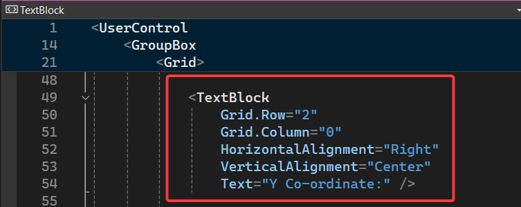

- Please see below 👇🏻 code sample for reference.




```xml {lineNos=true}
<UserControl
    x:Class="SolidworksTest.Views.PointView"
    xmlns="http://schemas.microsoft.com/winfx/2006/xaml/presentation"
    xmlns:x="http://schemas.microsoft.com/winfx/2006/xaml"
    xmlns:d="http://schemas.microsoft.com/expression/blend/2008"
    xmlns:local="clr-namespace:SolidworksTest.Views"
    xmlns:mc="http://schemas.openxmlformats.org/markup-compatibility/2006"
    xmlns:viewModel="clr-namespace:SolidworksTest.ViewModels"
    d:DataContext="{d:DesignInstance Type=viewModel:PointViewModel}"
    d:DesignHeight="450"
    d:DesignWidth="800"
    Background="White"
    mc:Ignorable="d">
    <GroupBox
        Margin="10"
        Padding="10"
        BorderBrush="Black"
        FontSize="18"
        Foreground="Black"
        Header="{Binding Header}">
        <Grid>
            <Grid.ColumnDefinitions>
                <ColumnDefinition Width="125" />
                <ColumnDefinition Width="25" />
                <ColumnDefinition Width="*" />
            </Grid.ColumnDefinitions>

            <Grid.RowDefinitions>
                <RowDefinition Height="25" />
                <RowDefinition Height="15" />
                <RowDefinition Height="25" />
            </Grid.RowDefinitions>

            <TextBlock
                Grid.Row="0"
                Grid.Column="0"
                HorizontalAlignment="Right"
                VerticalAlignment="Center"
                Text="X Co-ordinate:" />

            <TextBox
                Grid.Row="0"
                Grid.Column="2"
                HorizontalAlignment="Stretch"
                VerticalAlignment="Center"
                PreviewTextInput="InputTextBox_PreviewTextInput"
                Text="{Binding XPoint}" />

            <TextBlock
                Grid.Row="2"
                Grid.Column="0"
                HorizontalAlignment="Right"
                VerticalAlignment="Center"
                Text="Y Co-ordinate:" />

        </Grid>
    </GroupBox>
</UserControl>
```




---

### Add [YPoint] TextBox

- Now we add another **`<TextBox>`** tag inside **`<Grid>`** tag.

- **`<TextBox>`** tag shows label for **YPoint**.

- Below 👇🏻 is code for **`<TextBox>`** tag.




```xml {lineNos=true}
<TextBox
    Grid.Row="2"
    Grid.Column="2"
    HorizontalAlignment="Stretch"
    VerticalAlignment="Center"
    PreviewTextInput="InputTextBox_PreviewTextInput"
    Text="{Binding YPoint}" />
```





To understand above code, please visit 🚀 ____ section of this article.

- Please see below 👇🏻 image for reference.

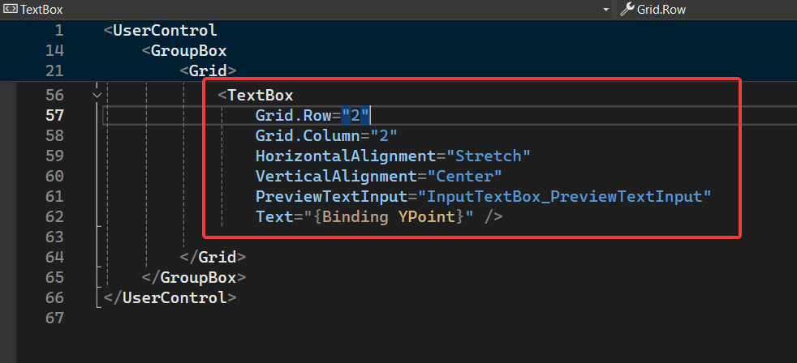


- Please see below 👇🏻 code sample for reference.




```xml {lineNos=true}
<UserControl
    x:Class="SolidworksTest.Views.PointView"
    xmlns="http://schemas.microsoft.com/winfx/2006/xaml/presentation"
    xmlns:x="http://schemas.microsoft.com/winfx/2006/xaml"
    xmlns:d="http://schemas.microsoft.com/expression/blend/2008"
    xmlns:local="clr-namespace:SolidworksTest.Views"
    xmlns:mc="http://schemas.openxmlformats.org/markup-compatibility/2006"
    xmlns:viewModel="clr-namespace:SolidworksTest.ViewModels"
    d:DataContext="{d:DesignInstance Type=viewModel:PointViewModel}"
    d:DesignHeight="450"
    d:DesignWidth="800"
    Background="White"
    mc:Ignorable="d">
    <GroupBox
        Margin="10"
        Padding="10"
        BorderBrush="Black"
        FontSize="18"
        Foreground="Black"
        Header="{Binding Header}">
        <Grid>
            <Grid.ColumnDefinitions>
                <ColumnDefinition Width="125" />
                <ColumnDefinition Width="25" />
                <ColumnDefinition Width="*" />
            </Grid.ColumnDefinitions>

            <Grid.RowDefinitions>
                <RowDefinition Height="25" />
                <RowDefinition Height="15" />
                <RowDefinition Height="25" />
            </Grid.RowDefinitions>

            <TextBlock
                Grid.Row="0"
                Grid.Column="0"
                HorizontalAlignment="Right"
                VerticalAlignment="Center"
                Text="X Co-ordinate:" />

            <TextBox
                Grid.Row="0"
                Grid.Column="2"
                HorizontalAlignment="Stretch"
                VerticalAlignment="Center"
                PreviewTextInput="InputTextBox_PreviewTextInput"
                Text="{Binding XPoint}" />

            <TextBlock
                Grid.Row="2"
                Grid.Column="0"
                HorizontalAlignment="Right"
                VerticalAlignment="Center"
                Text="Y Co-ordinate:" />

            <TextBox
                Grid.Row="2"
                Grid.Column="2"
                HorizontalAlignment="Stretch"
                VerticalAlignment="Center"
                PreviewTextInput="InputTextBox_PreviewTextInput"
                Text="{Binding YPoint}" />

        </Grid>
    </GroupBox>
</UserControl>
```





---

### Add [InputTextBox_PreviewTextInput] Method

Now we need to add __`InputTextBox_PreviewTextInput`__ method.

This method will allow __only Numbers__ to _add_ into __`<TextBox>`__.

For adding this method, first open __[`PointView.cs`]__ file.

Add below code into __[`PointView.cs`]__ file.

- Please see below 👇🏻 image for reference.

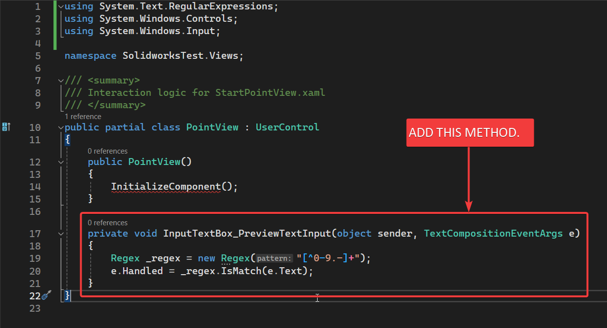


- Please see below 👇🏻 code sample for reference.




```cs {lineNos=true}
private void InputTextBox_PreviewTextInput(object sender, TextCompositionEventArgs e)
{
    Regex _regex = new Regex("[^0-9.-]+");
    e.Handled = _regex.IsMatch(e.Text);
}
```





In above code we create a __`Regex`__ type variable.

Name of variable: __`_regex`__.

Sequence we want to match: __`[^0-9.-]+`__

__`e.Handled`__ allow to enter the value.

__`_regex.IsMatch(e.Text)`__ means, if input text match the sequence then only it will allow otherwise it won't.

If sequence match in __`_regex.IsMatch(e.Text)`__ , then return __`true`__, otherwise return __`false`__.

---

## Register [PointViewModel]

Now we need to register our __[`PointViewModel`]__ class into our DI container.

* Open __[`App.xaml.cs`]__ class.

* In this class there is a function __[`RegisterTypes`]__. 

* We will register our class in this function.

- Please see below 👇🏻 image for reference.

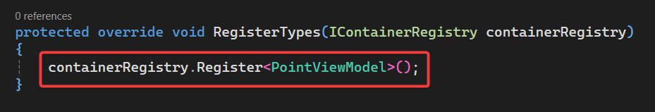

- Please see below 👇🏻 code sample for reference.




```cs {lineNos=true}
protected override void RegisterTypes(IContainerRegistry containerRegistry)
{
    containerRegistry.Register<PointViewModel>();
}
```





* In above code, we register __[`PointViewModel`]__ class in __`containerRegistry`__ through __`Register()`__ method. 


**This is it for now!!!**

*I hope my efforts will helpful to someone!*

If you found anything to **add or update**, please let me know on my *e-mail*.

Hope this post helps you to **Create Line UI in WPF application**.

*If you like the post then please share it with your friends also.*

*Do let me know by you like this post or not!*

*Till then, Happy learning!!!*
