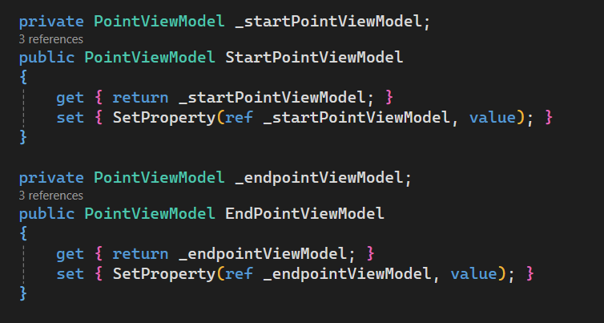
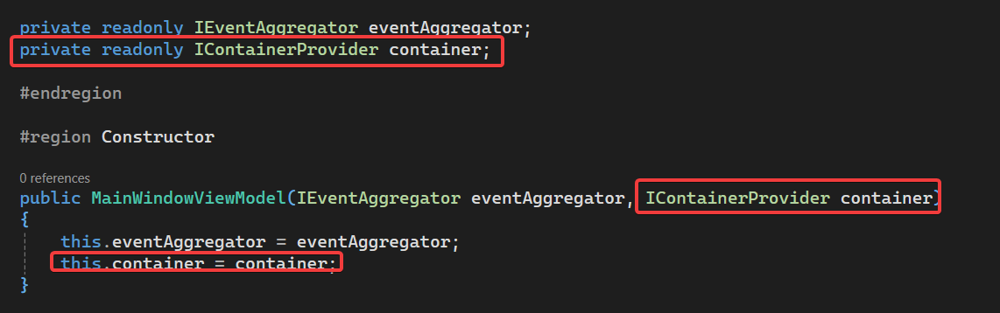
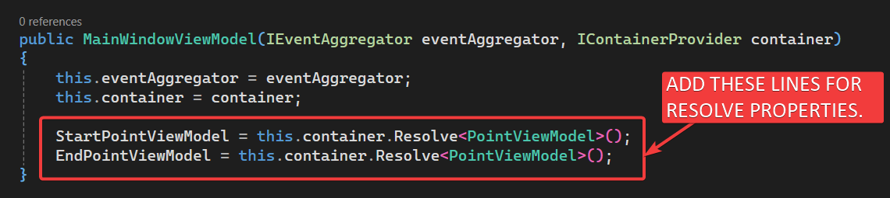
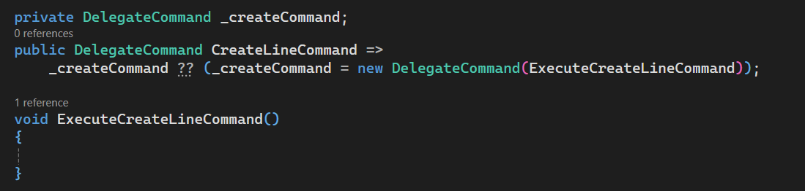
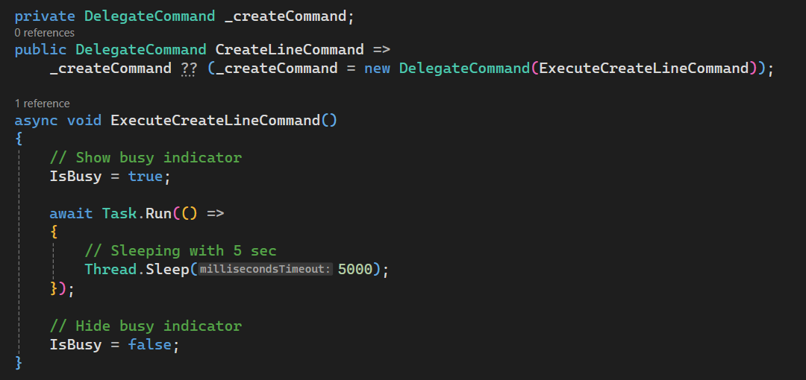
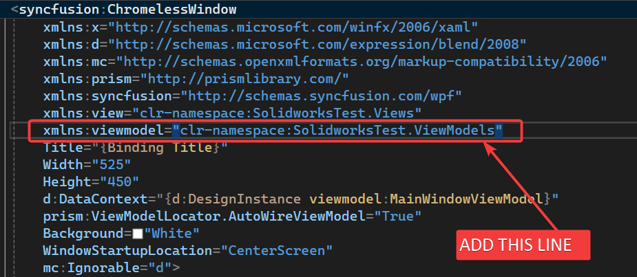
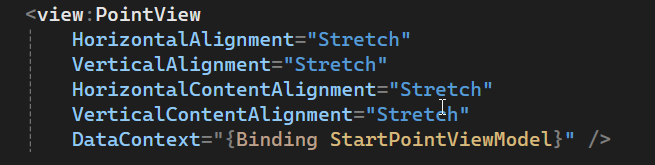
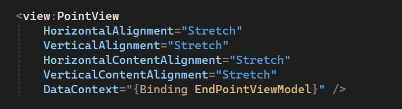
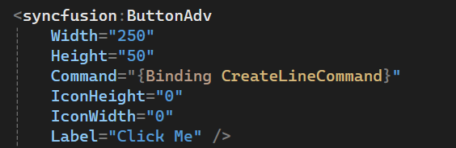
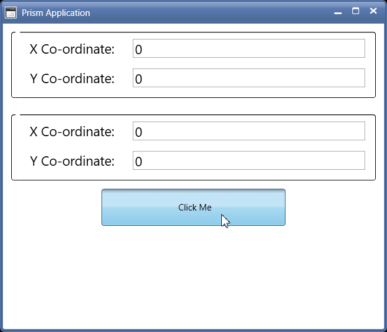

## Objective

In this article we continued from 🚀 ____ article.

We will create remaining UI controls and bindings with viewmodels.

---

## Demo Video

Below 🎬 video shows how to **Create Line UI Part 2** in *Visual Studio 2022*.




---

## Update [MainWindowViewModel]

- Now we need to **“add Properties and Methods”** for **“Binding”** with our view.

  - *View*: **`MainWindow`**
  - *ViewModel*: **`MainWindowViewModel`**

---

### Add [Properties]

Now we need to add 2 properties for __Start Point__ and __End Point__.

- Please see below 👇🏻 image for reference.



- Please see below 👇🏻 code sample for reference.




```cs {lineNos=true}
private PointViewModel _startPointViewModel;
public PointViewModel StartPointViewModel
{
    get { return _startPointViewModel; }
    set { SetProperty(ref _startPointViewModel, value); }
}

private PointViewModel _endpointViewModel;
public PointViewModel EndPointViewModel
{
    get { return _endpointViewModel; }
    set { SetProperty(ref _endpointViewModel, value); }
}
```




---

### Update Constructor

Now we need to update Constructor, so that we can resolve __[`StartPointViewModel`]__ and __[`EndPointViewModel`]__ properties through __DI Container__.

- First, we need to add a parameter to constructor and then assign it to a private field.

- Please see below 👇🏻 image for reference.



- Please see below 👇🏻 code sample for reference.




```cs {lineNos=true}
private readonly IEventAggregator eventAggregator;
private readonly IContainerProvider container;

public MainWindowViewModel(IEventAggregator eventAggregator, IContainerProvider container)
{
    this.eventAggregator = eventAggregator;
    this.container = container;
}
```




- Now, we need to set resolve value of __[`StartPointViewModel`]__ and __[`EndPointViewModel`]__ properties through __DI Container__.

- We resolve values in __"Constructor"__.

- Please see below 👇🏻 image for reference.




- Please see below 👇🏻 code sample for reference.




```cs {lineNos=true}
public MainWindowViewModel(IEventAggregator eventAggregator, IContainerProvider container)
{
    this.eventAggregator = eventAggregator;
    this.container = container;

    StartPointViewModel = this.container.Resolve<PointViewModel>();
    EndPointViewModel = this.container.Resolve<PointViewModel>();
}
```




---

### Add [Prism Command]

- We need 1 Prism Command for **Create Line Sketch Button**.

- This command will be *responsible* for **Create Line Sketch** in *Solidworks Part Document*.

- Please see below 👇🏻 code sample for adding **“Prism Command”** in **`MainWindowViewModel`**.




```cs {lineNos=true}
private DelegateCommand _createCommand;

public DelegateCommand CreateLineCommand =>
    _createCommand ?? (_createCommand = new DelegateCommand(ExecuteCreateLineCommand));

void ExecuteCreateLineCommand()
{
    
}
```




- Please see below 👇🏻 image for adding **“Prism Command”** in **`MainWindowViewModel`**.



---

### Add Code To Function

- Now we will add some code **`ExecuteCreateLineCommand`** function.

- We already used this code for in various articles.

- Please see below 👇🏻 code sample for waiting code to add.




```cs {lineNos=true}
private DelegateCommand _createCommand;

public DelegateCommand CreateLineCommand =>
    _createCommand ?? (_createCommand = new DelegateCommand(ExecuteCreateLineCommand));

async void ExecuteCreateLineCommand()
{
    // Show busy indicator
    IsBusy = true;

    await Task.Run(() =>
    {
        // Sleeping with 5 sec
        Thread.Sleep(5000);
    });

    // Hide busy indicator
    IsBusy = false;
}
```




- Please see below 👇🏻 image for waiting code to add.



---

## Update View [MainWindow]

Now we need to update a **[MainWindow]** window.

### Add [ViewModel] Namespace

Now we need to add [ViewModel] Namespace in __`<syncfusion:ChromelessWindow>`__ tag.

- Please see below 👇🏻 image for reference.



- Please see below 👇🏻 code sample for reference.




```xml {lineNos=true}
<syncfusion:ChromelessWindow
    x:Class="SolidworksTest.Views.MainWindow"
    xmlns="http://schemas.microsoft.com/winfx/2006/xaml/presentation"
    xmlns:x="http://schemas.microsoft.com/winfx/2006/xaml"
    xmlns:d="http://schemas.microsoft.com/expression/blend/2008"
    xmlns:mc="http://schemas.openxmlformats.org/markup-compatibility/2006"
    xmlns:prism="http://prismlibrary.com/"
    xmlns:syncfusion="http://schemas.syncfusion.com/wpf"
    xmlns:view="clr-namespace:SolidworksTest.Views"
    xmlns:viewmodel="clr-namespace:SolidworksTest.ViewModels"
    Title="{Binding Title}"
    Width="525"
    Height="450"
    d:DataContext="{d:DesignInstance viewmodel:MainWindowViewModel}"
    prism:ViewModelLocator.AutoWireViewModel="True"
    Background="White"
    WindowStartupLocation="CenterScreen"
    mc:Ignorable="d">
```




---

### Add [Start Point] View

* Now we need to add [__Start Point View__].

* Add __`<StackPanel>`__ tag.




```xml {lineNos=true}
<StackPanel>

</StackPanel>
```




Inside this __`<StackPanel>`__ tag, we add __`<view:PointView></view:PointView>`__ tag.

- Please see below 👇🏻 image for reference.



- Please see below 👇🏻 code sample for reference.




```xml {lineNos=true}
<view:PointView
    HorizontalAlignment="Stretch"
    VerticalAlignment="Stretch"
    HorizontalContentAlignment="Stretch"
    VerticalContentAlignment="Stretch"
    DataContext="{Binding StartPointViewModel}" />
```




- Above view bind __[`DataContext`]__ property of __[`view:PointView`]__ with __`StartPointViewModel`__ property of __[`MainWindowViewModel`]__.

---

### Add [End Point] View

* Now we need to add [__End Point View__].

Inside __`<StackPanel>`__ tag, we add __`<view:PointView></view:PointView>`__ tag.

- Please see below 👇🏻 image for reference.



- Please see below 👇🏻 code sample for reference.




```xml {lineNos=true}
<view:PointView
    HorizontalAlignment="Stretch"
    VerticalAlignment="Stretch"
    HorizontalContentAlignment="Stretch"
    VerticalContentAlignment="Stretch"
    DataContext="{Binding EndPointViewModel}" />
```




- Above view bind __[`DataContext`]__ property of __[`view:PointView`]__ with __`EndPointViewModel`__ property of __[`MainWindowViewModel`]__.

---

### Add [Create Line] Button

* Now we need to add [__Create Line__] Button.

Inside __`<StackPanel>`__ tag, we add __`<syncfusion:ButtonAdv></syncfusion:ButtonAdv>`__ tag.

- Please see below 👇🏻 image for reference.



- Please see below 👇🏻 code sample for reference.




```xml {lineNos=true}
<syncfusion:ButtonAdv
    Width="250"
    Height="50"
    Command="{Binding CreateLineCommand}"
    IconHeight="0"
    IconWidth="0"
    Label="Click Me" />
```




- Above view bind __[`Command`]__ property of __[`syncfusion:ButtonAdv`]__ with __`CreateLineCommand`__ property of __[`MainWindowViewModel`]__.

---

## Final Result

Now we run the application as shown in below 👇🏻 image.



Now we are able to **Creale Line in Solidworks Sketch** in MVVM pattern successfully.

**This is it !!!**

*I hope my efforts will helpful to someone!*

If you found anything to **add or update**, please let me know on my *e-mail*.

Hope this post helps you to **Creale Line in Solidworks Sketch in WPF application**.

*If you like the post then please share it with your friends also.*

*Do let me know by you like this post or not!*

*Till then, Happy learning!!!*
